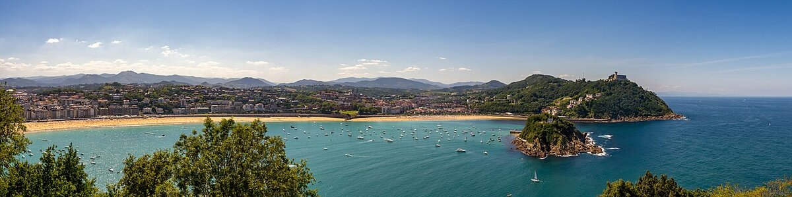
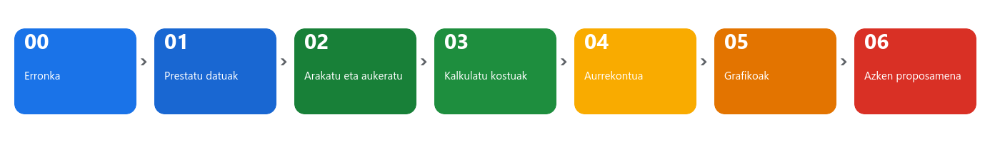
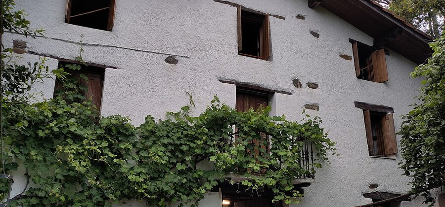
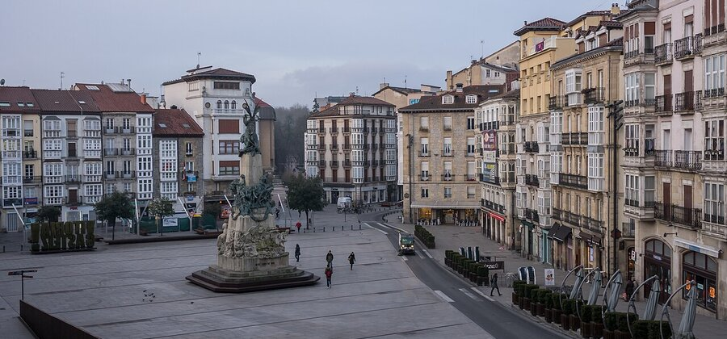
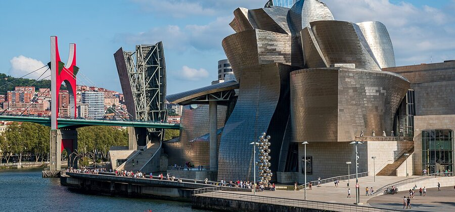
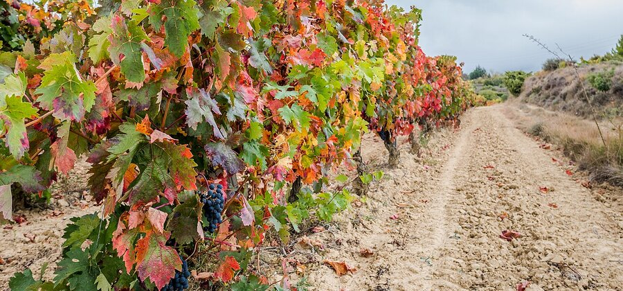

# 00. urratsa · Erronka: zure ihesaldi-agentzia

Hurrengo asteetan zure taldea **bidaia-agentzia** bat da. Bezero batek Euskadin barrena ihesaldi bat antolatzeko eskatzen dizue, eta zuek ostatua proposatu, kontuak egin eta txukun aurkeztu behar diozue. Dena Google-ren kalkulu-orri batekin eta benetako datuekin: Eusko Jaurlaritzak Open Data Euskadin argitaratzen dituen **1.469 ostatu turistikoak**.

Ez dago ezer erreserbatu beharrik, ez inori deitu beharrik. Ikasi behar duzuena da kalkulu-orri bat erabiltzen datuekin erabaki bat hartzeko, horretarako baitira.

## Zer egingo duzuen, urratsez urrats

| Urratsa | Zer egiten duzuen | Zer ikasten duzuen | Denbora |
|---|---|---|---|
| 00 | Taldea osatu, bezeroa aukeratu eta orri partekatua sortu | Partekatzea, bertsioen historia | 1 h |
| 01 | Datuak inportatu eta garbitu | Orriak, errenkadak eta zutabeak, izoztea, zenbatzeko funtzioak | 3 h |
| 02 | Bezeroarentzat balio duten ostatuak bilatu | Ordenatu, iragazi, **iragazki-ikuspegiak**, baldintzapeko formatua, taula dinamikoa | 3 h |
| 03 | Aukera bakoitzak zenbat balio duen kalkulatu | Formulak, `$` ikurreko erreferentziak, **BUSCARV**, MIN, MAX, PROMEDIO | 3 h |
| 04 | Aurrekontua muntatu goitibeherakoekin eta semaforoarekin | **Datuen balidazioa**, kontrol-laukiak, SI, ehunekoak, gelaxkak babestea | 3 h |
| 05 | Grafikoak egin | Zutabe-grafikoak eta zirkularrak, izenburuak eta etiketak | 2 h |
| 06 | Proposamena bezeroari aurkeztu | Azken fitxa, grafiko estekatuak dituen dokumentua, PDFa, demoa | 2 h |

Urrats bakoitza Moodleko zeregin bat da. Ordenan entregatzen dira eta bakoitza aurrekoan oinarritzen da: **ez da inoiz hutsetik hasi behar**, liburua hazten joaten da.

## Bezeroak

Talde bakoitzak **bezero batentzat** lan egiten du. Irakasleak esleitzen du (edo zozketa egiten duzue). Irakurri ondo fitxa: hor daude gero iragazki eta formula bihurtu beharko dituzuen baldintzak.

### A bezeroa · Etxeberria familia

| | |
|---|---|
| **Nortzuk** | Bi heldu eta bi haur (4 pertsona) |
| **Gauak** | 3 |
| **Non** | Gipuzkoa |
| **Ostatu mota** | Agroturismoa edo landetxea |
| **Baldintzak** | Laurak sartzea. Haurrek animaliak ikusteko ilusioa dute, beraz agroturismo batek puntuak batzen ditu |
| **Muga** | 200 € pertsonako, dena barne (ostatua, garraioa, otorduak eta jarduera) |
| **Beharko dituzuen zutabeak** | Provincia, Tipo de Alojamiento, Capacidad |

### B bezeroa · Surflari koadrila

| | |
|---|---|
| **Nortzuk** | Sei lagun surf-taulekin (6 pertsona) |
| **Gauak** | 2 |
| **Non** | Kostaldea, lurraldea berdin zaie |
| **Ostatu mota** | Aterpetxea, apartamentua, kanpina edo pentsioa. Hotela, merezi badu bakarrik |
| **Baldintzak** | Ostatua surflarientzat prestatuta egotea (*Surfing* zutabea = 1) eta seiak sartzea |
| **Muga** | 120 € pertsonako, dena barne. Surf-eskola bat nahi dute |
| **Beharko dituzuen zutabeak** | Surfing, Tipo de Alojamiento, Capacidad, Municipio |

### C bezeroa · Aneren agur-festa

| | |
|---|---|
| **Nortzuk** | Aneren hamar lagun (10 pertsona) |
| **Gauak** | 2 |
| **Non** | Araba |
| **Ostatu mota** | Landetxea, agroturismoa edo apartamentua, denak elkarrekin egoteko |
| **Baldintzak** | 10 plaza edo gehiago. Taldeko jarduera bat nahi dute |
| **Muga** | 170 € pertsonako, dena barne |
| **Beharko dituzuen zutabeak** | Provincia, Tipo de Alojamiento, Capacidad |

### D bezeroa · Zubiri S.L. enpresa

| | |
|---|---|
| **Nortzuk** | Hamabost langile prestakuntza-jardunaldi batean (15 pertsona) |
| **Gauak** | 1 |
| **Non** | Bilbo |
| **Ostatu mota** | Hotela |
| **Baldintzak** | Bilera-gela eta jatetxea izatea (*Sala de Reuniones* eta *Restaurante* zutabeak = 1). 15 plaza edo gehiago |
| **Muga** | 180 € pertsonako, dena barne. Enpresak ordaintzen du, baina nagusiak kontuak begiratzen ditu |
| **Beharko dituzuen zutabeak** | Municipio, Tipo de Alojamiento, Sala de Reuniones, Restaurante, Categoría, Capacidad |

### E bezeroa · Ikasketa-bidaia

| | |
|---|---|
| **Nortzuk** | Hogeita lau ikasle eta bi irakasle (26 pertsona) |
| **Gauak** | 2 |
| **Non** | Bizkaia, ahal bada kostaldean |
| **Ostatu mota** | Aterpetxea edo kanpina |
| **Baldintzak** | 26 plaza edo gehiago. Garraioa alokatutako autobusean |
| **Muga** | 100 € pertsonako, dena barne. Loteria salduz atera dutena da |
| **Beharko dituzuen zutabeak** | Provincia, Tipo de Alojamiento, Capacidad, Marcas |

### F bezeroa · Aitona eta amona, ospakizunean

| | |
|---|---|
| **Nortzuk** | Urrezko ezteiak ospatzen dituen bikote bat (2 pertsona) |
| **Gauak** | 2 |
| **Non** | Arabako Errioxa (*Marcas* zutabea: «Rioja Alavesa») |
| **Ostatu mota** | Hotela edo agroturismoa, jatetxearekin |
| **Baldintzak** | Restaurante = 1. Upategi bat bisitatu nahi dute |
| **Muga** | 320 € pertsonako, dena barne. Egun berezia da, baina pasatu gabe |
| **Beharko dituzuen zutabeak** | Marcas, Tipo de Alojamiento, Restaurante, Categoría |

## Jokoaren arauak

1. **Fitxategi bakarra erronka osorako.** Google-ren kalkulu-orri bat, `Agentzia_XXTaldea` izenekoa (zuen talde-zenbakiarekin). Urrats bakoitzean orriak gehitzen dituzue; aurrekoak ez dira inoiz ezabatzen.
2. **`Datuak` orria ez da ukitzen.** Jatorrizko kopia da. Lan guztia beste orrietan egiten da.
3. **Kalkula daitekeena, formula batekin kalkulatzen da.** Emaitzak eskuz idaztea debekatuta. Datu bat aldatzen baduzue, gainerako guztia bere kabuz eguneratu behar da.
4. **Prezioak asmatuak dira.** Ostatuak, udalerriak eta edukierak benetakoak dira; tarifak guk ematen dizkizuegu praktikatzeko. Azken proposamenean esan egin behar duzue.
5. **Teklatu txandakatua.** Saio bakoitzean pertsona desberdin batek idazten du. Amaieran, taldeko edonork liburuko edozein formula azaltzen jakin behar du.
6. **Urrats bat amaitzean, jarri izena bertsioari**: `Fitxategia > Bertsioen historia > Izendatu uneko bertsioa` (gazt. `Archivo > Historial de versiones > Asignar nombre a la versión actual`), adibidez `01. urratsa entregatuta`. Horrela beti itzul zaitezkete atzera zerbait apurtzen bada.

> [!TIP]
> Taldeak aldi berean orri berean lan egiten badu, bakoitzak bere **iragazki-ikuspegia** ireki dezake besteei trabarik egin gabe. 02. urratsean ikusiko duzue. Ordura arte, hitz egin ezer ezabatu aurretik.

> [!NOTE]
> Gida honetan menuen izenak euskaraz daude, eta parentesi artean gaztelaniaz, kontua hizkuntza horretan baduzue. Funtzioen izenak (BUSCARV, SI, SUMA...) gaztelaniaz daude, Google-k ez dituelako euskaratzen; kontua ingelesez badago, VLOOKUP, IF eta SUM dira.

## Nola entregatzen den eta nola ebaluatzen den

- Moodleko zeregin bakoitzean orri partekatuaren **esteka** entregatzen duzue eta bertsioari zer izen jarri diozuen idazten duzue. Aurretik egiaztatu irakasleak **editatzeko** baimena duela (`Partekatu`, goian eskuinean).
- 01etik 05era bitarteko urratsak **Gai / Ez gai** moduan zuzentzen dira. Zerbait ondo ez badago, irakasleak zer zuzendu esango dizue eta berriro entregatuko duzue.
- 06. urratsa **10etik** kalifikatzen da, zeregin horretan datorren errubrikarekin. Liburuan dagoena, azken dokumentua eta gelako demoa hartzen dira kontuan.

## Urrats honetan egin behar duzuena

1. Osatu taldea (hiru pertsona) eta idatzi nork zer egingo duen lehen saioan: pertsona bat teklatuan, beste bat jarraibideak irakurtzen eta beste bat emaitzak egiaztatzen. Saio bakoitzean txandakatzen duzue.
2. Jakin zein bezero egokitu zaizuen eta irakurri bere fitxa bi aldiz. Idatzi zuen hitzekin, esaldi batean, zer bilatuko diozuen.
3. Sartu [Google Driven](https://drive.google.com) ikastetxeko kontuarekin, sortu `Agentzia_XXTaldea` karpeta bat eta barruan izen bereko kalkulu-orri berri bat.
4. Partekatu hiru kideekin eta irakaslearekin, denak **Editore** gisa.
5. Lehen orrian (utzi oraingoz `1. orria` izenarekin) idatzi `A1`en taldearen izena, `A2`n kideak eta `A3`n egokitu zaizuen bezeroa.

## Entrega

Moodleko zereginean: kalkulu-orriaren esteka eta bezeroari zer bilatuko diozuen deskribatzen duen esaldia.

## Irudien kredituak

- Kontxako badia: Ermell, [*San Sebastian panoramic 1190606*](https://commons.wikimedia.org/wiki/File:San_Sebastian_panoramic_1190606.jpg), CC BY-SA 4.0.
- Baserria: Txapisotegi, [*Iztueta Berri*](https://commons.wikimedia.org/wiki/File:Iztueta_Berri.jpg), CC BY-SA 4.0.
- Zarautz: Jean Michel Etchecolonea, [*Zarautz Vue Camping (2)*](https://commons.wikimedia.org/wiki/File:Zarautz_Vue_Camping_%282%29.jpg), CC BY-SA 3.0.
- Vitoria-Gasteiz: Basotxerri, [*Vitoria - Plaza de la Virgen Blanca 01*](https://commons.wikimedia.org/wiki/File:Vitoria_-_Plaza_de_la_Virgen_Blanca_01.jpg), CC BY-SA 4.0.
- Guggenheim: José Ligero Loarte, [*Museo Guggenheim, 2021, Bilbao*](https://commons.wikimedia.org/wiki/File:Museo_Guggenheim_--_2021_--_Bilbao,_Euskadi,_Espa%C3%B1a.jpg), CC BY-SA 4.0.
- Mundaka: Licinian, [*MundakaCoast*](https://commons.wikimedia.org/wiki/File:MundakaCoast.jpg), CC BY-SA 3.0.
- Guardia: Basotxerri, [*Laguardia - Viñedo 01*](https://commons.wikimedia.org/wiki/File:Laguardia_-_Vi%C3%B1edo_01.jpg), CC BY-SA 4.0.
- Guztiak Wikimedia Commons-en. Urratsetako eskemak erronka honetarako eginak dira eta erabilera librekoak.
