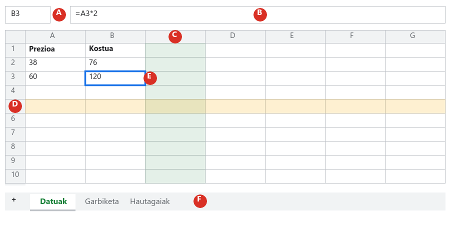
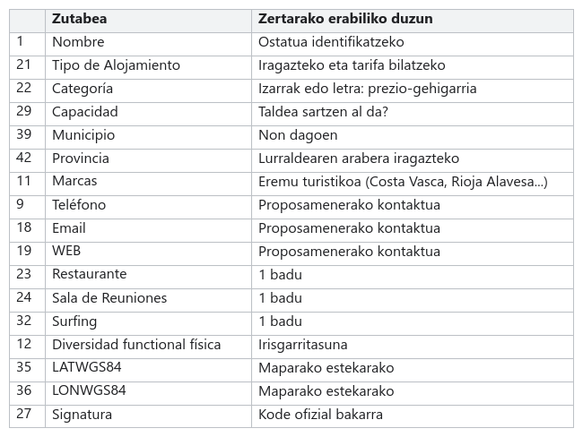

# 01. urratsa · Prestatu datuak

**Denbora:** 3 ordu · **Entrega:** Gai / Ez gai

Benetako datuak ez dira inoiz garbi etortzen. Zutabe hutsekin, izen errepikatuekin eta zenbaki ez diren zenbakiekin etortzen dira. Urrats honetan Open Data Euskadiko fitxategia zuen kalkulu-orrira ekartzen duzue eta lanerako prest uzten duzue. Erronkaren zatirik ikusgarriena ez da, baina hau gabe ondoren datorren ezerk ez du funtzionatzen.

## Hasi aurretik: nola deitzen den gauza bakoitza

*A. **Izenaren laukia**: zein gelaxkatan zauden esaten du (B3). B. **Formulen barra**: gelaxkan benetan dagoena erakusten du; formula bat bada, hemen ikusten duzu, gelaxkak emaitza erakutsi arren. C. **Zutabea**: bertikala, letrarekin. D. **Errenkada**: horizontala, zenbakiarekin. E. **Gelaxka aktiboa**: ertz urdina duena, zutabe baten eta errenkada baten gurutzea (B3 = B zutabea, 3. errenkada). F. **Orrien fitxak**: fitxategi berak orri asko izan ditzake; + ikurrarekin beste bat gehitzen duzu.*

**Barruti** bat gelaxka multzo bat da: `A2:A10` A2tik A10era bitarteko gelaxkak dira. `A:A` A zutabe osoa da. Askotan idatziko duzu.

## 1. Deskargatu fitxategia

1. Sartu [Open Data Euskadiko](https://opendata.euskadi.eus/catalogo/-/alojamientos/) katalogoan eta bilatu **Euskadiko ostatu turistikoak** datu-multzoa.
2. Deskargatu aurretik, irakurri fitxa: nork argitaratzen dituen datuak, zenbatero eguneratzen diren eta zein lizentzia duten. Azken proposamenerako beharko duzue.
3. Deskargatu **XLSX** formatua. Gainerakoak (JSON, XML, GeoJSON) programatzeko dira.
4. Idatzi nonbait deskargaren **data eta ordua**. Datuak aldatu egiten dira eta zuen zenbakiak egiaztatu ahal izan behar dira.

> [!NOTE]
> Egun horretan atariak funtzionatzen ez badu, irakasleak 2026ko irailaren 30ean deskargatutako kopia bat du.

## 2. Ekarri zure kalkulu-orrira

1. Ireki zuen `Agentzia_XXTaldea` orria eta joan `Fitxategia > Inportatu` (gazt. `Archivo > Importar`) atalera.
2. **Kargatu** fitxan, arrastatu XLSXa.
3. *Inportatzeko kokalekua* atalean aukeratu **Txertatu orri berriak** (*Insertar hojas nuevas*) eta sakatu *Inportatu datuak*. Orri berri bat agertzen da 1.470 lerrorekin (goiburu bat eta 1.469 ostatu).
4. Aldatu orri horren izena eta jarri `Datuak` (klik bikoitza fitxan). Orri hau **ez da gehiago ukitzen**.
5. Bikoiztu: `Datuak` fitxa ▸ gezia ▸ **Bikoiztu** (*Duplicar*). Jarri kopiari `Garbiketa` izena. Hemen egingo duzue lan.
6. `Garbiketa` orrian, `Ikusi > Izoztu > 1 errenkada` (gazt. `Ver > Inmovilizar > 1 fila`): horrela zutabeen izenak geldi geratzen dira behera egitean.

## 3. Egin kontuak garbitu aurretik

Ondo garbitzeko, zer dagoen jakin behar da. Sortu `Erantzunak` orri bat lau zutaberekin: `Zk.`, `Galdera`, `Erantzuna` eta `Non egiaztatzen den`. Urrats bakoitzeko erantzunak hor doaz, galderaren zenbakiarekin, eta formula dagoen gelaxka azken zutabean.

Behar dituzuen funtzioak, bakoitza adibide batekin (idatzi `Probak` orri batean entseatu nahi baduzue):

| Funtzioa | Zer zenbatzen duen | Adibidea |
|---|---|---|
| `=CONTARA(Garbiketa!A2:A)` | A zutabean **zerbait duten** gelaxkak, 2. errenkadatik amaierara | Zenbat ostatu dauden |
| `=CONTAR.BLANCO(Garbiketa!I2:I)` | I zutabean **hutsik** dauden gelaxkak | Zenbatek ez duten telefonorik |
| `=CONTAR.SI(Garbiketa!V2:V; "S")` | V zutabeko zenbat gelaxka diren zehazki "S" | Zenbat ostatuk duten S kategoria |
| `=CONTAR.SI(Garbiketa!AC2:AC; 0)` | AC zutabeko zenbat gelaxkak balio duten 0 | Zenbatek duten edukiera zero |
| `=UNIQUE(Garbiketa!V2:V)` | V zutabeko balio desberdinak zerrendatzen ditu, errepikatu gabe | Zein kategoria dauden |
| `=C2/B2` ehuneko formatuarekin | Zati bat guztizkoaren artean | Zein ehunekok ez duen telefonorik |

> [!TIP]
> Formula baten zatien arteko bereizlea **puntu eta koma** da (`;`) zuen orria gaztelaniaz badago. Errorea ematen badu, probatu komarekin: kontuaren konfigurazioaren araberakoa da. Eta kontuan izan zutabeen letrak aldatu egiten direla zutabeak ezabatzen dituzuenean: egiaztatu beti letra goiburuan.

Barruti bat hautatzen duzunean, begiratu behean eskuinean: orriak **Batura, Batez bestekoa, Zenbaketa** erakusten dizkizu. Azkar egiaztatzeko balio du, baina `Erantzunak` orrian formulak egon behar du.

## 4. Kendu soberan dagoena

Fitxategiak 52 zutabe ditu eta 17 erabiliko dituzue. Gainerakoek traba besterik ez dute egiten.

1. `Garbiketa` orrian, errepasatu 1. errenkada lasai. Zutabe **erabat hutsak** ikusiko dituzue (egiaztatu `CONTARA` funtzioarekin: 0 ematen badu, hutsik dago) eta bi aldiz **izen bera** duten zutabeak, adibidez *Dirección* eta *Teléfono*. Izen bereko bi zutabek arazoak ematen dituzte taula dinamiko bat egin bezain laster.
2. Ezabatu goiko zerrendan **ez** dauden zutabe guztiak: hautatu haien letrak (`Ctrl` sakatuta hainbat hauta ditzakezue) ▸ eskuineko botoia ▸ *Ezabatu zutabeak* (*Eliminar columnas*). Bloke bakoitza ezabatu aurretik idatzi zer kentzen duzuen `Erregistroa` izeneko orri berri batean, bi zutaberekin: *Zer egin dudan* eta *Zergatik*.
3. Ordenatu gelditzen diren 17 zutabeak irudian bezala (arrastatu goiburua saguarekin) eta jarri 1. errenkada letra lodiz.
4. Egiaztatu **Capacidad zenbaki bat dela**: hautatu zutabea eta begiratu behean *Batura* agertzen den. *Zenbaketa* bakarrik agertzen bada, testu gisa gordeta dago: hautatu zutabea, `Formatua > Zenbakia > Zenbakia` (gazt. `Formato > Número > Número`) eta, behar bada, idatzi berriro huts egiten duten gelaxkak.
5. Pasatu `Datuak > Datuen garbiketa > Moztu zuriuneak` (gazt. `Datos > Limpieza de datos > Recortar espacios en blanco`) testu-zutabeei (Nombre, Municipio, Tipo). Testu baten amaierako zuriuneak ikusezinak dira eta bilaketak apurtzen dituzte.

> [!WARNING]
> **Ez erabili "Kendu bikoiztuak" buru gabe.** 58 izen errepikatzen dira, baina asko udalerri desberdinetan izen bera duten ostatu desberdinak dira. Izenaren arabera ezabatzeak datu onak suntsitzen ditu. Ostatu bakoitza identifikatzen duen zutabea *Signatura* da. Bi errenkadak signatura bera, udalerri bera eta izen bera badituzte, orduan bai, bikoiztua da.

## 5. Erantzun Erantzunak orrian

| Zk. | Galdera |
|---|---|
| 1.1 | Zenbat ostatu eta zenbat zutabe ditu jatorrizko fitxategiak? Zein egunetan eta zein ordutan deskargatu duzue? |
| 1.2 | Zenbat zutabe zeuden erabat hutsik? Zeintzuk? |
| 1.3 | Zein zutabe-izen agertzen ziren bi aldiz? |
| 1.4 | Zenbat ostatuk ez dute telefonorik, zenbatek ez dute emailik eta zenbatek ez dute webik? Eman zenbakia eta ehunekoa, formularekin. |
| 1.5 | Zein balio desberdin hartzen ditu *Categoría* zutabeak? Zentzurik al du bere batez bestekoa kalkulatzeak? Zergatik? |
| 1.6 | Zenbat ostatuk dute 0 edukiera? Zer erabaki duzue haiekin egitea? |

## Egiaztatu entregatu aurretik

- [ ] `Datuak` osorik dago, bere 52 zutabeekin.
- [ ] `Garbiketa` orriak zerrendako 17 zutabeak ditu, 1. errenkada izoztuta eta letra lodiz.
- [ ] *Capacidad* zutabeak batzen du (zenbakia da).
- [ ] `Erregistroa` orriak azaltzen du zer kendu duzuen eta zergatik.
- [ ] `Erantzunak` orriak sei galderak ditu, bakoitza bere formularekin ondoan.
- [ ] Bertsioari izena jarri diozue: `01. urratsa entregatuta`.

## Nota igotzeko

- `=CONTAR.SI(Garbiketa!A2:A; A2)` formularekin zutabe lagungarri batean, aurkitu zein izen errepikatzen diren eta begiratu baten bat benetako bikoiztua den (signatura bera). Azaldu `Erregistroa` orrian zer aurkitu duzun.
- Jarri **baldintzapeko formatu** bat (`Formatua > Baldintzapeko formatua`, gazt. `Formato > Formato condicional`, *Gelaxka hutsik dago* araua) Teléfono, Email eta WEB zutabeei, gelaxka hutsak gorri argiz ikus daitezen.

## Entrega

Orriaren esteka, `01. urratsa entregatuta` bertsioarekin.
