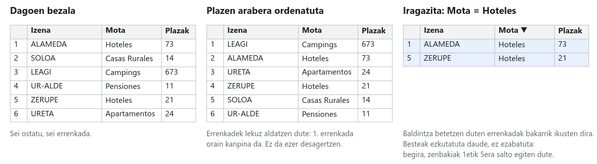
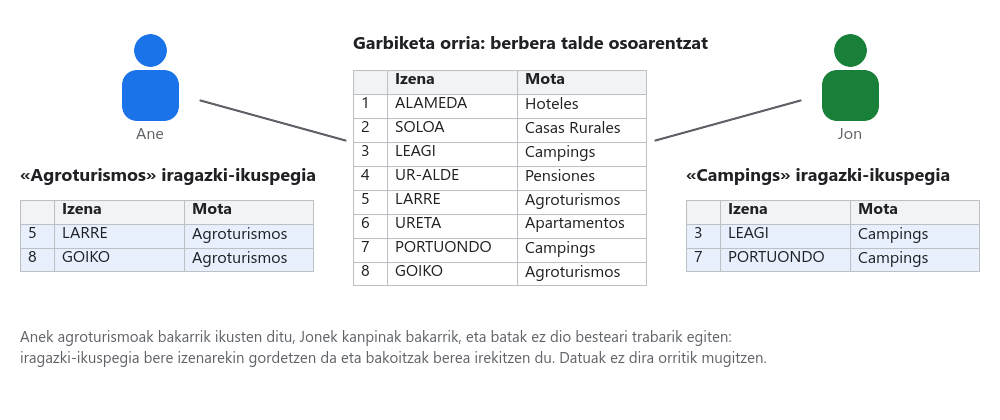

# 02. urratsa · Arakatu eta aukeratu bost hautagai

**Denbora:** 3 ordu · **Entrega:** Gai / Ez gai

1.469 ostatu dituzue eta baldintza zehatzak dituen bezero bat. Urrats honetan ordenatzen, iragazten eta **iragazki-ikuspegiak** gordetzen ikasten duzue, 1.469 errenkadak irakurri gabe, proposatuko dizkiozuen bost ostatuak aurkitzeko.

## Hasi aurretik: ordenatzea ez da iragaztea

- **Ordenatzeak** errenkaden ordena aldatzen du (plaza gehienetik gutxienera, izenaren arabera, udalerriaren arabera). Guztiak hor jarraitzen dute.
- **Iragazteak** baldintza bat betetzen ez duten errenkadak ezkutatzen ditu. Ez dira ezabatzen: iragazkia kentzen duzunean itzultzen dira. Begira errenkada-zenbakiei: 1etik 5era salto egiten badute, errenkada ezkutuak daude.
- Errenkada bakoitza ostatu bat da. Ordenatzean, orriak errenkada **osoa** mugitzen du, beraz izenak, udalerriak eta plazek elkarrekin jarraitzen dute. Noizbait bat ez datozela ikusten baduzu, norbaitek zutabe bakarra ordenatu duelako da. `Ctrl+Z`.

## 1. Aktibatu iragazkia eta praktikatu

1. `Garbiketa` orrian, egin klik datuak dituen edozein gelaxkatan eta joan `Datuak > Sortu iragazkia` (gazt. `Datos > Crear un filtro`) atalera. Inbutu bat agertzen da goiburu bakoitzean.
2. Sakatu *Provincia* zutabeko inbutua. Balioen zerrenda ikusiko duzu laukitxoekin: kendu marka *Garbitu* aukerarekin eta markatu probintzia bakarra. Onartu. Orain probintzia horretako ostatuak bakarrik ikusten dituzu.
3. Sakatu *Capacidad* zutabeko inbutua ▸ *Ordenatu Z-tik A-ra*: plaza gehien dituztenak goian.
4. Sakatu *Nombre* zutabeko inbutua eta idatzi zerbait bilaketa-laukian, adibidez `surf`. Begira: hori duten izenak bakarrik agertzen dira.
5. Inbutuan badago **Iragazi baldintzaren arabera** ere: *Handiagoa edo berdina* 10, *Testuak hau du* "Zarautz"... Hori da zenbakiak iragazteko modua.
6. Dena berriro ikusteko, inbutu bakoitzean aukeratu *Hautatu guztiak*, edo kendu iragazki osoa `Datuak > Kendu iragazkia` (gazt. `Datos > Quitar filtro`) aukerarekin.

> [!TIP]
> Zenbat errenkada gelditzen dira iragazi ondoren? Idatzi gelaxka libre batean, adibidez `S1`en, `=SUBTOTALES(103; A2:A)` formula. **Ikusgai dauden errenkadak bakarrik** zenbatzen ditu, beraz iragazkia aldatzen duzun bakoitzean aldatzen da. Zuen hautagai-kontagailua da.

## 2. Sortu iragazki-ikuspegiak: bat bakoitzarentzat

Hirurok orri berean aldi berean iragazten baduzue, zoratu egingo zarete: batek ezkutatzen duena desagertu egiten da besteentzat. Horretarako daude **iragazki-ikuspegiak**.

1. `Datuak > Iragazki-ikuspegiak > Sortu iragazki-ikuspegi berria` (gazt. `Datos > Vistas de filtro > Crear una vista de filtro nueva`). Orria marko gris ilun batekin jartzen da: ikuspegi baten barruan zaude.
2. Goian ezkerrean, jarri **izena**: zer iragazten duen, adibidez `Agroturismoak Gipuzkoa ≥ 4 plaza`.
3. Iragazi eta ordenatu aurreko atalean bezala. Egiten duzuna ikuspegi honen barruan bakarrik ikusten da.
4. Itxi ikuspegia eskuineko X-arekin. Datuak berriro osorik ikusten dira, baina ikuspegia gordeta geratzen da: `Datuak > Iragazki-ikuspegiak` atalean berreskuratzen duzu eta bere izenarekin agertzen da.
5. Kide bakoitzak **gutxienez ikuspegi bat** sortzen du bezeroaren baldintza batekin, eta taldeak azken ikuspegi bat sortzen du baldintza guztiak konbinatuz (probintzia, mota, edukiera, fitxak eskatzen duena). Azken ikuspegi horrek `X bezeroa · hautagaiak` izena izan behar du (zuen bezeroaren letrarekin).

Azken ikuspegia irekita dagoela, `=SUBTOTALES(103; A2:A)` kontagailuak esaten dizue zenbat ostatuk betetzen dituzten baldintza guztiak. Bost baino gutxiago badira, lasaitu baldintza bat eta idatzi `Erantzunak` orrian. Ehun baino gehiago badira, gehitu beste bat.

## 3. Markatu interesatzen zaizuena kolorez

`Formatua > Baldintzapeko formatua` (gazt. `Formato > Formato condicional`) aukerak arau bat betetzen duten gelaxkak margotzen ditu, automatikoki:

1. Hautatu *Capacidad* zutabe osoa.
2. `Formatua > Baldintzapeko formatua`, araua *Handiagoa edo berdina*, idatzi zuen bezeroaren pertsona kopurua, aukeratu berde bat. Prest: begiratu batean ikusten da non sartzen den taldea.
3. Gehitu beste arau bat *Tipo de Alojamiento* zutabeari: *Testua zehazki hau da* bezeroak nahiago duen mota, urdinez.

## 4. Laburtu taula dinamiko batekin

**Taula dinamiko** batek zenbatu eta taldekatu egiten du zure ordez. Bezeroaren lurraldeko eskaintza nolakoa den jakiteko erabiliko duzue.

1. `Garbiketa` orrian, hautatu datuak dituzten zutabe guztiak (egin klik A-n eta arrastatu azkeneraino) eta joan `Txertatu > Taula dinamikoa` (gazt. `Insertar > Tabla dinámica`) ▸ *Orri berria* atalera. Jarri orriari `Laburpena` izena.
2. Eskuineko panelean: **Errenkadak** atalean gehitu *Tipo de Alojamiento*; **Balioak** atalean gehitu *Nombre* eta, *Laburtu honen arabera* atalean, aukeratu `COUNTA`. Jada baduzue mota bakoitzeko zenbat ostatu dauden.
3. **Zutabeak** atalean gehitu *Provincia*. Orain taula bat da motak bertikalean eta lurraldeak horizontalean dituena.
4. **Iragazkiak** atalean gehitu *Capacidad* eta jarri *Handiagoa edo berdina* baldintza zuen bezeroaren pertsonekin. Begira nola aldatzen diren zenbakiak.
5. Egiaztatu zenbaki bat eskuz `=CONTAR.SI.CONJUNTO(Garbiketa!B:B; "Hoteles"; Garbiketa!F:F; "Bizkaia")` formularekin (egokitu letrak zure zutabeetara). Taula dinamikoarekin bat badator, biak ondo daude.

## 5. Aukeratu bost hautagaiak

1. Sortu `Hautagaiak` orri bat goiburu hauekin 1. errenkadan: `Izena`, `Mota`, `Kategoria`, `Udalerria`, `Plazak`, `Telefonoa`, `Weba`, `Latitudea`, `Longitudea`.
2. Ireki zuen `X bezeroa · hautagaiak` ikuspegia. Aukeratu baldintzak betetzen dituzten **bost ostatu**. **Gutxienez bi mota desberdinetakoak** izan behar dute (adibidez hiru agroturismo eta bi landetxe): bestela, hurrengo urratsean guztiek berdin balioko dute eta ez da ezer alderatzeko egongo.
3. Kopiatu bakoitza `Hautagaiak` orrian, ostatu bat errenkada bakoitzean (2.etik 6.era bitarteko errenkadak). Kopiatu gelaxkaz gelaxka edo errenkadaz errenkada, baina egiaztatu izena, udalerria eta plazak errenkada berekoak direla. Koordenatuak *LATWGS84* eta *LONWGS84* zutabeetan daude.
4. Taularen azpian idatzi bi esaldi: zein iragazkirekin aurkitu dituzuen eta zergatik bost horiek eta ez beste batzuk.
5. Itxi iragazki-ikuspegia. `Garbiketa` orriak iragazki aktiborik gabe geratu behar du.

> [!NOTE]
> Ostatu batek 26 plaza izateak ez du esan nahi bezeroak nahi duen asteburuan 26 plaza libre dituenik. Simulazio bat da: benetako bizitzan hurrengo urratsa deitzea litzateke.

## 6. Erantzun Erantzunak orrian

| Zk. | Galdera |
|---|---|
| 2.1 | Bezeroaren zein baldintza bihurtu dituzue iragazki? Zein ezin zen datuekin iragazi eta zer egin duzue? |
| 2.2 | Zenbat ostatuk betetzen dituzte baldintza guztiak (`SUBTOTALES` funtzioak azken ikuspegian ematen duen zenbakia)? |
| 2.3 | Bost hautagaietatik, zeinek ditu plaza gehien eta zeinek gutxien? |
| 2.4 | Taula dinamikoaren arabera, zein ostatu mota da ugariena bezeroaren lurraldean? Eta urriena? |

## Egiaztatu entregatu aurretik

- [ ] Gutxienez hiru iragazki-ikuspegi daude izenarekin, horietako bat `X bezeroa · hautagaiak`.
- [ ] `Garbiketa` orriak ez du iragazki aktiborik eta inork ez du zutabe bakarra ordenatu.
- [ ] *Capacidad* zutabeak baldintzapeko formatua du berdez bezeroaren pertsona kopurutik gora.
- [ ] `Laburpena` orriak taula dinamikoa du motekin, probintziekin eta edukieraren iragazkiarekin.
- [ ] `Hautagaiak` orriak bost ostatu oso ditu, gutxienez bi motatakoak, bere bi esaldiekin.
- [ ] `Erantzunak` orriak 2.1etik 2.4ra ditu.
- [ ] Izendun bertsioa: `02. urratsa entregatuta`.

## Nota igotzeko

- Gehitu `Laburpena` orriari bigarren taula dinamiko bat *Municipio* errenkadetan duena, ostatu gehienetik gutxienera ordenatuta eta bezeroaren probintziaren arabera iragazita: eskaintza handiena duten hamar udalerriak.
- `Hautagaiak` orrian, Q zutabean (utzi libre J-tik P-ra bitartekoak, hurrengo urratsetan erabiliko dira), eraiki maparako esteka bat: `=HIPERVINCULO("https://www.google.com/maps?q=" & H2 & "," & I2; "Ikusi mapan")`. Egin klik eta egiaztatu ostatua esaten duen lekuan dagoela.

## Entrega

Orriaren esteka, `02. urratsa entregatuta` bertsioarekin.
