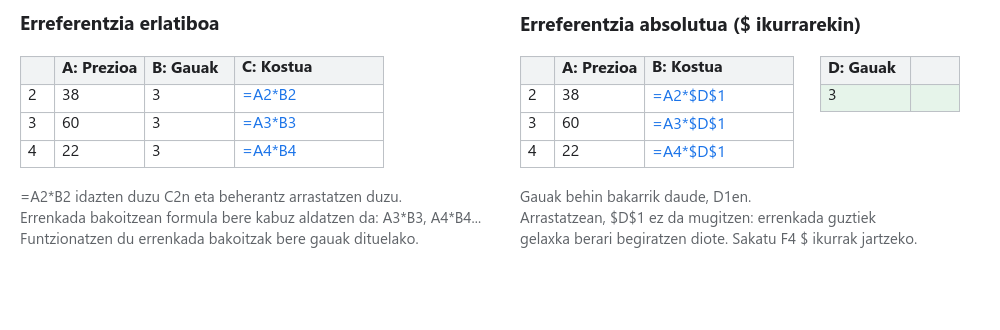
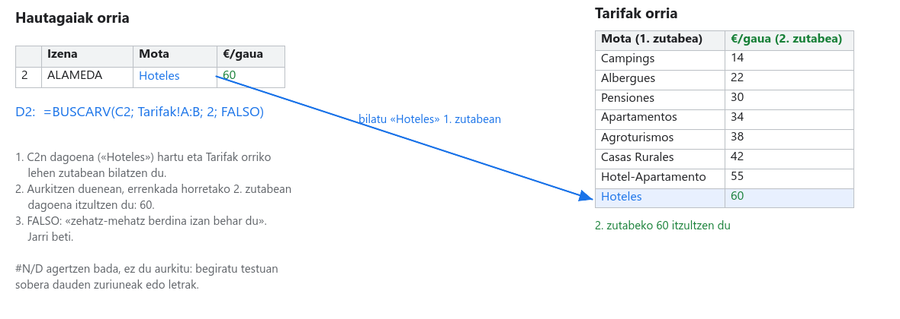
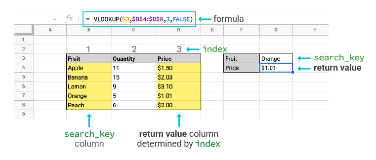

# 03. urratsa · Kalkulatu hautagai bakoitzak zenbat balio duen

**Denbora:** 3 ordu · **Entrega:** Gai / Ez gai

Bost ostatu dituzue jada. Orain bakoitzean lo egiteak zenbat balioko lukeen jakin behar da. Open Dataren datuek ez dute preziorik, beraz agentziak **simulatutako tarifa-taula** batekin lan egiten du: oinarrizko prezio bat ostatu motaren arabera eta gehigarri bat kategoriaren arabera. Horrekin, formula batzuekin eta BUSCARV funtzioarekin, orriak bere kabuz kalkulatzen du aukera bakoitzaren kostua.

## Hasi aurretik: kopiatzen diren formulak

Formula bat `=` ikurrarekin hasten da eta zenbakiak, eragiketak (`+ - * /`) eta beste gelaxketarako **erreferentziak** erabil ditzake. `=B2*C2` hobea da `=38*3` baino, prezioa edo gauak aldatzen badira emaitza bere kabuz aldatzen delako.

- Formula bat beherantz arrastatzen duzunean (gelaxkaren izkinako lauki urdin txikia), orriak errenkada-zenbakiak aldatzen ditu: `=A2*B2` `=A3*B3` bihurtzen da. **Erreferentzia erlatibo** bat da eta ia beti hori da nahi duzuna.
- Gelaxka batek kopiatzean finko geratu behar badu (bidaiaren gauak, gelaxka batean behin bakarrik daudenak), `$` jartzen diozu letraren eta zenbakiaren aurrean: `$B$2`. **Erreferentzia absolutu** bat da. Kurtsorea erreferentziaren barruan dagoela, `F4` teklak `$` ikurrak jarri eta kentzen ditu.
- Beste orri bateko gelaxka bat erabiltzeko, orriaren izena, harridura-ikur bat eta gelaxka idazten dira: `Bezeroa!B2`. Formula beherantz kopiatzen baduzu `Bezeroa!B3` bihurtzen da ere, beraz normalean `$` ikurrarekin nahiko duzu: `Bezeroa!$B$2`.

## 1. Bezeroa orria

Sortu `Bezeroa` orri bat zuen bezeroaren fitxako datuekin. Haien mende dagoen guztia hemendik kalkulatuko da, beraz bezeroa aldatzen bada orri hau bakarrik aldatzen duzue.

| | A | B |
|---|---|---|
| 1 | Bezeroa | *Bezeroaren letra eta izena* |
| 2 | Pertsonak | *adibidez* 4 |
| 3 | Gauak | *adibidez* 3 |
| 4 | Muga pertsonako | *adibidez* 200 |
| 5 | Lurraldea edo eremua | *adibidez* Gipuzkoa |

Jarri moneta-formatua `B4` gelaxkari: hautatu gelaxka eta sakatu tresna-barrako `€` botoia (edo `Formatua > Zenbakia > Moneta`, gazt. `Formato > Número > Moneda`).

## 2. Tarifak orria

Sortu `Tarifak` orri bat eta kopiatu taula hauek dauden bezala, bakoitza bere lekuan. Moten izenak **zehazki** datuetan bezala idatzita egon behar dute (letra larriekin, azentuekin eta pluralekin), BUSCARV funtzioak letraz letra alderatuko dituelako.

**Oinarrizko tarifa, `A1:B9` barrutian** (euro pertsona eta gau bakoitzeko):

| Tipo de Alojamiento | Oinarrizko tarifa |
|---|---|
| Campings | 14 |
| Albergues | 22 |
| Pensiones | 30 |
| Apartamentos | 34 |
| Agroturismos | 38 |
| Casas Rurales | 42 |
| Hotel-Apartamento | 55 |
| Hoteles | 60 |

**Kategoriaren araberako gehigarria, `D1:E9` barrutian** (oinarrizko tarifari gehitzen zaio):

| Categoría | Gehigarria |
|---|---|
| 1 | 0 |
| 2 | 6 |
| 3 | 15 |
| 4 | 35 |
| 5 | 90 |
| S | 0 |
| P | 8 |
| T | 0 |

1etik 5era bitarteko kategoriak hotelen, pentsioen eta apartamentuen izarrak dira. *S* letrak esan nahi du ostatu mota horrek ez duela kategoriarik. Kanpinetan *P*, *S* eta *T* lehen, bigarren eta hirugarren kategoria dira.

`Tarifak` orriko gainerako taulak (garraioa, otorduak, jarduerak) 04. urratsean gehituko dituzue.

## 3. BUSCARV: orriak bila dezala zure ordez

Hautagai bakoitzaren tarifa begiratu eta eskuz idatz zenezakete. Baina orain bost dira eta berrogeita hamar izan litezke, eta tarifa bat aldatuz gero dena errepasatu beharko zenukete. Horretarako dago **BUSCARV**: balio bat taula baten lehen zutabean bilatzen du eta errenkada bereko beste zutabe batean dagoena itzultzen dizu.

`=BUSCARV(zer bilatzen dudan; non; zein zutabe itzultzen dudan; FALSO)`

- **Zer bilatzen dudan**: hautagaiaren mota duen gelaxka, adibidez `B2`.
- **Non**: tarifen taula, `Tarifak!A:B`. Barrutiaren lehen zutabeak bilatzen duzuna duena izan behar du.
- **Zein zutabe itzultzen dudan**: barrutiaren lehenengotik zenbatuta. `2` tarifa da.
- **FALSO**: zehazki bat datorrenean bakarrik balio dezala. Jarri beti.

*Gauza bera Google Sheets-en laguntzan azalduta: search_key bilatzen duzuna da, index itzultzen duen zutabea eta return value emaitza. © Google.*

BUSCARV funtzioak `#N/D` itzultzen badu, ez du testua aurkitu. Ia beti zuriune bat sobera edo letra desberdin bat da: alderatu hautagaiaren gelaxka `Tarifak` orrikoarekin letraz letra.

## 4. Kostuaren zutabeak Hautagaiak orrian

`Hautagaiak` orrian, *Longitudea* zutabearen eskuinean (I zutabea), gehitu goiburu hauek 1. errenkadan eta idatzi 2. errenkadako formula. Gero hautatu `J2:O2` eta arrastatu 6. errenkadaraino.

| Zutabea | Goiburua | Formula 2. errenkadan | Zer egiten duen |
|---|---|---|---|
| J | Oinarrizko tarifa | `=BUSCARV(B2; Tarifak!A:B; 2; FALSO)` | Mota tarifen taulan bilatzen du |
| K | Gehigarria | `=BUSCARV(C2; Tarifak!D:E; 2; FALSO)` | Kategoria gehigarrien taulan bilatzen du |
| L | € pertsona eta gau bakoitzeko | `=J2+K2` | Gau baten prezioa pertsona batentzat |
| M | Ostatua pertsonako | `=L2*Bezeroa!$B$3` | Gau guztiak, pertsona bat |
| N | Ostatua taldearentzat | `=M2*Bezeroa!$B$2` | Gau guztiak, talde osoa |
| O | Sartzen al da taldea? | `=SI(E2>=Bezeroa!$B$2; "Bai"; "Ez")` | Plazak pertsonekin alderatzen ditu |

Begira `$` ikurrei: gauak eta pertsonak behin bakarrik daude `Bezeroa` orrian, beraz erreferentzia finkoa da. Arrastatzean, `B2` `B3` bihurtuko da, baina `Bezeroa!$B$3` ez.

Jarri moneta-formatua `J2:N6` barrutiari (hautatu eta sakatu `€`). Formatuak zenbakia nola ikusten den bakarrik aldatzen du, ez kalkulua. Ez aplikatu plazei.

`SI` funtzioak puntu eta komaz bereizitako hiru zati ditu: galdera bat (`E2>=Bezeroa!$B$2`), erantzuna baiezkoa bada idazten duena, eta ezezkoa bada idazten duena. Testuak komatxo artean doaz.

## 5. Bost aukeren laburpena

Taularen azpian, `A9:B12` barrutian:

| | A | B |
|---|---|---|
| 9 | Merkeena pertsonako | `=MIN(M2:M6)` |
| 10 | Garestiena pertsonako | `=MAX(M2:M6)` |
| 11 | Batez besteko prezioa | `=PROMEDIO(M2:M6)` |
| 12 | Garestienaren eta merkeenaren arteko aldea | `=B10-B9` |

`MIN` eta `MAX` funtzioek zenbateko bat itzultzen dute, ez izen bat. **Zein** den merkeena jakiteko bi aukera dituzu: taulari begiratu, edo `=INDICE(A2:A6; COINCIDIR(B9; M2:M6; 0))` formula, M zutabean gutxieneko zenbatekoa bilatu eta errenkada horretako izena itzultzen duena. Bigarren hau nota igotzeko da.

## 6. Jolastu datuekin

Hau da kalkulu-orri bat kalkulagailu batetik bereizten duena. `Bezeroa` orrian:

1. Aldatu gauak 3tik 4ra. Begira nola aldatzen diren M eta N bost hautagaietan, eta laburpena. Utzi berriro zegoen bezala.
2. Aldatu pertsonak hautagairen baten plazak baino zenbaki handiago batera. *Sartzen al da taldea?* zutabeak "Ez" jarri behar du. Utzi berriro zegoen bezala.
3. `Tarifak` orrian, igo hotelen tarifa 80ra. Zein hautagai aldatzen dira? Utzi berriro zegoen bezala.

Kide bakoitzak hiru probetako bat egiten du eta beste biei azaltzen die zer aldatu den eta zergatik.

## 7. Erantzun Erantzunak orrian

| Zk. | Galdera |
|---|---|
| 3.1 | Zein hautagai da merkeena pertsonako eta zein garestiena? Zenbat balio du bakoitzak talde osoarentzat? |
| 3.2 | Zein da batez besteko prezioa pertsonako? Kopiatu formula. |
| 3.3 | Bezeroa gau bat gehiago geratzen bada, zenbat igotzen da ostatu merkeena pertsonako? |
| 3.4 | Guztietan sartzen al dira? Bateren batean ez bada, zergatik aukeratu zenuten? |

## Egiaztatu entregatu aurretik

- [ ] `Bezeroa` orriak pertsonak, gauak eta muga ditu, eta formulak hortik elikatzen dira.
- [ ] `Tarifak` orriak bi taulak ditu, izenak zehazki datuetan bezala idatzita.
- [ ] `Hautagaiak` orrian, J2:O6 formulak dira (egin klik gelaxka batean eta begiratu formulen barra), ez eskuz idatzitako zenbakiak.
- [ ] Gelaxka batek ere ez du `#N/D` edo `#¡VALOR!` erakusten.
- [ ] MIN, MAX eta PROMEDIO laburpena A9:B12 barrutian dago.
- [ ] `Erantzunak` orriak 3.1etik 3.4ra ditu.
- [ ] Izendun bertsioa: `03. urratsa entregatuta`.

## Nota igotzeko

- **Eremu-gehigarria**: Donostian, Bilbon eta Vitoria-Gasteizen dena garestiagoa da. Gehitu P zutabe bat, *Eremu-gehigarria*, `=SI(O(D2="Donostia / San Sebastián"; D2="Bilbao"; D2="Vitoria-Gasteiz"); 15; 0)` formularekin, eta batu L zutabean. `O` funtzioak egia itzultzen du baldintzetako edozein betetzen bada.
- Jarri 5. ataleko `INDICE` eta `COINCIDIR` formula, laburpenak merkeenaren eta garestienaren izena esan dezan.

## Entrega

Orriaren esteka, `03. urratsa entregatuta` bertsioarekin.
