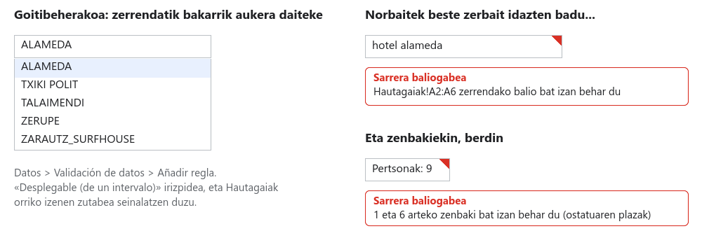
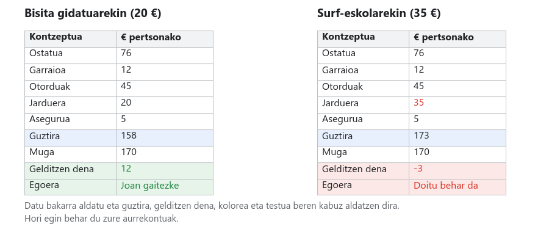

# 04. urratsa · Aurrekontua, goitibeherakoekin eta semaforoarekin

**Denbora:** 3 ordu · **Entrega:** Gai / Ez gai

Orain arte badakizue lo egiteak zenbat balio duen. Orain **aurrekontu osoa** muntatzen duzue: ostatua, garraioa, otorduak, jarduera eta gehigarriak. Eta akatsen aurka babestuta egiten duzue: bezeroak aukerak **goitibeherakoetan** aukeratzen ditu, ezin du edozer idatzi, eta **semaforo** batek esaten dio mugatik pasatzen den.

## Hasi aurretik: datuen balidazioa

Gelaxka arrunt batek edozer onartzen du: zenbaki bat, testu bat, data bat, akats ortografiko bat. **Datuen balidazioak** arau bat jartzen dio gelaxkari: "hemen bost izen hauetako bat bakarrik aukera daiteke", "hemen 1 eta 6 arteko zenbaki bat bakarrik", "hemen kontrol-lauki bat bakarrik, markatuta edo markatu gabe".

- `Datuak > Datuen balidazioa > Gehitu araua` (gazt. `Datos > Validación de datos > Añadir regla`) atalean dago. Aplikatzen zaion **barrutia** eta **irizpidea** aukeratzen dituzu.
- Erabiliko dituzuen irizpideak: **Goitibeherakoa (barruti batetik)**, aukerak gelaxka-barruti batetik hartzen dituena; **Goitibeherakoa**, eskuz idatzitako aukerekin; **Artean dago**, zenbakietarako; eta **Kontrol-laukia**.
- *Aukera aurreratuak* atalean erabakitzen duzu zer gertatzen den norbaitek beste zerbait idazten badu: **Baztertu sarrera** (ez du uzten) edo **Erakutsi abisua** (uzten du, baina gelaxka triangelu gorri batekin markatzen du). Eta **laguntza-testu** bat jar dezakezu, sagua gainetik pasatzean agertzen dena.

Goitibeherakoen abantaila ez da akatsak saihestea bakarrik: aukerak zerrenda batetik datozenez, BUSCARV funtzioak beti aurkitzen du bilatzen duena.

## 1. Osatu Tarifak orria

Gehitu hiru taula hauek `Tarifak` orriari, adierazitako gelaxketan. Goiburuak taula bakoitzeko lehen errenkadan doaz.

**Garraioa, `G1:H5` barrutian** (pertsonako, joan-etorria):

| Garraioa | € pertsonako |
|---|---|
| Bizikleta | 0 |
| Auto partekatua | 12 |
| Trena edo autobusa | 18 |
| Alokatutako autobusa | 25 |

**Otorduak, `G7:H10` barrutian** (pertsona eta egun bakoitzeko):

| Otorduak | € pertsona eta egun bakoitzeko |
|---|---|
| Piknika | 8 |
| Eguneko menua | 15 |
| Jatetxea | 30 |

**Jarduerak, `G12:H18` barrutian** (pertsonako):

| Jarduera | € pertsonako |
|---|---|
| Bat ere ez | 0 |
| Museoa | 10 |
| Bisita gidatua | 12 |
| Upategia dastaketarekin | 20 |
| Abentura-parkea | 28 |
| Surf-eskola | 35 |

## 2. Muntatu Aurrekontua orria

Sortu `Aurrekontua` orria eta kopiatu egitura hau. Dena **pertsonako** da. C zutabeko formulak dauden bezala doaz; B zutabea hurrengo atalean beteko duzue goitibeherakoekin.

| | A | B | C |
|---|---|---|---|
| 1 | Kontzeptua | Aukera | € pertsonako |
| 2 | Ostatua | | `=BUSCARV(B2; Hautagaiak!A:M; 13; FALSO)` |
| 3 | Garraioa | | `=BUSCARV(B3; Tarifak!G:H; 2; FALSO)` |
| 4 | Otorduak | | `=BUSCARV(B4; Tarifak!G:H; 2; FALSO)*(Bezeroa!B3+1)` |
| 5 | Jarduera | | `=BUSCARV(B5; Tarifak!G:H; 2; FALSO)` |
| 6 | Bidaia-asegurua (5 €) | | `=SI(B6; 5; 0)` |
| 7 | Aurretiazko erreserba: ostatuan % 10eko deskontua | | `=SI(B7; -C2*10%; 0)` |
| 9 | **Guztira pertsonako** | | `=SUMA(C2:C7)` |
| 10 | Bezeroaren muga | | `=Bezeroa!B4` |
| 11 | **Gelditzen dena** | | `=C10-C9` |
| 12 | Egoera | | `=SI(C11>=0; "Joan gaitezke"; "Doitu behar da")` |
| 14 | Pertsonak | | `=Bezeroa!B2` |
| 15 | **Guztira taldearentzat** | | `=C9*C14` |

Zer egiten duen formula bakoitzak:

- **C2** aukeratutako ostatuaren izena `Hautagaiak` orrian bilatzen du eta 13. zutabea ekartzen du, *Ostatua pertsonako* (M zutabea). Gau guztiak barne ditu jada.
- **C4** egun bateko otorduen prezioa bidaiaren egunekin biderkatzen du, gauak gehi bat direnak.
- **C6 eta C7** **kontrol-lauki** bat erabiltzen dute: markatutako lauki batek VERDADERO balio du eta `SI` funtzioak "bai" gisa ulertzen du. Deskontua negatiboa da kendu egiten duelako.
- **C9** 2.etik 7.era batzen du. Idatzi batura batzen duen barrutitik **kanpo**; barruan jartzen baduzu, orriak erreferentzia zirkular batez kexatzen da.
- **C11** sobratzen dena da. Positiboa, ondo; negatiboa, pasatu egin zarete.

B hutsik dagoen bitartean, C zutabeak `#N/D` erakutsiko du. Normala da: ez dago oraindik ezer bilatzeko.

## 3. Jarri goitibeherakoak eta kontrol-laukiak

1. Egin klik `B2` gelaxkan. `Datuak > Datuen balidazioa > Gehitu araua`. **Goitibeherakoa (barruti batetik)** irizpidea eta barrutian idatzi `Hautagaiak!A2:A6`. *Aukera aurreratuak* atalean, **Baztertu sarrera** eta `Aukeratu bost hautagaietako bat` laguntza-testua. Prest.
2. Errepikatu `B3` gelaxkan `Tarifak!G2:G5` barrutiarekin, `B4` gelaxkan `Tarifak!G8:G10` barrutiarekin eta `B5` gelaxkan `Tarifak!G13:G18` barrutiarekin.
3. `B6` eta `B7` gelaxketan, `Txertatu > Kontrol-laukia` (gazt. `Insertar > Casilla`).
4. Joan `Bezeroa` orrira. Jarri balidazioa `B2` gelaxkari (Pertsonak): **Artean dago** 1 eta 30, baztertu sarrera. `B3` gelaxkari (Gauak): 1 eta 7 artean. `B4` gelaxkari (Muga): **Handiagoa** 0 baino.
5. Probatu `Aurrekontua!B2` gelaxkan asmatutako izen bat idazten. Baztertu egin behar du. Probatu `Bezeroa` orrian 0 gau jartzen. Baztertu egin behar du.

Orain aukeratu goitibeherakoetan bezeroari proposatuko zeniokeen konbinazioa. C zutabeko formulak bizi egiten dira.

## 4. Semaforoa

1. Hautatu `C11`. `Formatua > Baldintzapeko formatua`. Araua: *Handiagoa edo berdina* `0`, betegarri berdearekin. *Eginda*.
2. *Gehitu beste arau bat* `C11` gelaxkari: *Txikiagoa* `0` baino, betegarri gorria.
3. Gauza bera `C12` gelaxkan, baina *Testuak hau du* `Joan` berdez eta `Doitu` gorriz.
4. Jarri moneta-formatua `C2:C15` barrutiari (`C14` izan ezik).
5. Probatu: aldatu jarduera garestienera, otorduak *Jatetxea* aukerara, markatu eta kendu marka deskontuari. Koloreak bere kabuz aldatu behar du. Utzi berriro konbinazio ona.

> [!TIP]
> Ostatu bat aukeratzean taldea sartzen den ere agertzea nahi baduzu, idatzi `A16` gelaxkan `Abisua` eta `C16` gelaxkan: `=SI(BUSCARV(B2; Hautagaiak!A:O; 15; FALSO)="Ez"; "Ez dira denak sartzen!"; "")`. Hautagaiak orriko 15. zutabea itzultzen du, *Sartzen al da taldea?* zutabea.

## 5. B plana

Telefonoak jo du: bezeroari gastu bat atera zaio eta **% 15 gutxiago** du aurrekonturako. B plan bat eskaini behar zaio plan nagusia bota gabe.

1. `Aurrekontua` fitxa ▸ gezia ▸ **Bikoiztu**. Aldatu kopiaren izena eta jarri `B plana`. Goitibeherakoak eta formulak orriarekin batera kopiatzen dira.
2. `B plana` orrian, aldatu `C10` eta jarri `=Bezeroa!B4*0,85`. Muga % 15 jaisten da.
3. Aldatu `B2:B7` barrutiko aukerak semaforoa berde jarri arte. Balio du ostatuz, otorduz edo jarduerez aldatzea; ez du balio tarifak aldatzeak ez garraioa kentzeak.
4. `B plana` orrian, eskuinean, muntatu alderaketa:

| | E | F |
|---|---|---|
| 1 | | € pertsonako |
| 2 | Plan nagusia | `=Aurrekontua!C9` |
| 3 | B plana | `=C9` |
| 4 | Aurrezten dena | `=F2-F3` |

## 6. Babestu formulak

Inork nahi gabe formula bat zapal ez dezan: `Datuak > Babestu orriak eta barrutiak` (gazt. `Datos > Proteger hojas e intervalos`) ▸ *Gehitu orri edo barruti bat* ▸ `Aurrekontua!C2:C16` barrutia ▸ *Ezarri baimenak* ▸ **Erakutsi abisu bat barruti hau editatzean**. Horrela, norbaitek gainean idazten saiatzen bada, abisu bat ateratzen zaio. Egin gauza bera `B plana` orrian.

## 7. Erantzun Erantzunak orrian

| Zk. | Galdera |
|---|---|
| 4.1 | Zenbat balio du plan nagusiak pertsonako eta talde osoarentzat? Zenbat sobratzen da? |
| 4.2 | Zenbat aurrezten du aurretiazko erreserbaren deskontuak zuen kasuan? Azaldu nola kalkulatzen duen formulak. |
| 4.3 | Zer aldatu duzue B planean muga berria betetzeko? Bi planetatik zein gomendatzen duzue eta zergatik? |
| 4.4 | Zein balidazio-arau jarri dituzue eta zer eragozten du bakoitzak? |

## Egiaztatu entregatu aurretik

- [ ] `Tarifak` orriak bost taulak ditu (oinarrizkoa, kategoria, garraioa, otorduak, jarduerak).
- [ ] `Aurrekontua` orrian, B2tik B5era zerrendan ez dagoena baztertzen duten goitibeherakoak dira; B6 eta B7 kontrol-laukiak dira.
- [ ] `Bezeroa!B2:B4` gelaxkek zenbakizko balidazioa dute.
- [ ] `C2:C15` formulak dira, moneta-formatuarekin, eta guztizkoa berdez dago.
- [ ] `C11` eta `C12` kolorez aldatzen dira aukerak aldatzean.
- [ ] `B plana` orriak muga murriztua betetzen du eta E1:F4 alderaketa du.
- [ ] Formulak abisuarekin babestuta daude.
- [ ] `Erantzunak` orriak 4.1etik 4.4ra ditu. Izendun bertsioa: `04. urratsa entregatuta`.

## Nota igotzeko

- Gehitu **Ezustekoak** errenkada bat gainerako gastuen baturaren % 5arekin, eta sartu guztizkoan.
- Aldatu goitibeherakoak **koloretako txipetara**: balidazio-arauan, *Aukera aurreratuak* ▸ *Bistaratzeko estiloa: Txipa*, eta eman kolore bat aukera bakoitzari.
- Bildu `C2` gelaxkako formula `SI.ERROR` funtzioarekin, B2 gelaxka hutsik dagoela `#N/D` beharrean 0 jar dezan: `=SI.ERROR(BUSCARV(B2; Hautagaiak!A:M; 13; FALSO); 0)`.

## Entrega

Orriaren esteka, `04. urratsa entregatuta` bertsioarekin.
