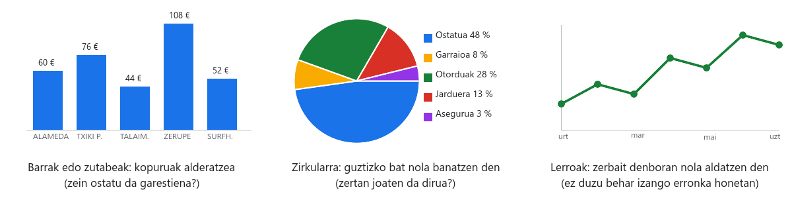

# 05. urratsa · Ulertzen diren grafikoak

**Denbora:** 2 ordu · **Entrega:** Gai / Ez gai

Bezeroari ez diozue berrogei zenbakiko taula bat erakutsiko. Hiru grafiko erakutsiko dizkiozue: zenbat balio duen hautagai bakoitzak, zertan joaten den dirua eta nolakoa den ostatuen eskaintza bere eremuan. Grafiko bat gelaxketatik abiatuta egiten da, beraz datuak aldatzen badira, grafikoa aldatzen da.

## Hasi aurretik: grafiko bakoitzak gauza bat kontatzen du

- **Zutabeak edo barrak**: hainbat gauzaren arteko kopuruak alderatzeko. "Zein da garestiena?" galderari erantzuten diona da.
- **Zirkularra**: guztizko bat bere zatien artean nola banatzen den ikusteko. Zatiek guztizkoa batzen badute bakarrik du zentzua, eta zati gutxirekin (bost edo sei gehienez). Ez sartu inoiz guztizkoa bertan: dirua bikoiztuko luke.
- **Lerroak**: zerbait denborarekin nola aldatzen den ikusteko. Ez duzue behar erronka honetan.

Urrezko arauak edozein grafikotarako: zer ikusten ari den esaten duen **izenburu** bat, **ardatzak** izenarekin eta unitatearekin (€ pertsonako), **etiketak** balioekin gutxi badira, eta azpian lerro bat datuen **iturriarekin**. Eta 3D efekturik ez: irakurtzeko zailagoak dira.

## 1. Zutabe-grafikoa: zenbat balio du hautagai bakoitzak

1. Sortu `Grafikoak` orria.
2. Joan `Hautagaiak` orrira eta hautatu `A1:A6` (izenak). `Ctrl` sakatuta, hautatu `M1:M6` ere (*Ostatua pertsonako*). Horrela elkarren ondoan ez dauden bi zutabe hautatuta dituzu.
3. `Txertatu > Diagrama` (gazt. `Insertar > Gráfico`). **Diagramen editorea** irekitzen da eskuinean. *Diagrama mota* atalean aukeratu **Zutabe-diagrama**.
4. *Pertsonalizatu* fitxa ▸ *Diagramaren eta ardatzen izenburuak*: izenburua `Ostatua pertsonako (N gau)` zuen bezeroaren gauekin; ardatz bertikalaren izenburua `€ pertsonako`.
5. *Pertsonalizatu* ▸ *Seriea* ▸ markatu **Datu-etiketak** zutabe bakoitzak bere zenbatekoa gainean eraman dezan.
6. Moztu grafikoa (`Ctrl+X`) eta itsatsi `Grafikoak` orrian (`Ctrl+V`). `Hautagaiak` orriarekin konektatuta jarraitzen du: aldatu tarifa bat eta begira nola mugitzen den.

## 2. Grafiko zirkularra: zertan joaten da dirua

1. `Aurrekontua` orrian, hautatu `A2:A6` eta, `Ctrl` sakatuta, `C2:C6`. Bost gastuak bakarrik: ez deskontua, ez guztizkoa, ez muga.
2. `Txertatu > Diagrama` ▸ **Diagrama zirkularra** mota.
3. *Pertsonalizatu* ▸ *Diagrama zirkularra* ▸ *Sektorearen etiketa*: **Ehunekoa**. Izenburua: `Zertan joaten da dirua? (pertsonako)`.
4. Eraman `Grafikoak` orrira, aurrekoaren ondora.
5. Probatu: aldatu jarduera `Aurrekontua` orriko goitibeherakoan. Zatiak aldatu behar du. Aldatzen ez bada, grafikoak kopiatutako balioei begiratzen die formulei beharrean.

## 3. Zutabe-grafikoa: eskaintza bezeroaren eremuan

Grafiko hau 1.469 ostatuetatik ateratzen da, ez zuen bostetatik. Bezeroari "dagoen guztia begiratu dugu" esateko balio du.

1. `Grafikoak` orrian, `A20` gelaxkatik aurrera, muntatu taula bat zortzi ostatu motekin A zutabean (`=Tarifak!A2`, `=Tarifak!A3`... formulekin ekar ditzakezu edo idatzi) eta `Ostatuak eremuan` goiburua `B20` gelaxkan.
2. `B21` gelaxkan idatzi `=CONTAR.SI.CONJUNTO(Garbiketa!B:B; A21; Garbiketa!F:F; Bezeroa!$B$5)` eta arrastatu `B28` gelaxkaraino. Mota bakoitzeko ostatuak zenbatzen ditu, probintzia bezeroarena dutenak (egiaztatu zure `Garbiketa` orrian mota B zutabean dagoela eta probintzia F zutabean; bestela, aldatu letrak).
3. Zuen bezeroak probintziarik ez badu, eremua baizik (surflari koadrila edo Arabako Errioxako aitona-amonak), zenbatu *Marcas* zutabearen arabera komodin batekin: `=CONTAR.SI.CONJUNTO(Garbiketa!B:B; A21; Garbiketa!G:G; "*" & Bezeroa!$B$5 & "*")`. Izartxoek "barruan du" esan nahi dute.
4. Hautatu `A20:B28` ▸ `Txertatu > Diagrama` ▸ **Zutabe-diagrama**. Izenburua: `Ostatuak motaren arabera ` eta zuen eremua. Ardatz bertikala: `Ostatu kopurua`.
5. Alderatu `Laburpena` orriko taula dinamikoarekin: zenbakiek bat etorri behar dute.

## 4. Letra txikia

Grafiko bakoitzaren azpian, gelaxka batean, idatzi iturria:

- Lehen bietan: `Gelako jarduera baterako simulatutako prezioak.`
- Hirugarrenean: `Datuak: Open Data Euskadi, ostatu turistikoak, (zuen data) deskargatuak.`

Ordenatu hiru grafikoak `Grafikoak` orrian elkar estal ez dezaten eta taulak estal ez ditzaten. Aldatu tamaina izkina batetik.

## 5. Erantzun Erantzunak orrian

| Zk. | Galdera |
|---|---|
| 5.1 | Zutabe-grafikoari bakarrik begiratuta, zein hautagai da garestiena eta zenbat garestiagoa da merkeena baino? |
| 5.2 | Zein gastuk eramaten du aurrekontuaren zatirik handiena eta gutxi gorabehera zein ehuneko da? |
| 5.3 | Zein ostatu mota da ugariena bezeroaren eremuan? Zuek aukeratu duzuen mota da? Ez bada, zergatik? |

## Egiaztatu entregatu aurretik

- [ ] Hiru grafiko `Grafikoak` orrian, bakoitza izenburuarekin, izendun ardatzekin eta iturria azpian.
- [ ] Zirkularrak ez du guztizkoa ez deskontua barne hartzen eta ehunekoak erakusten ditu.
- [ ] `Aurrekontua` orriko goitibeherako bat aldatzean, zirkularra aldatzen da.
- [ ] Hirugarren grafikoa taula dinamikoarekin bat dator.
- [ ] `Erantzunak` orriak 5.1etik 5.3ra ditu. Izendun bertsioa: `05. urratsa entregatuta`.

## Nota igotzeko

- **Minigrafiko** bat `Hautagaiak` orriko errenkada bakoitzean: `P2` gelaxkan idatzi `=SPARKLINE(M2; {"charttype"\"bar"; "max"\MAX($M$2:$M$6)})` eta arrastatu. Barra bat marrazten du gelaxkaren barruan, kostuaren proportzionala. Ingelesez konfiguratutako orrietan giltzek komak dituzte `\` eta `;` beharrean.
- Ordenatu zutabe-grafikoa merkeenetik garestienera: editorearen *Konfigurazioa* atalean, markatu *Ordenatu* zenbatekoen zutabearen arabera... edo, errazago, ordenatu `Hautagaiak` orriko errenkadak `Datuak > Ordenatu barrutia` (gazt. `Datos > Ordenar intervalo`) aukerarekin M zutabearen arabera.

## Entrega

Orriaren esteka, `05. urratsa entregatuta` bertsioarekin.
