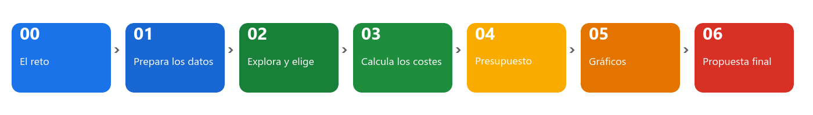
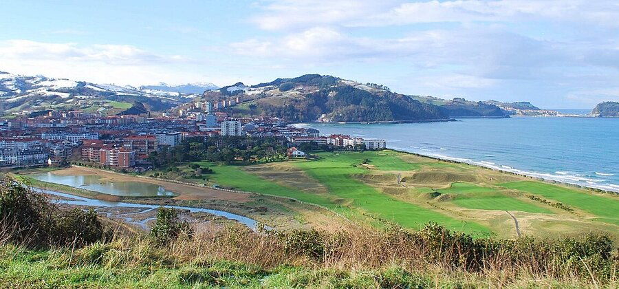
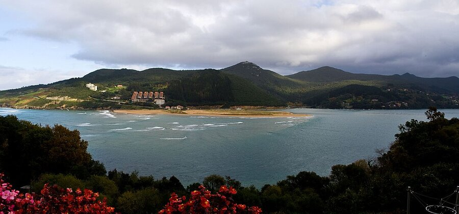

# Paso 00 · El reto: tu agencia de escapadas

Durante las próximas semanas tu grupo es una **agencia de viajes**. Un cliente os pide que le organicéis una escapada por Euskadi y vosotros tenéis que proponerle el alojamiento, hacerle las cuentas y presentárselo bonito. Todo con una hoja de cálculo de Google y con datos reales: los **1.469 alojamientos turísticos** que el Gobierno Vasco publica en Open Data Euskadi.

No hay que reservar nada ni llamar a nadie. Hay que aprender a usar una hoja de cálculo para tomar una decisión con datos, que es para lo que sirven.

## Qué vais a hacer, paso a paso

| Paso | Qué hacéis | Lo que aprendéis | Tiempo |
|---|---|---|---|
| 00 | Formar el grupo, elegir cliente y crear la hoja compartida | Compartir, historial de versiones | 1 h |
| 01 | Importar los datos y limpiarlos | Hojas, filas y columnas, inmovilizar, funciones de contar | 3 h |
| 02 | Buscar los alojamientos que valen para el cliente | Ordenar, filtrar, **vistas de filtro**, formato condicional, tabla dinámica | 3 h |
| 03 | Calcular lo que cuesta cada opción | Fórmulas, referencias con `$`, **BUSCARV**, MIN, MAX, PROMEDIO | 3 h |
| 04 | Montar el presupuesto con desplegables y semáforo | **Validación de datos**, casillas, SI, porcentajes, proteger celdas | 3 h |
| 05 | Hacer los gráficos | Gráficos de columnas y circular, títulos y etiquetas | 2 h |
| 06 | Presentar la propuesta al cliente | Ficha final, documento con gráficos enlazados, PDF, demo | 2 h |

Cada paso es una tarea de Moodle. Se entregan en orden y cada una se apoya en la anterior: **no hay que empezar de cero nunca**, el libro va creciendo.

## Los clientes

Cada grupo trabaja para **un cliente**. Lo asigna el profesor (o lo sorteáis). Leed bien la ficha: ahí están las condiciones que luego tendréis que convertir en filtros y en fórmulas.

### Cliente A · La familia Etxeberria

| | |
|---|---|
| **Quiénes** | Dos adultos y dos niños (4 personas) |
| **Noches** | 3 |
| **Dónde** | Gipuzkoa |
| **Tipo de alojamiento** | Agroturismo o casa rural |
| **Condiciones** | Que quepan los cuatro. A los niños les hace ilusión ver animales, así que un agroturismo suma puntos |
| **Límite** | 200 € por persona, con todo (alojamiento, transporte, comidas y actividad) |
| **Columnas que os harán falta** | Provincia, Tipo de Alojamiento, Capacidad |

### Cliente B · La cuadrilla surfera

| | |
|---|---|
| **Quiénes** | Seis amigos con tablas de surf (6 personas) |
| **Noches** | 2 |
| **Dónde** | La costa, les da igual el territorio |
| **Tipo de alojamiento** | Albergue, apartamento, camping o pensión. Hotel solo si sale a cuenta |
| **Condiciones** | Que el alojamiento esté preparado para surfistas (columna *Surfing* = 1) y que quepan los seis |
| **Límite** | 120 € por persona, con todo. Quieren una clase de surf |
| **Columnas que os harán falta** | Surfing, Tipo de Alojamiento, Capacidad, Municipio |

### Cliente C · La despedida de Ane

| | |
|---|---|
| **Quiénes** | Diez amigas de Ane (10 personas) |
| **Noches** | 2 |
| **Dónde** | Araba/Álava |
| **Tipo de alojamiento** | Casa rural, agroturismo o apartamento, para estar todas juntas |
| **Condiciones** | Capacidad de 10 o más. Quieren una actividad en grupo |
| **Límite** | 170 € por persona, con todo |
| **Columnas que os harán falta** | Provincia, Tipo de Alojamiento, Capacidad |

### Cliente D · La empresa Zubiri S.L.

| | |
|---|---|
| **Quiénes** | Quince trabajadores en una jornada de formación (15 personas) |
| **Noches** | 1 |
| **Dónde** | Bilbao |
| **Tipo de alojamiento** | Hotel |
| **Condiciones** | Con sala de reuniones y restaurante (columnas *Sala de Reuniones* y *Restaurante* = 1). Capacidad de 15 o más |
| **Límite** | 180 € por persona, con todo. La empresa paga, pero la jefa mira las cuentas |
| **Columnas que os harán falta** | Municipio, Tipo de Alojamiento, Sala de Reuniones, Restaurante, Categoría, Capacidad |

### Cliente E · El viaje de estudios

| | |
|---|---|
| **Quiénes** | Veinticuatro alumnos y dos profesores (26 personas) |
| **Noches** | 2 |
| **Dónde** | Bizkaia, a ser posible en la costa |
| **Tipo de alojamiento** | Albergue o camping |
| **Condiciones** | Capacidad de 26 o más. Transporte en autobús alquilado |
| **Límite** | 100 € por persona, con todo. Es lo que han sacado vendiendo lotería |
| **Columnas que os harán falta** | Provincia, Tipo de Alojamiento, Capacidad, Marcas |

### Cliente F · Aitona y amona, de celebración

| | |
|---|---|
| **Quiénes** | Una pareja que celebra sus bodas de oro (2 personas) |
| **Noches** | 2 |
| **Dónde** | Rioja Alavesa (columna *Marcas*) |
| **Tipo de alojamiento** | Hotel o agroturismo, con restaurante |
| **Condiciones** | Restaurante = 1. Quieren visitar una bodega |
| **Límite** | 320 € por persona, con todo. Es una ocasión especial, pero sin pasarse |
| **Columnas que os harán falta** | Marcas, Tipo de Alojamiento, Restaurante, Categoría |

## Las reglas del juego

1. **Un solo archivo para todo el reto.** Una hoja de cálculo de Google llamada `Agencia_GrupoXX` (con vuestro número de grupo). En cada paso añadís hojas; nunca borráis las anteriores.
2. **La hoja `Datos` no se toca.** Es la copia original. Todo el trabajo se hace en otras hojas.
3. **Lo que se pueda calcular, se calcula con una fórmula.** Nada de escribir resultados a mano. Si cambiáis un dato, todo lo demás tiene que actualizarse solo.
4. **Los precios son inventados.** Los alojamientos, municipios y capacidades son reales; las tarifas os las damos nosotros para practicar. Lo tenéis que decir en la propuesta final.
5. **Teclado rotatorio.** En cada sesión escribe una persona distinta. Al final, cualquiera del grupo tiene que saber explicar cualquier fórmula del libro.
6. **Cuando terminéis un paso, ponedle nombre a la versión**: `Archivo > Historial de versiones > Asignar nombre a la versión actual`, por ejemplo `Paso 01 entregado`. Así siempre podéis volver atrás si algo se rompe.

> [!TIP]
> Si el grupo trabaja a la vez en la misma hoja, cada uno puede abrir su propia **vista de filtro** sin molestar a los demás. Lo veréis en el paso 02. Hasta entonces, hablad antes de borrar nada.

## Cómo se entrega y cómo se evalúa

- En cada tarea de Moodle entregáis el **enlace** a la hoja compartida y escribís qué versión le habéis puesto de nombre. Antes comprobad que el profesor tiene permiso de **edición** (`Compartir`, arriba a la derecha).
- Los pasos 01 a 05 se corrigen como **Apto / No apto**. Si algo no está bien, el profesor os dirá qué corregir y lo volvéis a entregar.
- El paso 06 se califica **sobre 10** con la rúbrica que viene en esa tarea. Cuenta lo que hay en el libro, el documento final y la demostración en clase.

## Lo que tenéis que hacer en este paso

1. Formad el grupo (tres personas) y apuntad quién hace qué en la primera sesión: una persona al teclado, una leyendo las instrucciones y otra comprobando resultados. Cambiáis en cada sesión.
2. Averiguad qué cliente os ha tocado y leed su ficha dos veces. Escribid con vuestras palabras, en una frase, qué le vais a buscar.
3. Entrad en [Google Drive](https://drive.google.com) con la cuenta del centro, cread una carpeta `Agencia_GrupoXX` y dentro una hoja de cálculo nueva con el mismo nombre.
4. Compartidla con los tres integrantes y con el profesor, todos como **Editor**.
5. En la primera hoja (dejadla llamada `Hoja 1` por ahora) escribid en `A1` el nombre del grupo, en `A2` los integrantes y en `A3` el cliente que os ha tocado.

## Entrega

En la tarea de Moodle: el enlace a la hoja de cálculo y la frase que describe lo que le vais a buscar al cliente.

## Créditos de las imágenes

- Bahía de la Concha: Ermell, [*San Sebastian panoramic 1190606*](https://commons.wikimedia.org/wiki/File:San_Sebastian_panoramic_1190606.jpg), CC BY-SA 4.0.
- Caserío: Txapisotegi, [*Iztueta Berri*](https://commons.wikimedia.org/wiki/File:Iztueta_Berri.jpg), CC BY-SA 4.0.
- Zarautz: Jean Michel Etchecolonea, [*Zarautz Vue Camping (2)*](https://commons.wikimedia.org/wiki/File:Zarautz_Vue_Camping_%282%29.jpg), CC BY-SA 3.0.
- Vitoria-Gasteiz: Basotxerri, [*Vitoria - Plaza de la Virgen Blanca 01*](https://commons.wikimedia.org/wiki/File:Vitoria_-_Plaza_de_la_Virgen_Blanca_01.jpg), CC BY-SA 4.0.
- Guggenheim: José Ligero Loarte, [*Museo Guggenheim, 2021, Bilbao*](https://commons.wikimedia.org/wiki/File:Museo_Guggenheim_--_2021_--_Bilbao,_Euskadi,_Espa%C3%B1a.jpg), CC BY-SA 4.0.
- Mundaka: Licinian, [*MundakaCoast*](https://commons.wikimedia.org/wiki/File:MundakaCoast.jpg), CC BY-SA 3.0.
- Laguardia: Basotxerri, [*Laguardia - Viñedo 01*](https://commons.wikimedia.org/wiki/File:Laguardia_-_Vi%C3%B1edo_01.jpg), CC BY-SA 4.0.
- Todas en Wikimedia Commons. Los esquemas de los pasos están hechos para este reto y son de uso libre.
