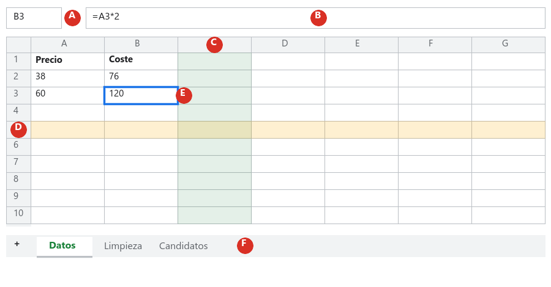
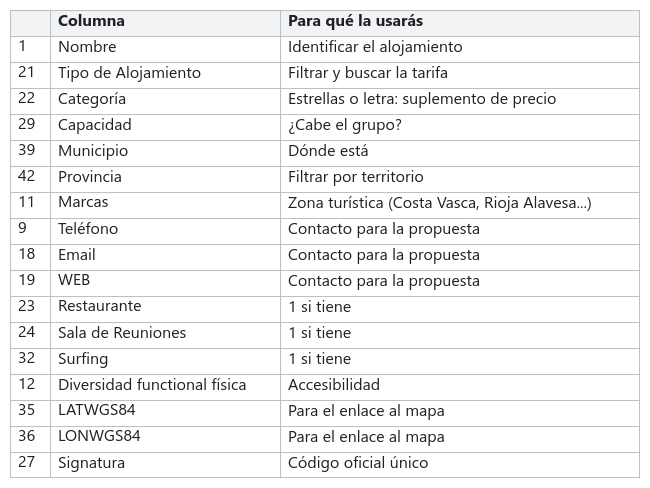

# Paso 01 · Prepara los datos

**Tiempo:** 3 horas · **Entrega:** Apto / No apto

Los datos reales nunca vienen limpios. Vienen con columnas vacías, nombres repetidos y números que no son números. En este paso traéis el archivo de Open Data Euskadi a vuestra hoja de cálculo y lo dejáis listo para trabajar. Es la parte menos vistosa del reto, pero sin ella nada de lo que viene después funciona.

## Antes de empezar: cómo se llama cada cosa

*A. **Cuadro de nombre**: dice en qué celda estás (B3). B. **Barra de fórmulas**: muestra lo que hay de verdad en la celda; si es una fórmula, la ves aquí aunque la celda enseñe el resultado. C. **Columna**: vertical, con letra. D. **Fila**: horizontal, con número. E. **Celda activa**: la que tiene el borde azul, el cruce de una columna y una fila (B3 = columna B, fila 3). F. **Pestañas de hojas**: un mismo archivo puede tener muchas hojas; con el + añades otra.*

Un **rango** es un grupo de celdas: `A2:A10` son las celdas de la A2 a la A10. `A:A` es la columna A entera. Lo vas a escribir mucho.

## 1. Descarga el archivo

1. Entra en el catálogo de [Open Data Euskadi](https://opendata.euskadi.eus/catalogo/-/alojamientos/) y localiza el conjunto **Alojamientos turísticos de Euskadi**.
2. Antes de descargar, lee la ficha: quién publica los datos, cada cuánto se actualizan y qué licencia tienen. Lo necesitaréis para la propuesta final.
3. Descarga el formato **XLSX**. Los demás (JSON, XML, GeoJSON) son para programar.
4. Apunta en algún sitio la **fecha y la hora** de la descarga. Los datos cambian y vuestros números tienen que poder comprobarse.

> [!NOTE]
> Si el portal no funciona ese día, el profesor tiene una copia descargada el 30 de septiembre de 2026.

## 2. Tráelo a tu hoja de cálculo

1. Abre vuestra hoja `Agencia_GrupoXX` y ve a `Archivo > Importar`.
2. Pestaña **Subir**, arrastra el XLSX.
3. En *Ubicación de importación* elige **Insertar hojas nuevas** y pulsa *Importar datos*. Aparece una hoja nueva con los 1.470 renglones (una cabecera y 1.469 alojamientos).
4. Cambia el nombre de esa hoja a `Datos` (doble clic en la pestaña). Esta hoja **no se toca más**.
5. Duplícala: pestaña `Datos` ▸ flecha ▸ **Duplicar**. Llama a la copia `Limpieza`. Aquí trabajaréis.
6. En `Limpieza`, `Ver > Inmovilizar > 1 fila`: así los nombres de las columnas se quedan quietos cuando bajas.

## 3. Haz las cuentas antes de limpiar

Para limpiar bien hay que saber qué hay. Crea una hoja `Respuestas` con cuatro columnas: `Nº`, `Pregunta`, `Respuesta` y `Dónde se comprueba`. Las respuestas de cada paso van ahí, con el número de la pregunta, y la celda donde está la fórmula en la última columna.

Las funciones que necesitas, con un ejemplo cada una (escríbelas en una hoja `Pruebas` si quieres ensayar):

| Función | Qué cuenta | Ejemplo |
|---|---|---|
| `=CONTARA(Limpieza!A2:A)` | Celdas **con algo** en la columna A, desde la fila 2 hasta el final | Cuántos alojamientos hay |
| `=CONTAR.BLANCO(Limpieza!I2:I)` | Celdas **vacías** en la columna I | Cuántos no tienen teléfono |
| `=CONTAR.SI(Limpieza!V2:V; "S")` | Cuántas celdas de la columna V son exactamente "S" | Cuántos alojamientos tienen categoría S |
| `=CONTAR.SI(Limpieza!AC2:AC; 0)` | Cuántas celdas de la columna AC valen 0 | Cuántos tienen capacidad cero |
| `=UNIQUE(Limpieza!V2:V)` | Lista los valores distintos de la columna V, sin repetir | Qué categorías existen |
| `=C2/B2` con formato de porcentaje | Una parte entre el total | Qué porcentaje no tiene teléfono |

> [!TIP]
> El separador entre los trozos de una fórmula es el **punto y coma** (`;`) si tu hoja está en castellano. Si te da error, prueba con coma: depende de la configuración de la cuenta. Y fíjate en que las letras de columna cambian cuando borras columnas: comprueba siempre la letra en la cabecera.

Cuando selecciones un rango, mira abajo a la derecha: la hoja te enseña **Suma, Promedio, Recuento**. Sirve para comprobar rápido, pero en `Respuestas` tiene que estar la fórmula.

## 4. Quita lo que sobra

El archivo tiene 52 columnas y vais a usar 17. Las demás solo estorban.

1. En `Limpieza`, recorre la fila 1 con calma. Verás columnas **completamente vacías** (compruébalo con `CONTARA`: si da 0, está vacía) y columnas que se llaman **igual** dos veces, por ejemplo *Dirección* y *Teléfono*. Dos columnas con el mismo nombre dan problemas en cuanto haces una tabla dinámica.
2. Borra todas las columnas que **no** estén en la lista de arriba: selecciona sus letras (con `Ctrl` puedes seleccionar varias) ▸ botón derecho ▸ *Eliminar columnas*. Antes de borrar cada bloque apunta qué quitas en una hoja nueva llamada `Registro`, con dos columnas: *Qué he hecho* y *Por qué*.
3. Ordena las 17 columnas que quedan como en la imagen (arrastra la cabecera con el ratón) y pon la fila 1 en negrita.
4. Comprueba que **Capacidad es un número**: selecciona la columna y mira si abajo aparece *Suma*. Si solo aparece *Recuento*, está guardada como texto: selecciona la columna, `Formato > Número > Número` y, si hace falta, vuelve a escribir las celdas que fallen.
5. Pasa `Datos > Limpieza de datos > Recortar espacios en blanco` a las columnas de texto (Nombre, Municipio, Tipo). Los espacios al final de un texto son invisibles y rompen las búsquedas.

> [!WARNING]
> **No uses "Eliminar duplicados" a lo loco.** Hay 58 nombres que se repiten, pero muchos son alojamientos distintos con el mismo nombre en municipios distintos. Borrar por nombre destruye datos buenos. La columna que identifica a cada alojamiento es *Signatura*. Si dos filas tienen la misma signatura, el mismo municipio y el mismo nombre, entonces sí es un duplicado.

## 5. Responde en la hoja Respuestas

| Nº | Pregunta |
|---|---|
| 1.1 | ¿Cuántos alojamientos y cuántas columnas tiene el archivo original? ¿Qué día y a qué hora lo descargasteis? |
| 1.2 | ¿Cuántas columnas estaban completamente vacías? ¿Cuáles? |
| 1.3 | ¿Qué nombres de columna aparecían dos veces? |
| 1.4 | ¿Cuántos alojamientos no tienen teléfono, cuántos no tienen email y cuántos no tienen web? Dad el número y el porcentaje, con la fórmula. |
| 1.5 | ¿Qué valores distintos toma *Categoría*? ¿Tiene sentido calcular su media? ¿Por qué? |
| 1.6 | ¿Cuántos alojamientos tienen capacidad 0? ¿Qué habéis decidido hacer con ellos? |

## Comprueba antes de entregar

- [ ] `Datos` sigue intacta, con sus 52 columnas.
- [ ] `Limpieza` tiene las 17 columnas de la lista, la fila 1 inmovilizada y en negrita.
- [ ] *Capacidad* suma (es un número).
- [ ] `Registro` explica qué habéis quitado y por qué.
- [ ] `Respuestas` tiene las seis preguntas con su fórmula al lado.
- [ ] Habéis puesto nombre a la versión: `Paso 01 entregado`.

## Para subir nota

- Con `=CONTAR.SI(Limpieza!A2:A; A2)` en una columna auxiliar averigua qué nombres se repiten y mira si alguno es un duplicado de verdad (misma signatura). Explica en `Registro` qué has encontrado.
- Pon un **formato condicional** (`Formato > Formato condicional`, regla *La celda está vacía*) a las columnas Teléfono, Email y WEB para que las celdas vacías se vean en rojo claro.

## Entrega

El enlace a la hoja, con la versión `Paso 01 entregado`.
