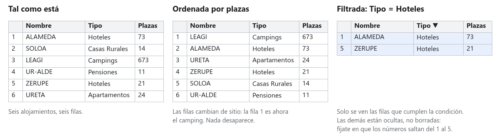
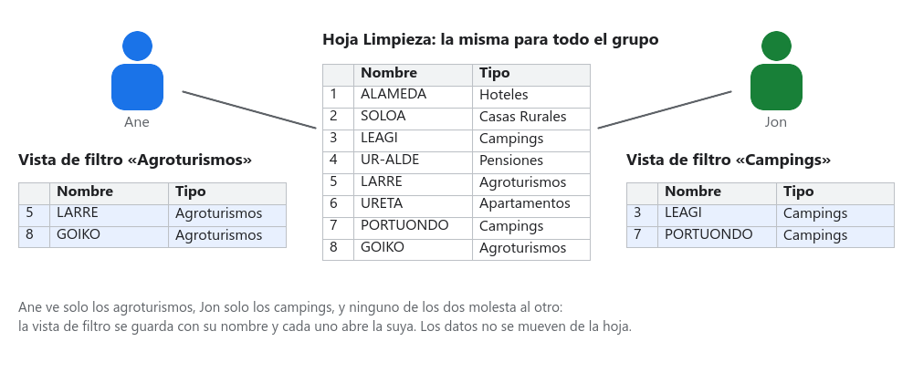

# Paso 02 · Explora y elige cinco candidatos

**Tiempo:** 3 horas · **Entrega:** Apto / No apto

Tenéis 1.469 alojamientos y un cliente con condiciones concretas. En este paso aprendéis a ordenar, filtrar y guardar **vistas de filtro** para encontrar, sin leer las 1.469 filas, los cinco alojamientos que vais a proponerle.

## Antes de empezar: ordenar no es filtrar

- **Ordenar** cambia el orden de las filas (de más plazas a menos, por nombre, por municipio). Todas siguen ahí.
- **Filtrar** esconde las filas que no cumplen una condición. No se borran: cuando quitas el filtro vuelven. Fíjate en los números de fila: si saltan del 1 al 5 es que hay filas ocultas.
- Cada fila es un alojamiento. Al ordenar, la hoja mueve la fila **entera**, así que el nombre, el municipio y las plazas siguen juntos. Si alguna vez ves que no coinciden, es que alguien ha ordenado una sola columna. `Ctrl+Z`.

## 1. Activa el filtro y practica

1. En `Limpieza`, haz clic en cualquier celda con datos y ve a `Datos > Crear un filtro`. Aparece un embudo en cada cabecera.
2. Pulsa el embudo de *Provincia*. Verás la lista de valores con casillas: desmarca *Borrar* y marca solo una provincia. Aceptar. Ya solo ves los alojamientos de esa provincia.
3. Pulsa el embudo de *Capacidad* ▸ *Ordenar de Z a A*: los de más plazas arriba.
4. Pulsa el embudo de *Nombre* y escribe algo en el cuadro de búsqueda, por ejemplo `surf`. Fíjate en que solo aparecen los nombres que lo contienen.
5. En el embudo también hay **Filtrar por condición**: *Mayor o igual que* 10, *El texto contiene* "Zarautz"... Es la manera de filtrar números.
6. Para volver a ver todo, en cada embudo elige *Seleccionar todo*, o quita el filtro entero con `Datos > Quitar filtro`.

> [!TIP]
> ¿Cuántas filas quedan después de filtrar? Escribe en una celda libre, por ejemplo en `S1`, la fórmula `=SUBTOTALES(103; A2:A)`. Cuenta **solo las filas visibles**, así que cambia cada vez que cambias el filtro. Es vuestro contador de candidatos.

## 2. Crea vistas de filtro: una para cada uno

Si los tres filtráis a la vez en la misma hoja, os volvéis locos: lo que uno oculta desaparece para los demás. Para eso existen las **vistas de filtro**.

1. `Datos > Vistas de filtro > Crear una vista de filtro nueva`. La hoja se pone con un marco gris oscuro: estás dentro de una vista.
2. Arriba a la izquierda, ponle **nombre**: lo que filtra, por ejemplo `Agroturismos Gipuzkoa ≥ 4 plazas`.
3. Filtra y ordena como en el apartado anterior. Lo que hagas solo se ve dentro de esta vista.
4. Cierra la vista con la X de la derecha. Los datos vuelven a verse completos, pero la vista queda guardada: la recuperas en `Datos > Vistas de filtro` y aparece con su nombre.
5. Cada integrante crea **al menos una vista** con una condición del cliente, y el grupo crea una vista final que combine todas las condiciones (provincia, tipo, capacidad, lo que pida la ficha). Esa vista final tiene que llamarse `Cliente X · candidatos` (con la letra de vuestro cliente).

Con la vista final abierta, el contador `=SUBTOTALES(103; A2:A)` os dice cuántos alojamientos cumplen todas las condiciones. Si son menos de cinco, relajad una condición y anotadlo en `Respuestas`. Si son más de cien, añadid otra.

## 3. Marca lo que os interesa con color

`Formato > Formato condicional` pinta las celdas que cumplen una regla, automáticamente:

1. Selecciona la columna *Capacidad* entera.
2. `Formato > Formato condicional`, regla *Mayor o igual que*, escribe las personas de vuestro cliente, elige un verde. Listo: a golpe de vista se ve dónde cabe el grupo.
3. Añade otra regla a *Tipo de Alojamiento*: *El texto es exactamente* el tipo que prefiere el cliente, en azul.

## 4. Resume con una tabla dinámica

Una **tabla dinámica** cuenta y agrupa por ti. Vais a usarla para saber cómo es la oferta del territorio del cliente.

1. En `Limpieza`, selecciona todas las columnas con datos (haz clic en la A y arrastra hasta la última) y ve a `Insertar > Tabla dinámica` ▸ *Hoja nueva*. Llama a la hoja `Resumen`.
2. En el panel de la derecha: en **Filas** añade *Tipo de Alojamiento*; en **Valores** añade *Nombre* y, en *Resumir por*, elige `COUNTA`. Ya tienes cuántos alojamientos hay de cada tipo.
3. En **Columnas** añade *Provincia*. Ahora es una tabla con tipos en vertical y territorios en horizontal.
4. En **Filtros** añade *Capacidad* y pon la condición *Mayor o igual que* las personas de vuestro cliente. Mira cómo cambian los números.
5. Comprueba un número a mano con `=CONTAR.SI.CONJUNTO(Limpieza!B:B; "Hoteles"; Limpieza!F:F; "Bizkaia")` (ajusta las letras a tus columnas). Si coincide con la tabla dinámica, las dos están bien.

## 5. Elige los cinco candidatos

1. Crea una hoja `Candidatos` con estas cabeceras en la fila 1: `Nombre`, `Tipo`, `Categoría`, `Municipio`, `Plazas`, `Teléfono`, `Web`, `Latitud`, `Longitud`.
2. Abre vuestra vista `Cliente X · candidatos`. Elegid **cinco alojamientos** que cumplan las condiciones. Tienen que ser de **al menos dos tipos distintos** (por ejemplo tres agroturismos y dos casas rurales): si no, en el paso siguiente todos costarán lo mismo y no habrá nada que comparar.
3. Copiad cada uno en `Candidatos`, un alojamiento por fila (filas 2 a 6). Copiad celda a celda o fila a fila, pero comprobad que el nombre, el municipio y las plazas son los de la misma fila. Las coordenadas están en *LATWGS84* y *LONWGS84*.
4. Debajo de la tabla escribid dos frases: con qué filtros los habéis encontrado y por qué esos cinco y no otros.
5. Cerrad la vista de filtro. `Limpieza` tiene que quedar sin filtros activos.

> [!NOTE]
> Que un alojamiento tenga 26 plazas no significa que tenga 26 plazas libres el fin de semana que quiere el cliente. Esto es una simulación: en la vida real el siguiente paso sería llamar.

## 6. Responde en la hoja Respuestas

| Nº | Pregunta |
|---|---|
| 2.1 | ¿Qué condiciones del cliente habéis convertido en filtros? ¿Cuál no se podía filtrar con los datos y qué habéis hecho? |
| 2.2 | ¿Cuántos alojamientos cumplen todas las condiciones (el número que da `SUBTOTALES` en la vista final)? |
| 2.3 | De los cinco candidatos, ¿cuál tiene más plazas y cuál menos? |
| 2.4 | Según la tabla dinámica, ¿qué tipo de alojamiento es el más abundante en el territorio del cliente? ¿Y el más escaso? |

## Comprueba antes de entregar

- [ ] Hay al menos tres vistas de filtro con nombre, una de ellas `Cliente X · candidatos`.
- [ ] `Limpieza` no tiene filtros activos y nadie ha ordenado una sola columna.
- [ ] *Capacidad* tiene formato condicional en verde a partir de las personas del cliente.
- [ ] `Resumen` tiene la tabla dinámica con tipos, provincias y el filtro de capacidad.
- [ ] `Candidatos` tiene cinco alojamientos completos, de al menos dos tipos, con sus dos frases.
- [ ] `Respuestas` tiene 2.1 a 2.4.
- [ ] Versión con nombre: `Paso 02 entregado`.

## Para subir nota

- Añade a `Resumen` una segunda tabla dinámica con *Municipio* en filas, ordenada de más a menos alojamientos, y filtrada por la provincia del cliente: los diez municipios con más oferta.
- En `Candidatos`, en la columna Q (deja libres de la J a la P, que se usarán en los pasos siguientes), construye un enlace al mapa: `=HIPERVINCULO("https://www.google.com/maps?q=" & H2 & "," & I2; "Ver en el mapa")`. Haz clic y comprueba que el alojamiento está donde dice.

## Entrega

El enlace a la hoja, con la versión `Paso 02 entregado`.
