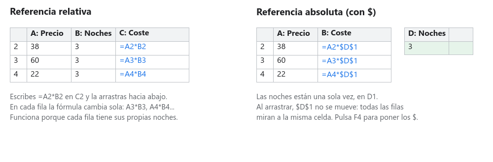
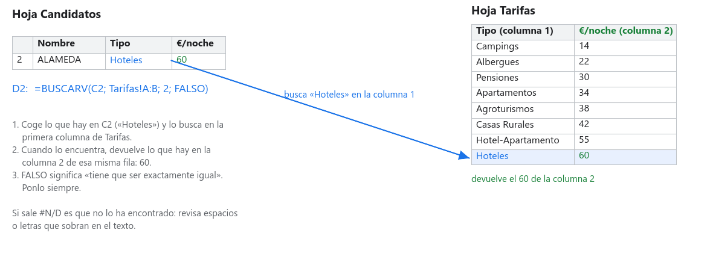

# Paso 03 · Calcula lo que cuesta cada candidato

**Tiempo:** 3 horas · **Entrega:** Apto / No apto

Ya tenéis cinco alojamientos. Ahora toca saber cuánto costaría dormir en cada uno. Los datos de Open Data no tienen precios, así que la agencia trabaja con una **tabla de tarifas simulada**: un precio base según el tipo de alojamiento y un suplemento según la categoría. Con eso, unas cuantas fórmulas y la función BUSCARV, la hoja calcula sola el coste de cada opción.

## Antes de empezar: fórmulas que se copian

Una fórmula empieza por `=` y puede usar números, operaciones (`+ - * /`) y **referencias** a otras celdas. `=B2*C2` es mejor que `=38*3`, porque si cambia el precio o las noches, el resultado cambia solo.

- Cuando arrastras una fórmula hacia abajo (el cuadradito azul de la esquina de la celda), la hoja cambia los números de fila: `=A2*B2` se convierte en `=A3*B3`. Es una **referencia relativa** y casi siempre es lo que quieres.
- Si una celda tiene que quedarse fija al copiar (las noches del viaje, que están una sola vez en una celda), le pones `$` delante de la letra y del número: `$B$2`. Es una **referencia absoluta**. Con el cursor dentro de la referencia, la tecla `F4` pone y quita los `$`.
- Para usar una celda de otra hoja se escribe el nombre de la hoja, una exclamación y la celda: `Cliente!B2`. Si copias la fórmula hacia abajo también cambia a `Cliente!B3`, así que normalmente la querrás con `$`: `Cliente!$B$2`.

## 1. La hoja Cliente

Crea una hoja `Cliente` con los datos de la ficha de vuestro cliente. Todo lo que dependa de ellos se calculará desde aquí, así que si cambia el cliente solo cambiáis esta hoja.

| | A | B |
|---|---|---|
| 1 | Cliente | *Letra y nombre del cliente* |
| 2 | Personas | *por ejemplo* 4 |
| 3 | Noches | *por ejemplo* 3 |
| 4 | Límite por persona | *por ejemplo* 200 |
| 5 | Territorio o zona | *por ejemplo* Gipuzkoa |

Pon formato de moneda a `B4`: selecciona la celda y pulsa el botón `€` de la barra de herramientas (o `Formato > Número > Moneda`).

## 2. La hoja Tarifas

Crea una hoja `Tarifas` y copia estas tablas tal cual, cada una en su sitio. Los nombres de los tipos tienen que estar escritos **exactamente** como en los datos (con mayúsculas, acentos y plurales), porque BUSCARV los va a comparar letra a letra.

**Tarifa base, en `A1:B9`** (euros por persona y noche):

| Tipo de Alojamiento | Tarifa base |
|---|---|
| Campings | 14 |
| Albergues | 22 |
| Pensiones | 30 |
| Apartamentos | 34 |
| Agroturismos | 38 |
| Casas Rurales | 42 |
| Hotel-Apartamento | 55 |
| Hoteles | 60 |

**Suplemento por categoría, en `D1:E9`** (se suma a la tarifa base):

| Categoría | Suplemento |
|---|---|
| 1 | 0 |
| 2 | 6 |
| 3 | 15 |
| 4 | 35 |
| 5 | 90 |
| S | 0 |
| P | 8 |
| T | 0 |

Las categorías 1 a 5 son las estrellas de hoteles, pensiones y apartamentos. *S* significa que ese tipo de alojamiento no tiene categoría. *P*, *S* y *T* en los campings son primera, segunda y tercera.

Las demás tablas de `Tarifas` (transporte, comidas, actividades) las añadiréis en el paso 04.

## 3. BUSCARV: que la hoja busque por ti

Podríais mirar la tarifa de cada candidato y escribirla a mano. Pero son cinco ahora y podrían ser cincuenta, y si cambiáis una tarifa tendríais que repasarlo todo. Para eso está **BUSCARV**: busca un valor en la primera columna de una tabla y te devuelve lo que hay en otra columna de esa misma fila.

`=BUSCARV(qué busco; dónde; qué columna devuelvo; FALSO)`

- **Qué busco**: la celda con el tipo del candidato, por ejemplo `B2`.
- **Dónde**: la tabla de tarifas, `Tarifas!A:B`. La primera columna del rango tiene que ser la que contiene lo que buscas.
- **Qué columna devuelvo**: contando desde la primera del rango. `2` es la tarifa.
- **FALSO**: que solo valga si coincide exactamente. Ponlo siempre.

*Lo mismo explicado en la ayuda de Google Sheets: search_key es lo que buscas, index la columna que devuelve y return value el resultado. © Google.*

Si BUSCARV devuelve `#N/D` es que no ha encontrado el texto. Casi siempre es un espacio de más o una letra distinta: compara la celda del candidato con la de `Tarifas` letra a letra.

## 4. Las columnas de coste en Candidatos

En `Candidatos`, a la derecha de *Longitud* (columna I), añade estas cabeceras en la fila 1 y escribe la fórmula de la fila 2. Luego selecciona `J2:O2` y arrastra hasta la fila 6.

| Columna | Cabecera | Fórmula en la fila 2 | Qué hace |
|---|---|---|---|
| J | Tarifa base | `=BUSCARV(B2; Tarifas!A:B; 2; FALSO)` | Busca el tipo en la tabla de tarifas |
| K | Suplemento | `=BUSCARV(C2; Tarifas!D:E; 2; FALSO)` | Busca la categoría en la tabla de suplementos |
| L | € por persona y noche | `=J2+K2` | Precio de una noche para una persona |
| M | Alojamiento por persona | `=L2*Cliente!$B$3` | Todas las noches, una persona |
| N | Alojamiento del grupo | `=M2*Cliente!$B$2` | Todas las noches, todo el grupo |
| O | ¿Cabe el grupo? | `=SI(E2>=Cliente!$B$2; "Sí"; "No")` | Compara las plazas con las personas |

Fíjate en los `$`: las noches y las personas están una sola vez en `Cliente`, así que la referencia va fija. Cuando arrastres, `B2` cambiará a `B3`, pero `Cliente!$B$3` no.

Da formato de moneda a `J2:N6` (selecciona y pulsa `€`). El formato solo cambia cómo se ve el número, no el cálculo. No lo apliques a las plazas.

La función `SI` tiene tres partes separadas por punto y coma: una pregunta (`E2>=Cliente!$B$2`), lo que escribe si la respuesta es sí, y lo que escribe si es no. Los textos van entre comillas.

## 5. Resumen de las cinco opciones

Debajo de la tabla, en `A9:B12`:

| | A | B |
|---|---|---|
| 9 | Más barato por persona | `=MIN(M2:M6)` |
| 10 | Más caro por persona | `=MAX(M2:M6)` |
| 11 | Precio medio | `=PROMEDIO(M2:M6)` |
| 12 | Diferencia entre el más caro y el más barato | `=B10-B9` |

`MIN` y `MAX` devuelven un importe, no un nombre. Para saber **cuál** es el más barato tienes dos opciones: mirar la tabla, o la fórmula `=INDICE(A2:A6; COINCIDIR(B9; M2:M6; 0))`, que busca el importe mínimo en la columna M y devuelve el nombre de esa fila. Esta segunda es para subir nota.

## 6. Juega con los datos

Esto es lo que diferencia una hoja de cálculo de una calculadora. En `Cliente`:

1. Cambia las noches de 3 a 4. Mira cómo cambian M y N en los cinco candidatos, y el resumen. Vuelve a dejarlo.
2. Cambia las personas por un número mayor que las plazas de algún candidato. La columna *¿Cabe el grupo?* tiene que pasar a "No". Vuelve a dejarlo.
3. En `Tarifas`, sube la tarifa de los hoteles a 80. ¿Qué candidatos cambian? Vuelve a dejarlo.

Cada integrante hace una de las tres pruebas y explica a los otros dos qué ha cambiado y por qué.

## 7. Responde en la hoja Respuestas

| Nº | Pregunta |
|---|---|
| 3.1 | ¿Qué candidato es el más barato por persona y cuál el más caro? ¿Cuánto cuesta cada uno para todo el grupo? |
| 3.2 | ¿Cuál es el precio medio por persona? Copia la fórmula. |
| 3.3 | Si el cliente se queda una noche más, ¿cuánto sube el alojamiento más barato por persona? |
| 3.4 | ¿Caben en todos? Si alguno no, ¿por qué lo habíais elegido? |

## Comprueba antes de entregar

- [ ] `Cliente` tiene personas, noches y límite, y las fórmulas se alimentan de ahí.
- [ ] `Tarifas` tiene las dos tablas con los nombres escritos exactamente igual que en los datos.
- [ ] En `Candidatos`, J2:O6 son fórmulas (haz clic en una celda y mira la barra de fórmulas), no números escritos a mano.
- [ ] Ninguna celda muestra `#N/D` ni `#¡VALOR!`.
- [ ] El resumen MIN, MAX y PROMEDIO está en A9:B12.
- [ ] `Respuestas` tiene 3.1 a 3.4.
- [ ] Versión con nombre: `Paso 03 entregado`.

## Para subir nota

- **Suplemento de zona**: en Donostia, Bilbao y Vitoria-Gasteiz todo es más caro. Añade una columna P *Suplemento de zona* con `=SI(O(D2="Donostia / San Sebastián"; D2="Bilbao"; D2="Vitoria-Gasteiz"); 15; 0)` y súmala en L. La función `O` devuelve verdadero si se cumple cualquiera de las condiciones.
- Pon la fórmula de `INDICE` y `COINCIDIR` del apartado 5 para que el resumen diga el nombre del más barato y del más caro.

## Entrega

El enlace a la hoja, con la versión `Paso 03 entregado`.
