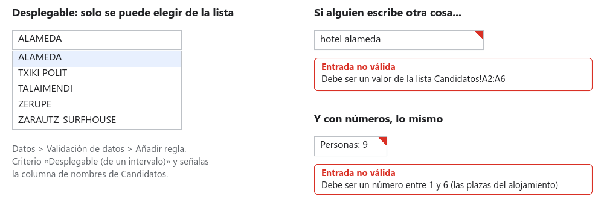
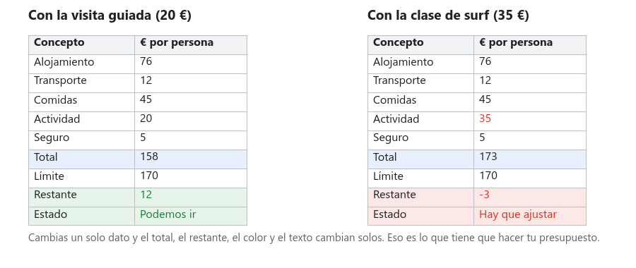

# Paso 04 · El presupuesto, con desplegables y semáforo

**Tiempo:** 3 horas · **Entrega:** Apto / No apto

Hasta ahora sabéis cuánto cuesta dormir. Ahora montáis el **presupuesto completo**: alojamiento, transporte, comidas, actividad y extras. Y lo hacéis a prueba de errores: el cliente elige las opciones en **desplegables**, no puede escribir cualquier cosa, y un **semáforo** le dice si se pasa del límite.

## Antes de empezar: validación de datos

Una celda normal admite lo que sea: un número, un texto, una fecha, una falta de ortografía. La **validación de datos** le pone una regla a la celda: "aquí solo se puede elegir uno de estos cinco nombres", "aquí solo un número entre 1 y 6", "aquí solo una casilla marcada o sin marcar".

- Está en `Datos > Validación de datos > Añadir regla`. Eliges el **intervalo** al que se aplica y el **criterio**.
- Criterios que vais a usar: **Desplegable (de un intervalo)**, que coge las opciones de un rango de celdas; **Desplegable**, con opciones escritas a mano; **Está entre**, para números; y **Casilla**.
- En *Opciones avanzadas* decides qué pasa si alguien escribe otra cosa: **Rechazar entrada** (no deja) o **Mostrar advertencia** (deja, pero marca la celda con un triángulo rojo). Y puedes poner un **texto de ayuda** que aparece al pasar el ratón.

Lo bueno de los desplegables no es solo que evitan errores: como las opciones salen de una lista, BUSCARV siempre encuentra lo que busca.

## 1. Completa la hoja Tarifas

Añade estas tres tablas a `Tarifas`, en las celdas indicadas. Las cabeceras van en la primera fila de cada tabla.

**Transporte, en `G1:H5`** (por persona, ida y vuelta):

| Transporte | € por persona |
|---|---|
| Bicicleta | 0 |
| Coche compartido | 12 |
| Tren o autobús | 18 |
| Autobús alquilado | 25 |

**Comidas, en `G7:H10`** (por persona y día):

| Comidas | € por persona y día |
|---|---|
| Picnic | 8 |
| Menú del día | 15 |
| Restaurante | 30 |

**Actividades, en `G12:H18`** (por persona):

| Actividad | € por persona |
|---|---|
| Ninguna | 0 |
| Museo | 10 |
| Visita guiada | 12 |
| Bodega con cata | 20 |
| Parque de aventura | 28 |
| Clase de surf | 35 |

## 2. Monta la hoja Presupuesto

Crea la hoja `Presupuesto` y copia esta estructura. Todo es **por persona**. Las fórmulas de la columna C van tal cual; la columna B la rellenaréis con desplegables en el apartado siguiente.

| | A | B | C |
|---|---|---|---|
| 1 | Concepto | Elección | € por persona |
| 2 | Alojamiento | | `=BUSCARV(B2; Candidatos!A:M; 13; FALSO)` |
| 3 | Transporte | | `=BUSCARV(B3; Tarifas!G:H; 2; FALSO)` |
| 4 | Comidas | | `=BUSCARV(B4; Tarifas!G:H; 2; FALSO)*(Cliente!B3+1)` |
| 5 | Actividad | | `=BUSCARV(B5; Tarifas!G:H; 2; FALSO)` |
| 6 | Seguro de viaje (5 €) | | `=SI(B6; 5; 0)` |
| 7 | Reserva anticipada: 10 % de descuento en el alojamiento | | `=SI(B7; -C2*10%; 0)` |
| 9 | **Total por persona** | | `=SUMA(C2:C7)` |
| 10 | Límite del cliente | | `=Cliente!B4` |
| 11 | **Restante** | | `=C10-C9` |
| 12 | Estado | | `=SI(C11>=0; "Podemos ir"; "Hay que ajustar")` |
| 14 | Personas | | `=Cliente!B2` |
| 15 | **Total del grupo** | | `=C9*C14` |

Qué hace cada fórmula:

- **C2** busca el nombre del alojamiento elegido en `Candidatos` y trae la columna 13, que es *Alojamiento por persona* (la M). Ya incluye todas las noches.
- **C4** multiplica el precio de un día de comidas por los días del viaje, que son las noches más uno.
- **C6 y C7** usan una **casilla**: una casilla marcada vale VERDADERO y `SI` lo entiende como "sí". El descuento es negativo porque resta.
- **C9** suma del 2 al 7. Escribe la suma **fuera** del rango que suma; si la pones dentro, la hoja se queja de una referencia circular.
- **C11** es lo que sobra. Positivo, bien; negativo, os habéis pasado.

Mientras B esté vacía, la columna C mostrará `#N/D`. Es normal: no hay nada que buscar todavía.

## 3. Pon los desplegables y las casillas

1. Haz clic en `B2`. `Datos > Validación de datos > Añadir regla`. Criterio **Desplegable (de un intervalo)** y en el rango escribe `Candidatos!A2:A6`. En *Opciones avanzadas*, **Rechazar entrada** y el texto de ayuda `Elige uno de los cinco candidatos`. Listo.
2. Repite en `B3` con el rango `Tarifas!G2:G5`, en `B4` con `Tarifas!G8:G10` y en `B5` con `Tarifas!G13:G18`.
3. En `B6` y `B7`, `Insertar > Casilla`.
4. Ve a `Cliente`. Pon validación a `B2` (Personas): criterio **Está entre** 1 y 30, rechazar entrada. A `B3` (Noches): entre 1 y 7. A `B4` (Límite): **Mayor que** 0.
5. Prueba a escribir en `Presupuesto!B2` un nombre inventado. Tiene que rechazarlo. Prueba a poner 0 noches en `Cliente`. Tiene que rechazarlo.

Ahora elige en los desplegables la combinación que le propondríais al cliente. Las fórmulas de C cobran vida.

## 4. El semáforo

1. Selecciona `C11`. `Formato > Formato condicional`. Regla: *Mayor o igual que* `0`, con relleno verde. *Hecho*.
2. *Añadir otra regla* sobre `C11`: *Menor que* `0`, relleno rojo.
3. Lo mismo en `C12`, pero con *El texto contiene* `Podemos` en verde y `ajustar` en rojo.
4. Da formato de moneda a `C2:C15` (menos `C14`).
5. Prueba: cambia la actividad a la más cara, la comida a *Restaurante*, marca y desmarca el descuento. El color tiene que cambiar solo. Vuelve a dejar la combinación buena.

> [!TIP]
> Si al elegir un alojamiento quieres que aparezca también si cabe el grupo, en `A16` escribe `Aviso` y en `C16`: `=SI(BUSCARV(B2; Candidatos!A:O; 15; FALSO)="No"; "¡No caben todos!"; "")`. Devuelve la columna 15 de Candidatos, la de *¿Cabe el grupo?*.

## 5. El plan B

Suena el teléfono: al cliente le ha salido un gasto y tiene un **15 % menos** de presupuesto. Hay que ofrecerle un plan B sin tirar el plan principal.

1. Pestaña `Presupuesto` ▸ flecha ▸ **Duplicar**. Renombra la copia como `Plan B`. Los desplegables y las fórmulas se copian con la hoja.
2. En `Plan B`, cambia `C10` por `=Cliente!B4*0,85`. El límite baja un 15 %.
3. Cambia las elecciones de `B2:B7` hasta que el semáforo se ponga verde. Vale cambiar de alojamiento, de comidas o de actividad; no vale cambiar las tarifas ni quitar el transporte.
4. En `Plan B`, a la derecha, monta la comparación:

| | E | F |
|---|---|---|
| 1 | | € por persona |
| 2 | Plan principal | `=Presupuesto!C9` |
| 3 | Plan B | `=C9` |
| 4 | Lo que se ahorra | `=F2-F3` |

## 6. Protege las fórmulas

Para que nadie machaque una fórmula sin querer: `Datos > Proteger hojas e intervalos` ▸ *Añadir una hoja o un intervalo* ▸ intervalo `Presupuesto!C2:C16` ▸ *Establecer permisos* ▸ **Mostrar una advertencia al editar este intervalo**. Así, si alguien intenta escribir encima, le sale un aviso. Haz lo mismo en `Plan B`.

## 7. Responde en la hoja Respuestas

| Nº | Pregunta |
|---|---|
| 4.1 | ¿Cuánto cuesta el plan principal por persona y para todo el grupo? ¿Cuánto sobra? |
| 4.2 | ¿Cuánto ahorra el descuento por reserva anticipada en vuestro caso? Explicad cómo lo calcula la fórmula. |
| 4.3 | ¿Qué habéis cambiado en el plan B para cumplir el nuevo límite? ¿Cuál de los dos planes recomendáis y por qué? |
| 4.4 | ¿Qué reglas de validación habéis puesto y qué impide cada una? |

## Comprueba antes de entregar

- [ ] `Tarifas` tiene las cinco tablas (base, categoría, transporte, comidas, actividades).
- [ ] En `Presupuesto`, B2 a B5 son desplegables que rechazan lo que no está en la lista; B6 y B7 son casillas.
- [ ] `Cliente!B2:B4` tienen validación numérica.
- [ ] `C2:C15` son fórmulas, con formato de moneda, y el total está en verde.
- [ ] `C11` y `C12` cambian de color al cambiar las elecciones.
- [ ] `Plan B` cumple el límite reducido y tiene la comparación E1:F4.
- [ ] Las fórmulas están protegidas con advertencia.
- [ ] `Respuestas` tiene 4.1 a 4.4. Versión con nombre: `Paso 04 entregado`.

## Para subir nota

- Añade una fila **Imprevistos** con el 5 % de la suma de los demás gastos, y métela en el total.
- Cambia los desplegables a **chips de colores**: en la regla de validación, *Opciones avanzadas* ▸ *Estilo de visualización: Chip*, y da un color a cada opción.
- Envuelve la fórmula de `C2` con `SI.ERROR` para que, con la celda B2 vacía, en vez de `#N/D` ponga 0: `=SI.ERROR(BUSCARV(B2; Candidatos!A:M; 13; FALSO); 0)`.

## Entrega

El enlace a la hoja, con la versión `Paso 04 entregado`.
