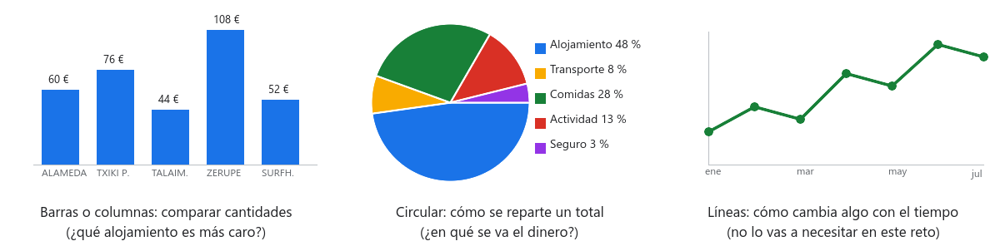

# Paso 05 · Gráficos que se entienden

**Tiempo:** 2 horas · **Entrega:** Apto / No apto

Al cliente no le vais a enseñar una tabla con cuarenta números. Le vais a enseñar tres gráficos: cuánto cuesta cada candidato, en qué se va el dinero y cómo es la oferta de alojamientos en su zona. Un gráfico se hace a partir de celdas, así que si cambian los datos, cambia el gráfico.

## Antes de empezar: cada gráfico cuenta una cosa

- **Columnas o barras**: para comparar cantidades entre varias cosas. Es el que responde "¿cuál es más caro?".
- **Circular**: para ver cómo se reparte un total entre sus partes. Solo tiene sentido si las porciones suman el total, y con pocas porciones (cinco o seis como mucho). Nunca metas en él el total: duplicaría el dinero.
- **Líneas**: para ver cómo cambia algo con el tiempo. No lo necesitáis en este reto.

Reglas de oro para cualquier gráfico: un **título** que diga qué se está viendo, los **ejes** con nombre y unidad (€ por persona), **etiquetas** con los valores si son pocos, y una línea debajo con la **fuente** de los datos. Y nada de efectos 3D: son más difíciles de leer.

## 1. Gráfico de columnas: cuánto cuesta cada candidato

1. Crea la hoja `Gráficos`.
2. Ve a `Candidatos` y selecciona `A1:A6` (los nombres). Con `Ctrl` pulsado, selecciona también `M1:M6` (*Alojamiento por persona*). Así tienes dos columnas no contiguas seleccionadas.
3. `Insertar > Gráfico`. Se abre el **Editor de gráficos** a la derecha. En *Tipo de gráfico* elige **Gráfico de columnas**.
4. Pestaña *Personalizar* ▸ *Títulos de gráficos y ejes*: título `Alojamiento por persona (N noches)` con las noches de vuestro cliente; título del eje vertical `€ por persona`.
5. *Personalizar* ▸ *Serie* ▸ marca **Etiquetas de datos** para que cada columna lleve su importe encima.
6. Corta el gráfico (`Ctrl+X`) y pégalo en `Gráficos` (`Ctrl+V`). Sigue conectado a `Candidatos`: cambia una tarifa y mira cómo se mueve.

## 2. Gráfico circular: en qué se va el dinero

1. En `Presupuesto`, selecciona `A2:A6` y, con `Ctrl`, `C2:C6`. Solo los cinco gastos: ni el descuento, ni el total, ni el límite.
2. `Insertar > Gráfico` ▸ tipo **Gráfico circular**.
3. *Personalizar* ▸ *Gráfico circular* ▸ *Etiqueta de sector*: **Porcentaje**. Título: `¿En qué se va el dinero? (por persona)`.
4. Llévalo a `Gráficos`, al lado del anterior.
5. Prueba: cambia la actividad en el desplegable de `Presupuesto`. La porción tiene que cambiar. Si no cambia, el gráfico apunta a valores copiados en vez de a las fórmulas.

## 3. Gráfico de columnas: la oferta en la zona del cliente

Este gráfico sale de los 1.469 alojamientos, no de vuestros cinco. Sirve para decirle al cliente "hemos mirado todo lo que hay".

1. En `Gráficos`, a partir de `A20`, monta una tabla con los ocho tipos de alojamiento en la columna A (puedes traerlos con `=Tarifas!A2`, `=Tarifas!A3`... o escribirlos) y la cabecera `Alojamientos en la zona` en `B20`.
2. En `B21` escribe `=CONTAR.SI.CONJUNTO(Limpieza!B:B; A21; Limpieza!F:F; Cliente!$B$5)` y arrastra hasta `B28`. Cuenta los alojamientos de cada tipo cuya provincia es la del cliente (comprueba que en tu `Limpieza` el tipo está en B y la provincia en F; si no, cambia las letras).
3. Si vuestro cliente no tiene provincia sino zona (la cuadrilla surfera o los abuelos de Rioja Alavesa), cuenta por la columna *Marcas* con un comodín: `=CONTAR.SI.CONJUNTO(Limpieza!B:B; A21; Limpieza!G:G; "*" & Cliente!$B$5 & "*")`. Los asteriscos significan "contiene".
4. Selecciona `A20:B28` ▸ `Insertar > Gráfico` ▸ **Gráfico de columnas**. Título: `Alojamientos por tipo en ` y vuestra zona. Eje vertical: `Número de alojamientos`.
5. Compáralo con la tabla dinámica de `Resumen`: los números tienen que coincidir.

## 4. La letra pequeña

Debajo de cada gráfico, en una celda, escribe la fuente:

- En los dos primeros: `Precios simulados para una actividad de aula.`
- En el tercero: `Datos: Open Data Euskadi, alojamientos turísticos, descargados el (vuestra fecha).`

Ordena los tres gráficos en `Gráficos` para que no se tapen entre sí ni tapen las tablas. Redimensiona desde una esquina.

## 5. Responde en la hoja Respuestas

| Nº | Pregunta |
|---|---|
| 5.1 | Mirando solo el gráfico de columnas, ¿qué candidato es el más caro y cuánto más caro es que el más barato? |
| 5.2 | ¿Qué gasto se lleva la mayor parte del presupuesto y qué porcentaje aproximado es? |
| 5.3 | ¿Qué tipo de alojamiento abunda más en la zona del cliente? ¿Es el tipo que habéis elegido? Si no, ¿por qué? |

## Comprueba antes de entregar

- [ ] Tres gráficos en `Gráficos`, cada uno con título, ejes con nombre y fuente debajo.
- [ ] El circular no incluye el total ni el descuento y muestra porcentajes.
- [ ] Al cambiar un desplegable de `Presupuesto`, el circular cambia.
- [ ] El tercer gráfico coincide con la tabla dinámica.
- [ ] `Respuestas` tiene 5.1 a 5.3. Versión con nombre: `Paso 05 entregado`.

## Para subir nota

- Una **minigráfica** en cada fila de `Candidatos`: en `P2` escribe `=SPARKLINE(M2; {"charttype"\"bar"; "max"\MAX($M$2:$M$6)})` y arrastra. Dibuja una barra dentro de la celda, proporcional al coste. En hojas configuradas en inglés las llaves llevan comas en vez de `\` y `;`.
- Ordena el gráfico de columnas de más barato a más caro: en *Configuración* del editor, marca *Ordenar* por la columna de importes... o, más fácil, ordena las filas de `Candidatos` con `Datos > Ordenar intervalo` por la columna M.

## Entrega

El enlace a la hoja, con la versión `Paso 05 entregado`.
