# Irudi-doikuntzak

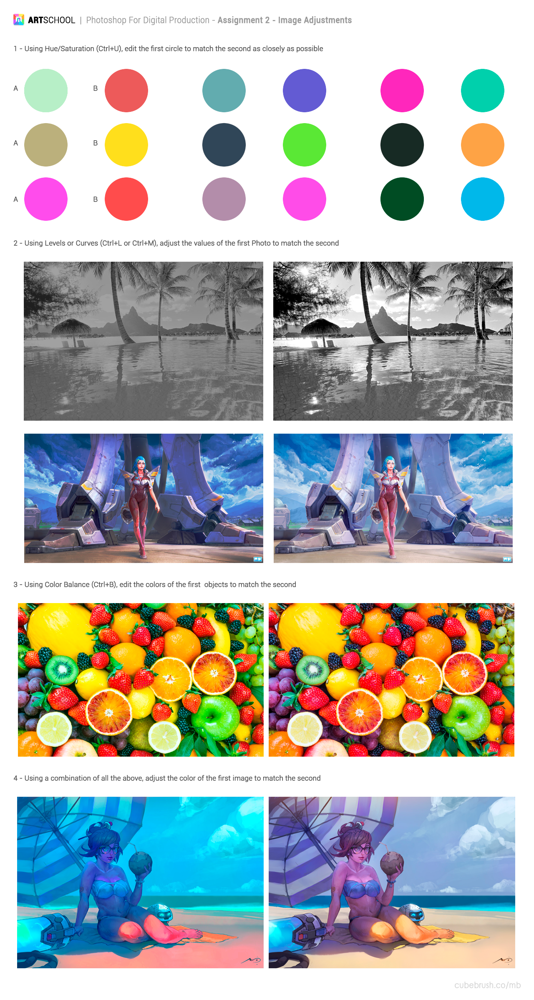

Goiko irudiak **praktika honetako ariketa guztiak** ditu. Ireki Photoshopen eta lan egin zuzenean haren gainean: ariketa bakoitzean ezkerreko irudiak (**A**) eskuinekoaren (**B**) ahalik eta antz handiena izan behar du amaieran.

| Ariketa | Tresna | Zer lortu behar da |
|---|---|---|
| 1 | Tonua/Saturazioa (`Ctrl+U`) | **A** zirkulu bakoitzak bere **B** zirkuluaren kolore bera izatea |
| 2 | Mailak (`Ctrl+L`) edo Kurbak (`Ctrl+M`) | Ezkerreko argazkiak eta ilustrazioak eskuinekoen kontraste eta argitasun bera izatea |
| 3 | Kolore-balantzea (`Ctrl+B`) | Ezkerreko frutek eskuinekoen tonu berak izatea |
| 4 | Aurreko guztiak | Ezkerreko hondartzaren ilustrazioak eskuinekoaren koloreak izatea |

## Hasi aurretik

- Lan egin beti **doikuntza-geruzekin** (*capas de ajuste*; `Capa > Nueva capa de ajuste` edo Geruzak paneleko zirkulu erdi zuri erdi beltzaren ikonoa), ez `Imagen > Ajustes` bidez. Doikuntzak ez du irudia suntsitzen eta nahi duzunean berriro uki dezakezu.
- Hautatu lehenengo aldatu nahi duzun eremua (*Marko angeluzuzena*, *Makila magikoa*, *Objektu-hautapena*). Doikuntza-geruza hautapen aktibo batekin sortzen baduzu, Photoshopek hautapen hori geruzaren **maskara** bihurtzen du eta doikuntzak eremu horri bakarrik eragiten dio.
- Beste aukera bat: kopiatu ezkerreko irudi bakoitza bere geruzara (`Ctrl+J`) eta aplikatu doikuntza **mozketa-maskararekin** (*máscara de recorte*; `Alt+klik` doikuntza-geruzaren eta irudiaren geruzaren artean).
- Jarri izenak geruzei: `1-zirkulu-gorria`, `2-kurbak-hondartza`, etab.

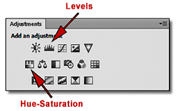

***Doikuntzak** panela (`Ventana > Ajustes`): ikono bakoitzak doikuntza-geruza berri bat sortzen du. Seinalatuta, Mailak eta Tonua/saturazioa.*

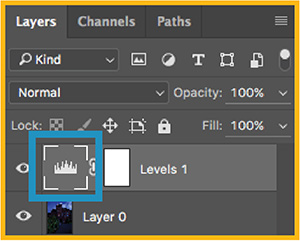

*Horrela ikusten da doikuntza-geruza bat Geruzak panelean: ezkerrean doikuntzaren ikonoa eta eskuinean bere maskara. Maskara zuriz, doikuntzak irudi osoari eragiten dio; beltzez margotzen duzun lekuan, eragiteari uzten dio.*

## Tonua / Saturazioa

`Capa > Nueva capa de ajuste > Tono/saturación`

Hiru graduatzaile ditu:

- **Tonua** (*Tono*): kolorea gurpil kromatikoan biratzen du. *Zein kolore den* aldatzen duena da (gorria, laranja, horia, berdea...). -180tik +180ra doa.
- **Saturazioa**: kolorearen purutasuna. Ezkerrerantz grisera arte itzaltzen da, eskuinerantz biziagoa bihurtzen da.
- **Argitasuna** (*Luminosidad*): ezkerrerantz beltzerantz iluntzen da, eskuinerantz zurirantz argitzen da.

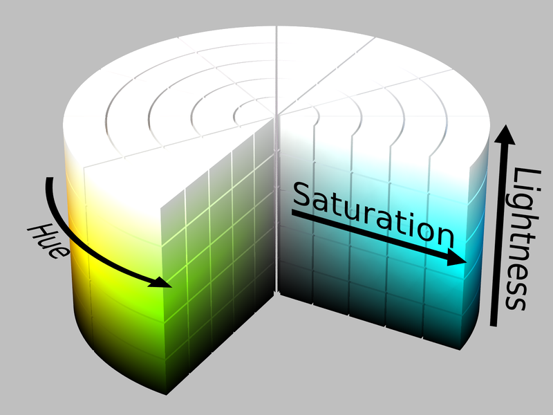

*Hiru graduatzaileak HSL ereduaren hiru ardatzak dira: **Hue** Tonua da (zilindroaren inguruan biratzen da), **Saturation** Saturazioa (zentroko grisetik ertzeko kolore purura) eta **Lightness** Argitasuna (beheko beltzetik goiko zurira).*

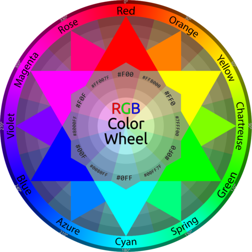

*Tonua graduatzaileak gurpil hau zeharkatzen du gradutan. Gorritik abiatuta, +60 horira doa, +120 berdera eta ±180 zianera, bere kontrakoa.*

Aholkuak 1. ariketarako:

1. Lehenengo mugitu **Tonua** B zirkuluaren kolore-familia aurkitu arte.
2. Gero doitu **Saturazioa** eta azkenik **Argitasuna**.
3. Ez bazara iristen (adibidez berde zurbil batetik gorri bizi batera pasatzeko), aktibatu **Koloreztatu** (*Colorear*) laukia: doikuntza kolore lau batetik abiatzen da eta askoz errazagoa da edozein helmugatara iristea.
4. **Maisua** (*Maestro*) zerrendan Gorriei, Horiei, Berdeei, Zianei, Urdinei edo Magentei bakarrik eragitea aukera dezakezu. Argazki bateko kolore bakar bat aldatzeko balio du, gainerakoa ukitu gabe.

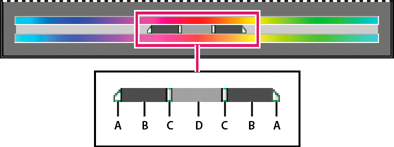

*Zerrendan kolore bat aukeratzean erregulatzaile hauek agertzen dira panelaren beheko bi kolore-barren artean. A. Moteltzea doitzen du (ondoko koloreetarako trantsizio leuna) gama aldatu gabe. B. Gama doitzen du moteltzea aldatu gabe. C. Kolore-osagaiaren gama doitzen du. D. Erregulatzaile osoa arrastatzen du.*

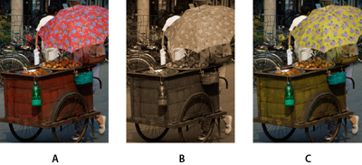

*A. Jatorrizkoa. B. Irudi osoa sepiara biratuta **Koloreztatu** bidez. C. Magentak bakarrik, zerrendan hautatuta eta Tonua graduatzailearekin aldatuta.*

## Mailak

`Capa > Nueva capa de ajuste > Niveles`

**Histograma** erakusten du: zenbat pixel dauden argitasun-maila bakoitzean, 0tik (beltza) 255era (zuria). 2. ariketako zuri-beltzeko argazkia bezalako irudi "garbitu" batek histograma erdian kontzentratuta du: ez dago beltz ez zuri pururik.

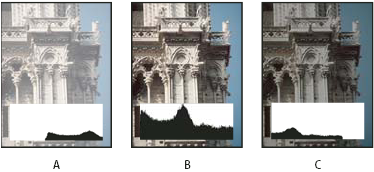

*Nola irakurri histograma bat. A. Gehiegi esposatutako argazkia: dena eskuinean pilatuta. B. Ondo esposatutako argazkia, tonu-gama osoarekin. C. Gutxiegi esposatutako argazkia: dena ezkerrean.*

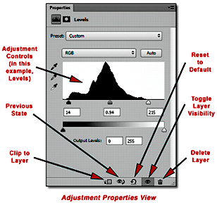

*Mailak panela: histogramaren azpian, sarrera-mailen hiru triangeluak (beltza, grisa eta zuria) eta, beherago, irteera-mailen barra.*

Histogramaren azpian **sarrera-mailen** hiru triangelu daude:

- **Beltza (ezkerra)**: bere ezkerrean geratzen den guztia beltz puru bihurtzen da. Arrastatu histograma hasten den lekuraino itzalak berreskuratzeko.
- **Zuria (eskuina)**: bere eskuinean geratzen den guztia zuri puru bihurtzen da. Arrastatu histograma amaitzen den lekuraino argiak berreskuratzeko.
- **Grisa (erdia)**: erdiko tonuak argitu edo iluntzen ditu beltzak eta zuriak ukitu gabe.

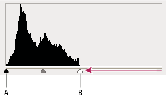

*Histograma hau ez da muturretara iristen: irudiak ez du tonu-gama osoa erabiltzen. Arrastatu itzalen erregulatzailea (**A**) hasten den lekuraino eta argienena (**B**) amaitzen den lekuraino.*

**Irteera-mailek** kontrakoa egiten dute: barrutia mugatu eta kontrastea murrizten dute (irudi bat nahita "garbitzeko" balio dute).

Zerrendan kanal bakoitza (Gorria, Berdea, Urdina) bereizita landu dezakezu kolore-nagusitasunak zuzentzeko.

## Kurbak

`Capa > Nueva capa de ajuste > Curvas`

Tresna guztietatik indartsuena da: Mailak bezala egiten du baina kontrol osoarekin. Lerro diagonalak sarrerako balioa (ardatz horizontala) irteerakoarekin (ardatz bertikala) erlazionatzen du. Ukitzen ez baduzu, balio bakoitza sartzen den bezala irteten da.

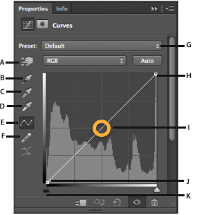

*Kurbak panela. A. Irudian doitzeko tresna. B, C eta D. Tanta-kontagailuak puntu beltza, grisa eta zuria finkatzeko. E. Kurba puntuekin editatu. F. Kurba eskuz marraztu. G. Aurrez ezarritako doikuntzak. H, I eta J. Puntu beltza, puntu grisa eta puntu zuria. K. Mozketa erakutsi.*

- Egin klik lerroaren gainean **puntu** bat gehitzeko eta arrastatu: gorantz argitzen du, beherantz iluntzen du.
- Lerroaren muturrak puntu beltza eta puntu zuria dira, Mailak-en bezala.
- **S itxurako kurba** batek (itzaletan puntu bat jaitsi eta argietan beste bat igo) kontrastea handitzen du. Alderantzizko S batek murriztu egiten du.
- **RGB** kanal bakoitza bereizita edita dezakezu: Urdinaren kurba igotzeak urdina gehitzen du eta horia kentzen, Gorriarena jaisteak ziana gehitzen du, etab.
- **Irudian doitzeko** tresnak (hatza duen eskuaren ikonoa) argazkiaren eremu batean klik egin eta arrastatzea ahalbidetzen du argitzeko edo iluntzeko; Photoshopek jartzen du puntua kurban zure ordez.
- Beltzaren, grisaren eta zuriaren **tanta-kontagailuek** klik batez finkatzen dute zein pixel izan behar den beltz puru, gris neutro edo zuri puru. Oso erabilgarriak nagusitasunak kentzeko.

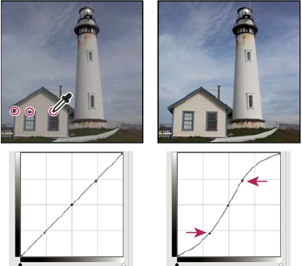

*Irudian doitzeko tresna: argazkiaren eremu batean klik egitean puntu bat gehitzen da kurban, eta arrastatzean eremu hori argitu edo ilundu egiten da.*

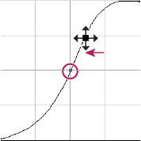

*Kurbak erdiko tonuetan zenbat eta malda handiagoa izan, orduan eta kontraste handiagoa. Horixe da S itxurako kurba batek egiten duena.*

2. ariketako ilustrazioan eskuineko bertsioak kontraste handiagoa eta itzal sakonagoak ditu: S itxurako kurba leun bat nahikoa izaten da.

## Kolore-balantzea

`Capa > Nueva capa de ajuste > Equilibrio de color`

Hiru graduatzailek kolore bakoitza bere osagarriarekin jartzen dute aurrez aurre:

- **Ziana ↔ Gorria**
- **Magenta ↔ Berdea**
- **Horia ↔ Urdina**

Eta bereizita aplikatzen dira **Itzaletan**, **Erdiko tonuetan** eta **Argietan**. Normalena erdiko tonuetatik hastea da, gehien nabaritzen direnak baitira, eta itzalak eta argiak beharrezkoa bada bakarrik ukitzea.

Utzi markatuta **Argitasuna mantendu** (*Preservar luminosidad*), kolorea aldatzean irudia ez dadin argitu ez ilundu.

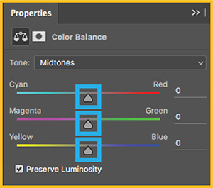

*Kolore-balantzea panela: tonuaren zerrenda (itzalak, erdiko tonuak edo argiak), hiru graduatzaileak eta Argitasuna mantendu laukia. Bikote bakoitza goiko kolore-gurpilean kontrako koloreak dira.*

3. ariketan eskuineko frutak beroagoak dira: mugitu erdiko tonuak gorrirantz eta horirantz, eta egiaztatu itzalek magenta pixka bat eskatzen duten.

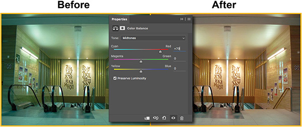

*Aurretik eta ondoren: ezkerreko argazkiak nagusitasun ziana du. Ziana–Gorria graduatzailea +70era mugituz erdiko tonuetan, neutralizatu egiten da.*

## Beste doikuntza batzuk

Ez dira beharrezkoak praktika honetarako, baina komeni da ezagutzea. Doikuntza-geruzen menu berean daude.

| Doikuntza | Zertarako balio du |
|---|---|
| **Distira/Kontrastea** (*Brillo/Contraste*) | Mailak-en bertsio azkarra eta zehaztasun gutxikoa. Ukitu txikietarako. |
| **Esposizioa** (*Exposición*) | Kameraren diafragma ireki edo ixtea simulatzen du. HDR irudietarako pentsatua, baina edozeinetan funtzionatzen du. |
| **Bizitasuna** (*Intensidad*) | Saturazioa bezala baina adimentsua: kolore itzaliak gehiago saturatzen ditu eta azalaren tonuak babesten ditu. |
| **Zuri-beltza** (*Blanco y negro*) | Gris-eskalara bihurtzen du, jatorrizko kolore bakoitza zein argi edo ilun irteten den erabakitzen utziz. |
| **Argazki-iragazkia** (*Filtro de fotografía*) | Nagusitasun bero edo hotz bat gehitzen du, objektiboaren aurrean kolore-iragazki bat jartzea bezala. |
| **Zuzenketa selektiboa** (*Corrección selectiva*) | Kolore jakin baten barruko zian, magenta, hori eta beltz kantitatea aldatzen du (gorriak bakarrik, zuriak bakarrik...). |
| **Degradatu-mapa** (*Mapa de degradado*) | Argitasunak kolore-degradatu batekin ordezkatzen ditu. Biraketetarako eta duotono efektuetarako. |
| **Alderantzikatu** (*Invertir*) | Irudiaren negatiboa sortzen du. |
| **Atalasea** (*Umbral*) | Pixel bakoitza zuri edo beltz bihurtzen da mozketa-balio baten arabera. |
| **Posterizatu** (*Posterizar*) | Tonu-mailen kopurua murrizten du. Kartel-efektua. |

## Entrega

- `.psd` fitxategia doikuntza-geruza guztiekin eta beren maskarekin, geruzak izendatuta.
- Azken emaitzaren esportazio bat `.png` edo `.jpg` formatuan.

## Irudien kredituak

- Kurbak panela, irudian doitzeko tresna, kurbaren malda, histogramak eta Mailak-en erregulatzaileak: [Adobe Photoshop laguntza](https://helpx.adobe.com/es/photoshop/using/curves-adjustment.html) ([Mailak](https://helpx.adobe.com/es/photoshop/using/levels-adjustment.html), [Histogramak](https://helpx.adobe.com/es/photoshop/using/viewing-histograms-pixel-values.html)). Gama-erregulatzaileak eta Tonua/saturazioa adibidea: [Photoshop Elements laguntza](https://helpx.adobe.com/es/photoshop-elements/using/adjusting-color-saturation-hue-vibrance.html). © Adobe.
- Kolore-balantzea panela, aurretik eta ondoren, eta doikuntza-geruza Geruzak panelean: [Pacific Lutheran University, *Photoshop: Color Balance Adjustment*](https://kb.plu.edu/91927).
- Doikuntzak panela eta Mailak panel oharduna: John Watts, [Apogee Photo Magazine](https://www.apogeephoto.com/photoshop-cs6-cc-the-adjustments-panel-and-properties-panel/).
- HSL zilindroa: SharkD, [Wikimedia Commons, CC BY-SA 3.0](https://commons.wikimedia.org/wiki/File:HSL_color_solid_cylinder_saturation_gray.png). RGB kolore-gurpila: Jim McKeeth, [Wikimedia Commons, CC BY-SA 4.0](https://commons.wikimedia.org/wiki/File:RGB_color_wheel_with_hue_and_hex.svg).
