# Branding

Una marca no es solo un logo: es un logo, una paleta de colores, una tipografía y unos elementos gráficos que se repiten en todo lo que la marca toca. En esta práctica vas a definir una identidad sencilla, aplicarla sobre objetos reales (merchandising) y montar una composición de presentación de la marca.

## Ejemplos

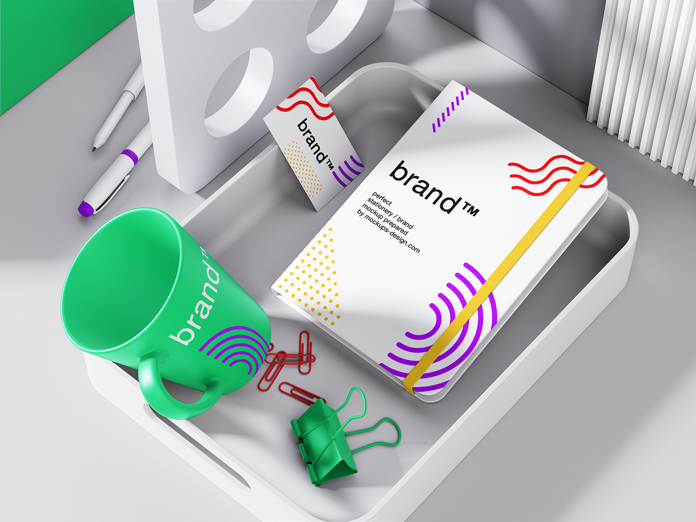

Fíjate en el ejemplo: el logo, la paleta (verde, morado, rojo, amarillo) y los elementos gráficos (ondas, puntos, arcos) se repiten en la taza, la libreta y la tarjeta. Cada objeto es distinto, pero todos se reconocen como de la misma marca.

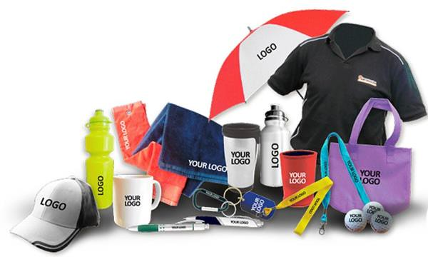

## Qué hay que hacer

### 1. Define la marca

- Elige o inventa una marca: una empresa ficticia, un grupo de música, un club, un proyecto personal... Lo que quieras, pero decídelo antes de empezar.
- **Logo**: diseña uno sencillo (texto + una forma geométrica es suficiente) o usa uno que ya tengas. Guárdalo en una capa aparte, como forma vectorial u objeto inteligente, para poder escalarlo sin que pierda calidad.
- **Paleta de colores**: entre 3 y 5 colores con sus códigos hexadecimales. Un color principal, uno o dos secundarios y uno o dos neutros. Guárdalos en el panel **Muestras** para tenerlos siempre a mano.
- **Elemento gráfico** (opcional, pero suma): un patrón, unas líneas, unos puntos, una forma... algo que acompañe al logo y ayude a reconocer la marca incluso cuando el logo es pequeño.

### 2. Aplica la marca a los assets

En la carpeta `assets/` tienes objetos en blanco listos para "vestir":

| | | |
|:---:|:---:|:---:|
| 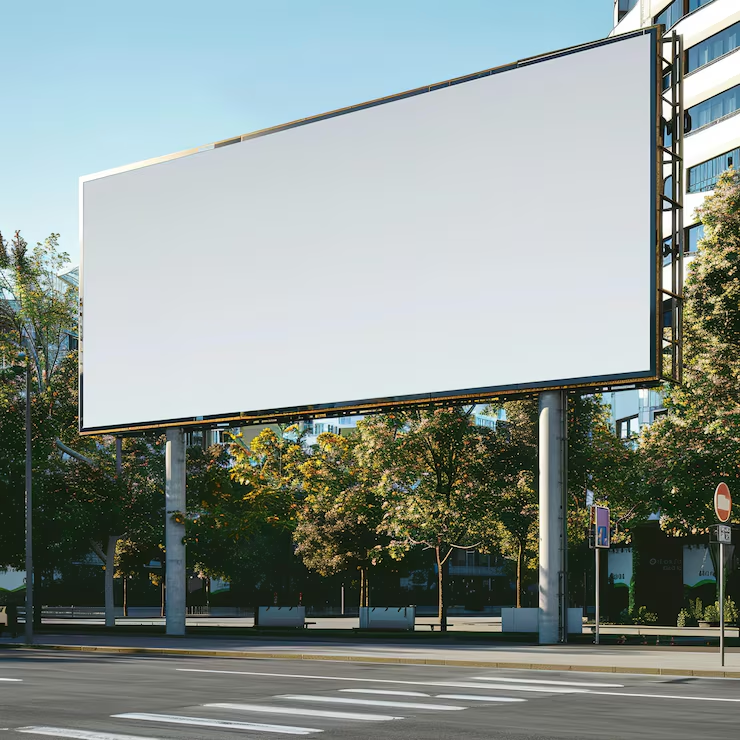 | 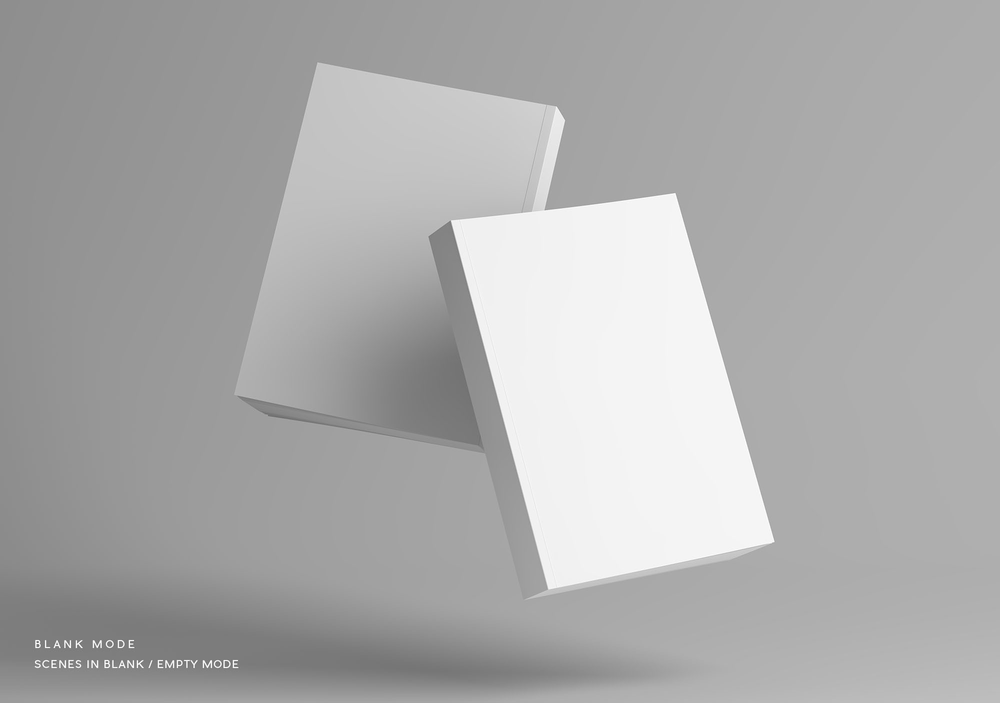 | 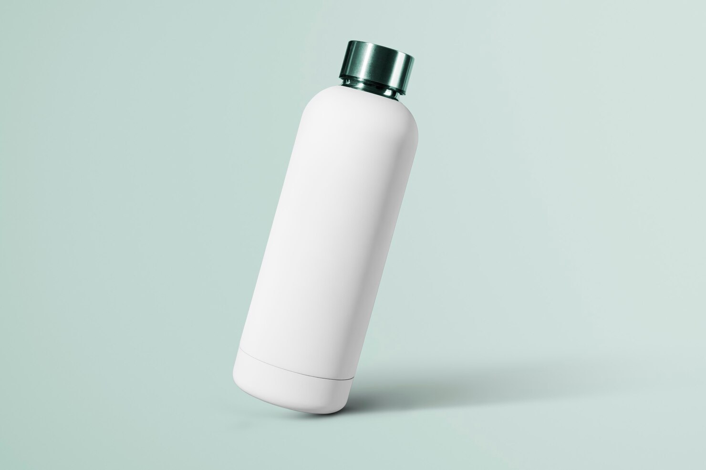 |
| **Valla publicitaria** `billboard.png` | **Libro o libreta** `book.png` | **Botella** `bottle.jpg` |
| 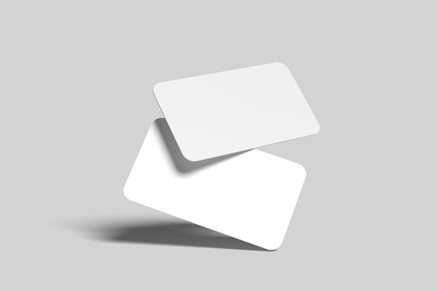 | 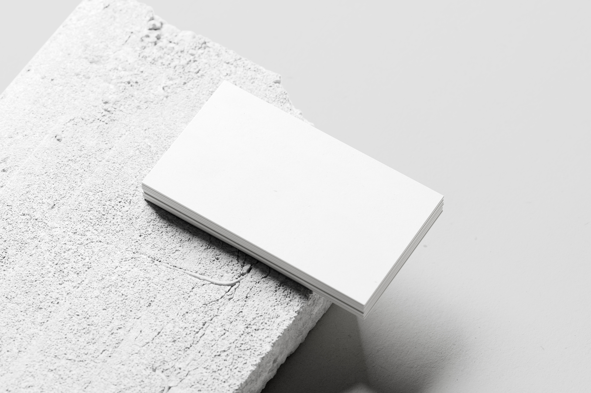 | 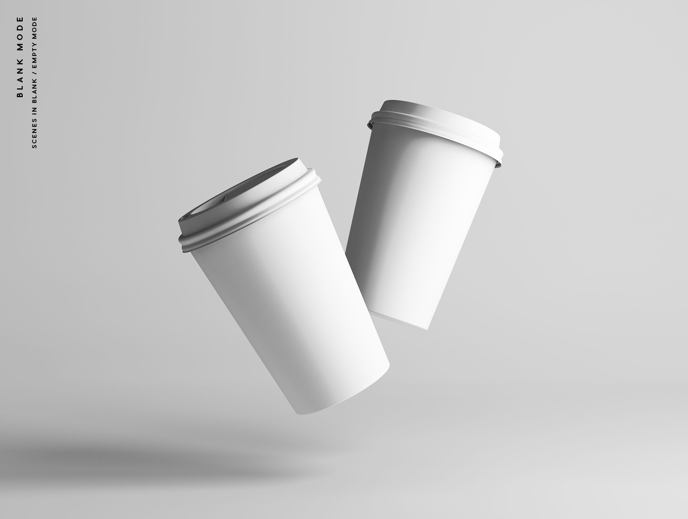 |
| **Tarjetas de visita (flotando)** `card.png` | **Tarjetas de visita (sobre piedra)** `card2.png` | **Vasos de café de papel** `cuppaper.png` |
| 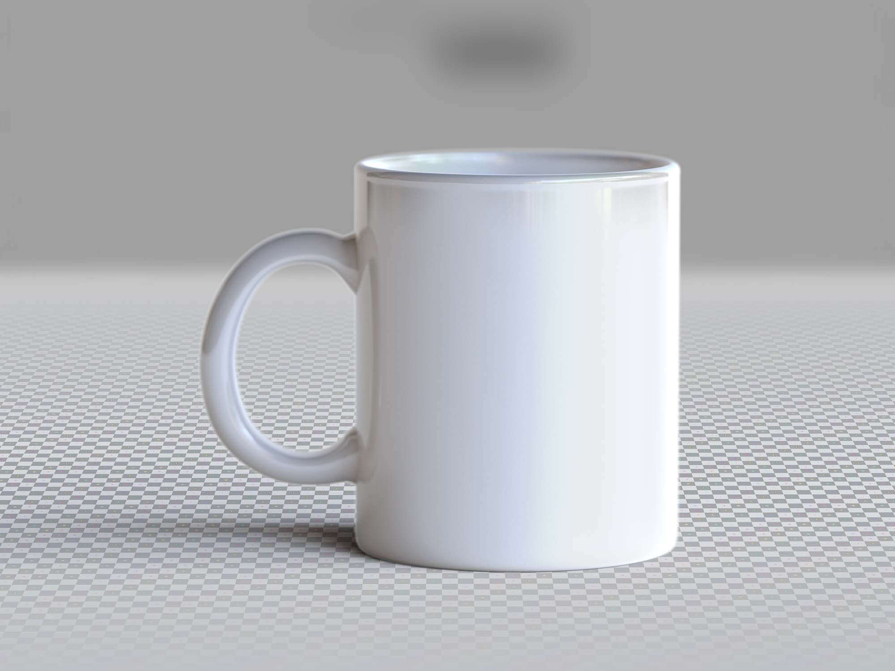 | 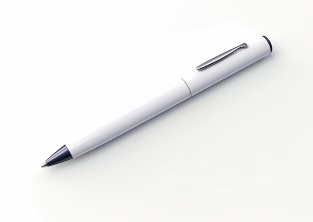 | 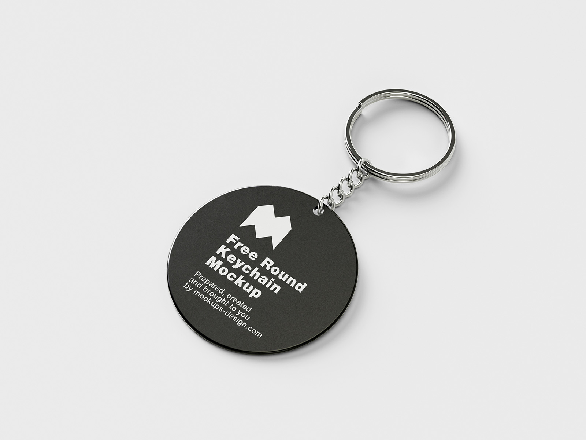 |
| **Taza** `cuptea.png` | **Bolígrafo** `image.png` | **Llavero** `keyholder.png` |

Aplica tu marca sobre **al menos 5** de ellos. En cada uno tienen que aparecer el logo **y** la paleta de colores: no basta con pegar el logo encima de un objeto blanco.

Técnicas que vas a necesitar:

- **Objetos inteligentes**: convierte el logo en objeto inteligente (`Capa > Objetos inteligentes > Convertir en objeto inteligente`) antes de deformarlo. Así puedes editarlo después y las transformaciones no destruyen píxeles.
- **Transformar** (`Ctrl+T` y botón derecho): *Escala*, *Rotar*, *Distorsionar*, *Perspectiva* y sobre todo **Deformar**, para que el logo siga la curva de la taza, la botella o el vaso.
- **Modos de fusión**: pon la capa del logo en *Multiplicar* para que respete las sombras del objeto, o en *Superponer* o *Luz suave* para que coja su textura y sus brillos. Sobre objetos oscuros, *Trama* o *Normal* con la opacidad algo bajada.
- **Cambiar el color del objeto**: selecciona el objeto y crea una capa de ajuste *Tono/saturación* con *Colorear* activado, o rellena una capa con el color y ponla en modo *Multiplicar* o *Color* con máscara de recorte. Los reflejos y las sombras del objeto original tienen que seguir viéndose.
- **Máscaras de capa**: para que el logo no se salga del objeto y para suavizar bordes.
- **Sombras y relieve**: un poco de *Sombra interior* o una sombra pintada con pincel suave ayudan a que el logo parezca impreso y no pegado.

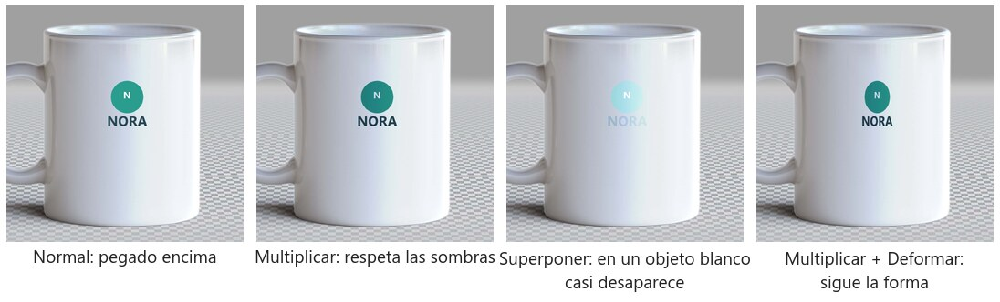

*El mismo logo sobre la taza. En **Normal** parece una pegatina: tapa las sombras del objeto. En **Multiplicar** el blanco del logo desaparece y las sombras de la taza se ven a través del color, como si estuviera impreso. **Superponer** sobre un objeto blanco casi no se ve: solo tiene sentido en superficies con textura o color. A la derecha, Multiplicar más **Deformar** para que el logo se estreche hacia los lados siguiendo la curva de la taza. Todos los modos están explicados en la práctica de *modos de fusión*, y las transformaciones en la de *transformar*.*

### 3. Crea la composición

Monta una única imagen de presentación de marca, tipo *mockup*, con varios de los objetos que has vestido (**mínimo 3**), como en `branding0.png`:

- Recorta los objetos de sus fondos y colócalos sobre un fondo que use tu paleta.
- Cuida las sombras para que todos parezcan apoyados en la misma superficie y con la misma luz.
- Añade el logo y, si quieres, el nombre de la marca y la paleta como muestras de color.

## Entrega

- Un `.psd` por cada asset vestido, con las capas nombradas.
- El `.psd` de la composición final y su exportación en `.png` o `.jpg` a buena resolución.
- Una hoja de marca (puede ser una imagen más) con el logo, los colores con sus códigos hexadecimales y la tipografía usada.
