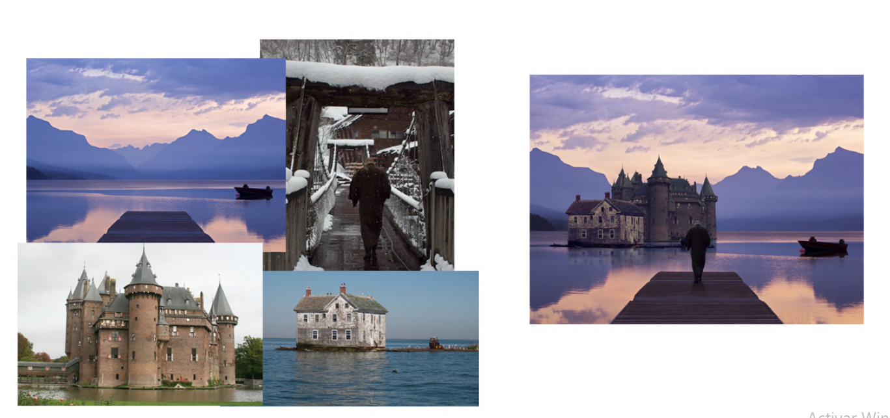
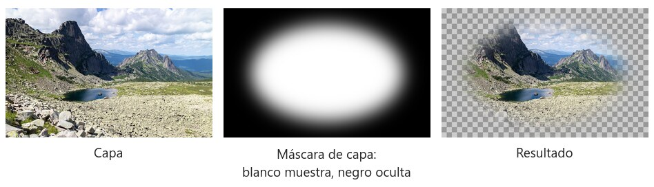
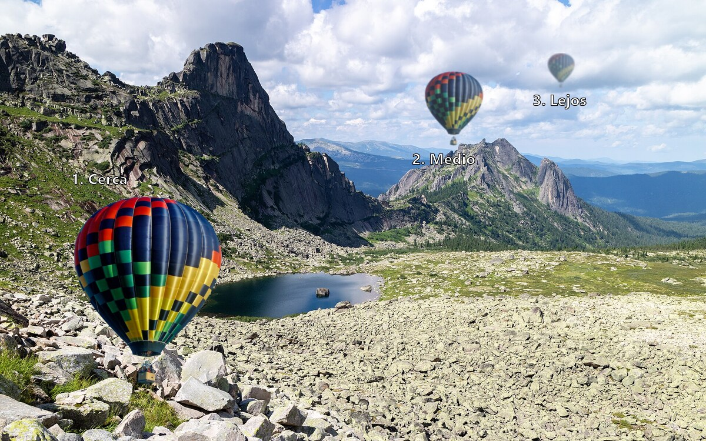

# Crea tu casa de fantasía

A partir de cuatro fotos distintas (un paisaje de lago, un castillo, una casa sobre el agua y una persona cruzando un puente nevado) se ha montado una sola imagen: la casa de ensueño sobre el lago. Esta técnica se llama **photobashing**: construir una imagen nueva mezclando trozos de fotografías, de manera que el resultado parezca una única foto.

## Qué hay que hacer

Diseña **tu casa ideal** (o la casa de un personaje, una casa imposible, una casa de cuento...) combinando al menos **4 fotografías** distintas:

1. Un **paisaje base** que marque la luz, la hora del día y la atmósfera (lago, montaña, playa, ciudad, desierto, nubes...).
2. Una o varias **construcciones** que combinarás para formar la casa (una torre de un castillo, el tejado de una cabaña, la cristalera de un edificio moderno...).
3. **Elementos de ambiente**: personas, animales, barcas, árboles, farolas, caminos, pájaros... lo que haga falta para que la escena cuente algo.

Busca las fotos en bancos de imágenes libres (Pexels, Unsplash, Pixabay) y apunta la fuente de cada una.

## Técnicas que vas a necesitar

### Máscaras de capa

Una **máscara de capa** es una imagen en blanco y negro pegada a la capa que decide qué partes se ven: donde la máscara es blanca la capa se ve, donde es negra se oculta y donde es gris se transparenta. Es la manera correcta de recortar: la goma de borrar destruye píxeles, la máscara solo los esconde y siempre puedes volver a pintarla.

*La capa, su máscara y el resultado. Lo blanco se ve, lo negro desaparece y el borde difuminado de la máscara da una transición suave.*

- Con una selección activa, el botón de máscara del panel Capas (el rectángulo con un círculo) crea una máscara que ya oculta todo lo que no estaba seleccionado.
- Para retocarla, haz clic en la miniatura de la máscara y pinta con el **Pincel**: negro oculta, blanco recupera. `X` intercambia los dos colores y `D` los pone en blanco y negro.
- `Alt+clic` en la miniatura muestra la máscara sola; `Shift+clic` la desactiva un momento para comparar; `Ctrl+clic` la convierte en selección.
- **Seleccionar y aplicar máscara** (`Selección > Seleccionar y aplicar máscara`, o el botón de la barra de opciones de cualquier herramienta de selección) es el sitio para recortar pelo, hojas y bordes difíciles: el *Pincel de perfeccionar bordes* por el contorno, *Descontaminar colores* para quitar el halo del fondo y, en *Salida a*, elige *Máscara de capa*.
- Un *Desenfoque gaussiano* de 0,5 a 1 píxel sobre la máscara quita el borde "recortado con tijeras" de los elementos pegados.

### Perspectiva atmosférica

Cuanto más lejos está algo, más aire hay entre el objeto y la cámara. El aire aclara las sombras, resta contraste y saturación y lo tiñe todo del color del cielo. Si no reproduces esto, los elementos lejanos parecen pegatinas.

*El mismo globo tres veces. 1. Cerca: colores y contraste completos, nítido. 2. Medio: algo menos de saturación y contraste, un poco del color del cielo. 3. Lejos: casi del color del cielo, pequeño, alto en la imagen y un poco desenfocado.*

Para conseguirlo, sobre cada elemento lejano y con máscara de recorte: una capa de *Curvas* que levante los negros, *Tono/saturación* bajando la saturación y una capa rellena del color del cielo al 20 o 50 % de opacidad (o un *Filtro de fotografía* azulado). Si hace falta, un *Desenfoque gaussiano* de 1 o 2 píxeles.

### Luz y sombras

- Mira de dónde viene la luz en el paisaje base (fíjate en las sombras que ya existen) y elige fotos de construcciones iluminadas desde el mismo lado. Si una viene al revés, voltéala en horizontal.
- Todo lo que apoya en el suelo tiene **sombra de contacto** (pequeña y oscura, justo debajo) y, si hay sol, **sombra proyectada** hacia el lado contrario de la luz. Píntalas en una capa en modo *Multiplicar*, como se explica en la práctica de *modos de fusión*.
- Las luces (ventanas encendidas, farolas, reflejos) van en capas en modo *Trama* o *Sobreexponer color*.

## Cómo hacerlo

1. **Planifica.** Antes de recortar nada decide qué paisaje usas de fondo y haz un boceto rápido de dónde va cada cosa. Elige fotos con una luz parecida (misma dirección del sol, misma hora del día) y te ahorrarás la mitad del trabajo.
2. **Recorta** cada elemento: *Selección de objeto*, *Selección rápida*, *Varita mágica* o *Pluma* para bordes rectos (edificios). Refina con *Seleccionar y aplicar máscara* en vegetación y pelo. Pega cada elemento en su propia capa y usa **máscaras de capa**, nunca la goma de borrar.
3. **Coloca y escala** con *Transformación libre* (`Ctrl+T`). Respeta la perspectiva: lo lejano es más pequeño y está más alto en la imagen; lo cercano, más grande y más abajo. Convierte las capas en objetos inteligentes antes de escalarlas.
4. **Iguala el color y la luz** de cada trozo con el fondo usando capas de ajuste con máscara de recorte: *Curvas* o *Niveles* para el contraste, *Balance de color* o *Filtro de fotografía* para la dominante (si el fondo es azulado, todo tiene que tirar a azul), *Tono/saturación* para bajar la saturación de lo lejano.
5. **Integra**:
   - **Sombras**: pinta en una capa nueva con pincel suave negro a baja opacidad, o duplica la capa del elemento, rellénala de negro, deforma y desenfoca.
   - **Reflejos** en agua o cristal: duplica el elemento, voltéalo en vertical, baja la opacidad y aplica *Desenfoque de movimiento*.
   - **Profundidad**: desenfoque gaussiano ligero y menos contraste en lo que está lejos; nitidez en lo cercano.
   - **Bordes**: pasa un pincel suave por la máscara para que los contornos recortados no se vean duros.
6. **Remata** con una capa de ajuste general encima de todo (*Curvas*, o *Mapa de degradado* a baja opacidad) para unificar el conjunto. Si quieres, añade niebla, rayos de luz, grano...

## Entrega

- El `.psd` con todas las capas nombradas y agrupadas (fondo, casa, ambiente, ajustes).
- La imagen final exportada en `.jpg` o `.png`.
- Un comentario o documento con los enlaces de las fotos originales que has utilizado.

## Créditos de las imágenes

- Foto de paisaje de las figuras: Vyacheslav Argenberg, [*Ergaki, Mountain lake Skazka, Rock formations, Sayan Mountains, Russia*](https://commons.wikimedia.org/wiki/File:Ergaki,_Mountain_lake_Skazka,_Rock_formations,_Sayan_Mountains,_Russia.jpg), Wikimedia Commons, CC BY 4.0.
- Globo de la figura de perspectiva atmosférica: `baloon.png`, de la práctica de transformar.
- Los esquemas se han generado para estas prácticas con ImageMagick y son de uso libre.
