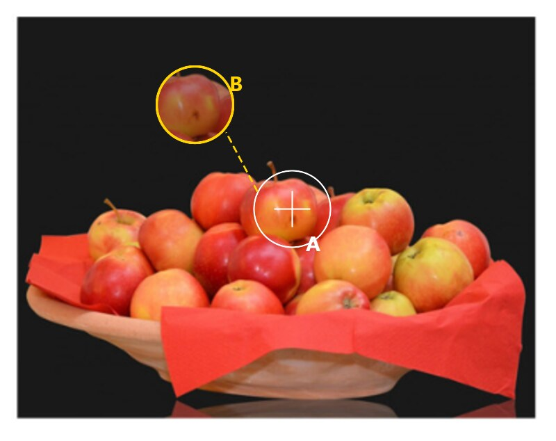
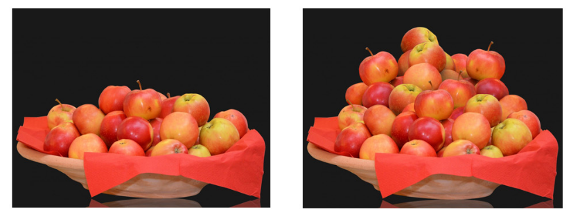
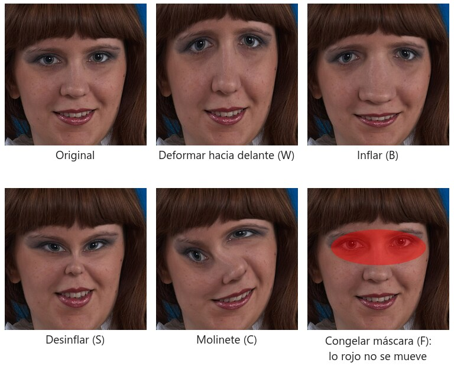
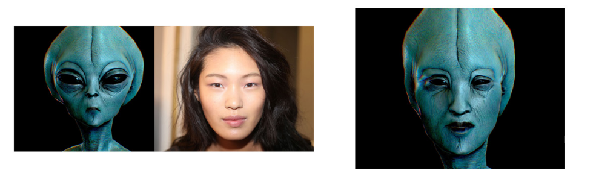

# Klonatu eta likidotu

Bi ariketa labur, ukituan izugarri erabiltzen diren bi tresna praktikatzeko: **Klonatzeko tanpoia** (*Tampón de clonar*) eta **Likidotu** iragazkia (*Licuar*).

## Nola funtzionatzen du Klonatzeko tanpoiak

Tanpoiak pixelak leku batetik kopiatzen ditu (**jatorria**) eta beste batean margotzen ditu (**helmuga**), aukeratuta duzun pintzelaren forma, tamaina eta gogortasunarekin.

*A. Jatorria: `Alt+klik` bidez finkatzen da. B. Helmuga: margotzean, kurtsorearen barruan kopiatuko duzunaren aurrebista ikusten da. Arrastatzen duzun bitartean, jatorriaren gurutzea pintzelarekin paraleloan mugitzen da.*

- **Lerrokatuta** (*Alineado*, aukeren barran): aktibatuta, jatorria trazu bakoitzarekin desplazatzen da helmugarekiko distantzia mantenduz; horrela eremu handi bat hainbat pasalditan klona dezakezu. Desaktibatuta, trazu berri bakoitza jatorri beretik hasten da berriro: objektu bera hainbat aldiz errepikatzeko.
- **Lagina** (*Muestra*): *Uneko geruza* (*Capa actual*), *Unekoa eta azpikoa* (*Actual y debajo*) edo *Geruza guztiak* (*Todas las capas*). *Unekoa eta azpikoa* aukerarekin geruza huts batean klona dezakezu eta jatorrizkoa osorik mantendu.
- **Gogortasuna eta opakutasuna**: pintzel gogor batek ertz zorrotzak kopiatzen ditu (objektuak); leun batek urtu egiten ditu (azalak, zeruak, ehundurak). Opakutasun baxuarekin pasaldiak pila ditzakezu.
- **Klonazio-jatorria** panela (`Ventana > Origen de clonación`): klonatzen duzuna eskalatu, biratu eta irauli dezakezu, bost jatorri arte gorde eta jatorriaren gainjartzea irudiaren gainean erakutsi.
- Jatorriak helmugaren **argi bera eta itxurazko tamaina bera** izan behar ditu; bestela, adabakia nabaritzen da. Aldatu jatorria maiz, patroiak ez errepikatzeko.

## 1. Sagar gehiago (klonatu)

Ezkerreko fruta-ontzitik abiatuta, lortu eskuinekoa: sagar-mendi bat. Ez du balio beste sagar batzuen argazki bat itsasteak; irudian dauden berberak izan behar dute, klonatuta.

### Nola egin

**A aukera: Klonatzeko tanpoia (`S`)**

1. Sortu **geruza berri huts** bat argazkiaren gainean eta, tanpoiaren aukeren barran, jarri *Muestra: Actual y debajo*. Horrela aparteko geruza batean klonatzen duzu eta gaizki ateratzen dena ezaba dezakezu jatorrizkoa ukitu gabe.
2. Aukeratu pintzel biribil bat, **% 50 eta 80 arteko gogortasunarekin** eta sagar bat baino tamaina pixka bat txikiagoarekin.
3. Egin `Alt+klik` kopiatu nahi duzun sagarraren gainean: hor finkatzen duzu **jatorri-puntua**.
4. Margotu kopia nahi duzun lekuan. Jatorriaren aurrebista ikusiko duzu kurtsorearen barruan. *Lerrokatuta* aktibatuta, jatorria zurekin mugitzen da trazuen artean; sagar bera puntu beretik berriro kopiatu nahi baduzu, desaktibatu edo egin `Alt+klik` berriro.
5. Aldatu jatorrizko sagarra, pintzelaren tamaina eta angelua errepikapena nabaritu ez dadin.
6. Goiko sagarrek behekoak **estaltzen** dituzte, beraz klonatu behetik gora.

**B aukera: bikoiztu eta transformatu** (A aukerarekin konbina daiteke)

1. Hautatu sagar bat *Objektu-hautapena* (*Selección de objeto*) edo *Lazoa* (*Lazo*) erabiliz.
2. `Ctrl+J` geruza berri batera kopiatzeko. Mugitu, `Ctrl+T` pixka bat eskalatzeko eta biratzeko, eta irauli horizontalki berdin-berdina izan ez dadin.
3. Gehitu **geruza-maskara** bat eta, pintzel leun beltzarekin, ezabatu ondoko sagarrekin gainjartzen den ertza.
4. Beharrezkoa bada, ukitu argia eta kolorea *Tonua/saturazioa* edo *Kurbak* erabiliz mozketa-maskararekin: sagar guztiak ez dira berdin gorriak.

Ezagutzea komeni diren tresna ahaideak: **Pintzel zuzentzaileak** (*Pincel corrector*, `J`) klonatzen du baina argia eta ehundura helmugarekin nahasten ditu, **Adabakiak** (*Parche*) hautapen oso bat beste leku batera arrastatzen du eta **Edukiaren araberako betetzeak** (*Relleno según contenido*) pixelak asmatzen ditu zerbait estaltzeko.

## Nola funtzionatzen du Likidotu

`Filtro > Licuar` aparteko leiho bat irekitzen du, non irudia gomazkoa balitz bezala portatzen den: pintzelek pixelak bultzatu, uzkurtu, handitu edo bihurritu egiten dituzte. Mugitzen dena ez da kolorea, irudiaren azpian dagoen **sare** ikusezin bat baizik; horregatik eremuka desegin, gorde eta berriro aplika daiteke.

*Tresna nagusiak aurpegi beraren gainean. Aurrerantz deformatu tresnak kopeta gorantz tiratzen du; Puztu eta Hustu tresnek pintzelaren azpian dagoena handitu edo uzkurtu egiten dute; Zurrunbiloak bihurritu egiten du. Izozte-maskarak (gorriz) mugitu nahi ez dituzun eremuak babesten ditu.*

Eskuineko paneleko lau kontrolek tresnak baino gehiago agintzen dute:

- **Tamaina**: batera mugitu nahi duzun eremu osoa hartzen du. Garezur bat luzatzeko, burua baino pintzel handiagoa; ezpain-ertz baterako, txiki bat.
- **Presioa**: zenbat mugitzen den pasaldi bakoitzean. 10 eta 30 artean, kontrolarekin lan egiteko.
- **Dentsitatea**: efektua zenbateraino dagoen kontzentratuta pintzelaren erdian. Baxua bada, pintzelaren ertzak ia ez du bultzatzen eta deformazioa leuna geratzen da.
- **Abiadura**: sakatuta eduki eta mugitu gabe jarduten duten tresnetarako (Puztu, Hustu, Zurrunbiloa).

Sartu aurretik geruza objektu adimendun bihurtzen baduzu, Likidotu **iragazki adimendun** gisa aplikatzen da: klik bikoitzarekin berriro irekitzen duzu, sarea utzi zenuen bezala, eta iragazkiaren maskarak efektua eremu batera mugatzea ahalbidetzen du.

## 2. Aliena (likidotu)

Bihurtu neskaren erretratua ezkerreko alien. Emaitzak eskuinekoaren antza izan behar du: buru luzatua, begi handi beltzak, sudur eta aho txikiak, azal urdin berdexka eta atzeko plano beltza.

### Nola egin

1. Bikoiztu geruza eta bihurtu **objektu adimendun** (`Capa > Objetos inteligentes > Convertir en objeto inteligente`). Horrela Likidotu iragazki adimendun gisa aplikatzen da eta berriro ireki eta aldatu dezakezu.
2. Ireki `Filtro > Licuar` (`Ctrl+Shift+X`). Erabiliko dituzun tresnak:
   - **Aurrerantz deformatu** (*Deformar hacia delante*, `W`): pixelak plastilina balira bezala arrastatzen ditu. Nagusia da: tiratu kopeta gorantz, estutu kokotsa, jaitsi ezpain-ertzak.
   - **Puztu** (*Inflar*, `B`): pintzelaren azpian dagoena handitzen du. Begietarako.
   - **Hustu** (*Desinflar*, `S`): uzkurtzen du. Ahorako eta sudurrerako.
   - **Ezkerrerantz bultzatu** (*Empujar hacia la izquierda*, `O`): pixelak trazuarekiko perpendikularrean desplazatzen ditu. Lepoa edo masailak modu erregularrean estutzeko.
   - **Izoztu maskara** (*Congelar máscara*, `F`): margotu mugitzea nahi ez dituzun eremuak (adibidez begiak, kopeta deformatzen duzun bitartean). **Desizoztu** (*Descongelar*, `D`) tresnak askatu egiten ditu.
   - **Berreraiki** (*Reconstruir*, `R`): deformazioa desegiten du margotzen duzun lekuan bakarrik.
   - **Aurpegi-ezagutzarekin likidotu** panela (*Licuar con reconocimiento facial*): Photoshopek aurpegia detektatzen du eta graduatzaileak ematen dizkizu begietarako (tamaina, altuera, inklinazioa), sudurrerako, ahorako eta aurpegiaren formarako. Hasi hemendik eta amaitu eskuz.
3. Lan egin pintzel **handiekin eta presio baxuarekin** (10-30). Pasaldi leun askok emaitza hobea ematen dute bortitz batek baino. Pintzel handia deformazio orokorretarako (garezurra) eta txikia xehetasunetarako (ezpain-ertzak).
4. Likidotu-tik irtetean, kolorea:
   - *Tonua/saturazioa* doikuntza-geruza **Koloreztatu** (*Colorear*) aktibatuta urdin berdexkarantz, edo *Kolore-balantzea* zianera eta berdera bultzatuz erdiko tonuetan eta itzaletan.
   - Begiak: hautatu eta bete beltzez, edo margotu geruza batean *Biderkatu* (*Multiplicar*) moduan, distira txiki bat utziz.
   - Jaitsi saturazioa eta igo kontrastea *Kurbak* erabiliz, azala gogorragoa dirudien.
5. Atzeko planoa eta ilea: hautatu figura, alderantzikatu hautapena eta bete beltzez geruza berri batean. Soberan dagoen ilea klonatzeko tanpoiarekin, pintzel beltzarekin edo buruaren ingerada Likidotu-tik bertatik estutuz estaltzen da.
6. Aukerakoa: itsatsi alienaren azalaren ehundura aurpegiaren gainean maskara batekin eta *Gainjarri* (*Superponer*) moduan opakutasun baxuan.

## Entrega

- Bi `.psd` fitxategiak, geruzak eta iragazki adimendunak editagarri.
- Bi azken irudiak `.jpg` edo `.png` formatuan esportatuta.

## Irudien kredituak

- Likidotu irudiko erretratua: Dmitry Makeev, [*Russia, Moscow Oblast. Young woman with umbrella, studio portrait*](https://commons.wikimedia.org/wiki/File:Russia,_Moscow_Oblast._Young_woman_with_umbrella,_studio_portrait.jpg), Wikimedia Commons, CC BY-SA 4.0.
- Eskemak praktika hauetarako sortu dira ImageMagick-ekin eta erabilera librekoak dira.
