# Modos de fusión de capa

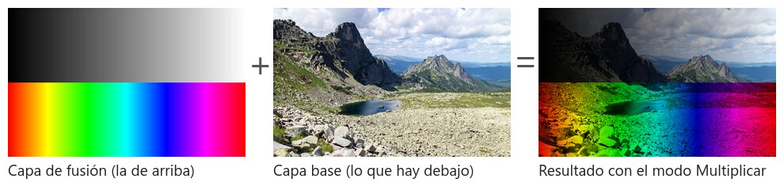

El **modo de fusión** de una capa decide cómo se mezclan sus píxeles con los de las capas que tiene debajo. En modo *Normal* la capa de arriba simplemente tapa lo de abajo. Con cualquier otro modo, Photoshop hace una operación matemática píxel a píxel entre el color de la capa (la **capa de fusión**) y el color de lo que hay debajo (la **capa base**) y muestra el resultado. Es la herramienta que hay detrás de casi todo el fotomontaje: pegar texturas, añadir luces y sombras, colorear, simular tintas, mezclar fotos.

Esta práctica tiene dos partes: una explicación de todos los modos, con la misma pareja de capas para que puedas compararlos, y siete ejercicios cortos más un proyecto final. El material de los ejercicios está en la carpeta `ejercicios/`; en cada subcarpeta hay un `muestra.jpg` con el resultado que se espera.

| Ejercicio | Modo principal | Qué hay que conseguir |
|---|---|---|
| 1 | Multiplicar | Imprimir un grabado sobre un papel viejo y colorearlo sin perder la tinta |
| 2 | Multiplicar | Colocar un objeto recortado sobre una mesa y pintarle su sombra |
| 3 | Trama | Añadir fuegos artificiales, luces desenfocadas y un destello a una ciudad de noche |
| 4 | Superponer y Luz suave | Dar textura y aspecto envejecido a una foto |
| 5 | Luz suave con gris 50 % | Iluminar y sombrear un retrato a mano (*dodge and burn*) |
| 6 | Color, Tono y Luminosidad | Colorear una foto en blanco y negro y cambiar el color de un objeto |
| 7 | Diferencia | Alinear dos fotos con precisión de píxel |
| 8 | Todos | Un cartel que combine al menos cuatro modos |

## Antes de empezar

- El modo de fusión se cambia en el **desplegable del panel Capas**, arriba a la izquierda, donde pone *Normal*. También aparece en `Capa > Estilo de capa > Opciones de fusión` (doble clic en la capa), en la barra de opciones del **Pincel** (fusiona cada trazo en vez de la capa entera) y dentro de los **estilos de capa** (una *Sombra paralela* usa Multiplicar; un *Resplandor exterior*, Trama).
- **Atajos**: con la herramienta Mover (`V`) activa, `Shift` + `+` y `Shift` + `-` recorren todos los modos de la capa seleccionada. Es la mejor manera de probar: deja la capa puesta y ve pulsando. Los más usados tienen atajo directo: `Alt+Shift+M` Multiplicar, `Alt+Shift+S` Trama, `Alt+Shift+O` Superponer, `Alt+Shift+F` Luz suave, `Alt+Shift+N` Normal. Si tienes el Pincel seleccionado, estos atajos cambian el modo del pincel, no el de la capa.
- Es **no destructivo**: cambiar el modo no toca los píxeles. Puedes volver a Normal cuando quieras.
- **Opacidad** y **Relleno** regulan cuánto se nota la capa. Relleno no afecta a los estilos de capa (sombras, trazos) y en ocho modos (Subexponer color, Subexposición lineal, Sobreexponer color, Sobreexposición lineal, Luz intensa, Luz lineal, Mezcla definida y Diferencia) da un resultado distinto y más suave que Opacidad. Prueba los dos.
- El modo afecta a **toda la capa**. Para limitarlo a una zona usa una **máscara de capa**, igual que con las capas de ajuste.
- Los **grupos** están por defecto en modo *Pasar a través*: cada capa del grupo se fusiona con todo lo que hay debajo. Si pones el grupo en *Normal*, las capas solo se fusionan entre ellas y el grupo entero se comporta como una sola capa.
- Nombra las capas con el modo y la opacidad que llevan: `textura-superponer-60`, `sombra-multiplicar`.

## Cómo leer los ejemplos

Todos los ejemplos de esta guía usan las mismas dos capas: una foto de paisaje como capa base y, encima, una capa de prueba con un **degradado de negro a blanco** en la mitad superior y un **arcoíris** en la inferior. En el degradado se ve qué hace cada modo con los tonos oscuros, con el gris medio y con los claros; en el arcoíris, qué hace con los colores.

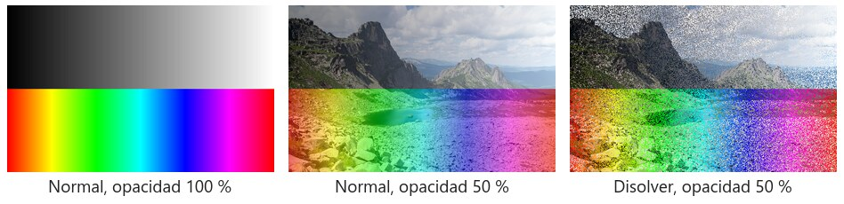

*Con **Normal** al 100 % la capa de arriba tapa la foto. Al bajar la opacidad se transparenta. **Disolver** no mezcla: con opacidad 50 % deja la mitad de los píxeles de la capa y quita la otra mitad al azar. Solo se nota con opacidad baja o en bordes suaves, y sirve para efectos de grano, spray o nieve.*

## Los seis grupos

En el desplegable los modos están separados por líneas en seis grupos. Cada grupo hace un tipo de cosa, y casi todos tienen un **color neutro**: el color de la capa de fusión que no cambia nada, como si fuera transparente. Conocer el color neutro es la clave para usar bien cada modo.

| Grupo | Modos | Qué hacen | Color neutro |
|---|---|---|---|
| Normal | Normal, Disolver | Tapan | Ninguno |
| Oscurecer | Oscurecer, Multiplicar, Subexponer color, Subexposición lineal, Color más oscuro | El resultado nunca es más claro que la base | **Blanco** |
| Aclarar | Aclarar, Trama, Sobreexponer color, Sobreexposición lineal (Añadir), Color más claro | El resultado nunca es más oscuro que la base | **Negro** |
| Contraste | Superponer, Luz suave, Luz fuerte, Luz intensa, Luz lineal, Luz focal, Mezcla definida | Oscurecen lo oscuro y aclaran lo claro | **Gris 50 %** |
| Inversión | Diferencia, Exclusión, Restar, Dividir | Comparan las dos capas | Negro (Dividir: blanco) |
| Componentes | Tono, Saturación, Color, Luminosidad | Cogen solo una propiedad del color de la capa | Ninguno |

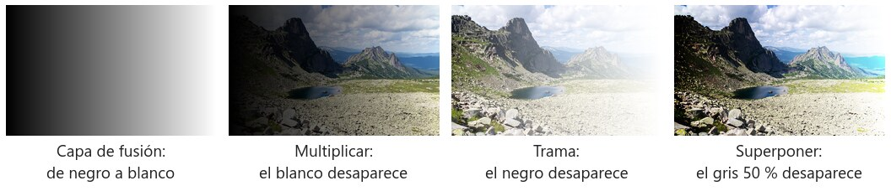

*El color neutro en acción. Con un degradado de negro a blanco como capa de fusión, en **Multiplicar** la foto se ve intacta donde el degradado es blanco; en **Trama**, donde es negro; en **Superponer**, en el centro, donde es gris 50 %.*

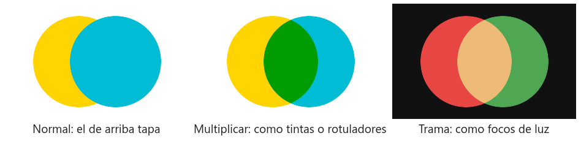

*Otra manera de entenderlo: **Multiplicar** se comporta como tintas o rotuladores sobre papel (donde se solapan, el color se oscurece y se mezcla), y **Trama** como focos de luz sobre una pared oscura (donde se solapan, la luz se suma y aclara).*

## Grupo Oscurecer

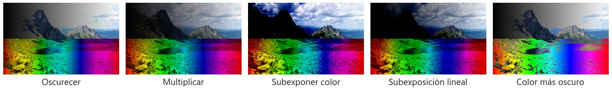

Todos ignoran el blanco de la capa de fusión y solo pueden oscurecer la base.

- **Oscurecer**: compara cada canal (rojo, verde y azul) de las dos capas y se queda con el valor más bajo. Como compara canal a canal puede crear colores que no estaban en ninguna de las dos.
- **Multiplicar**: multiplica los dos colores (en valores de 0 a 1). Cualquier cosa por blanco (1) queda igual; cualquier cosa por negro (0) da negro; los grises y colores intermedios oscurecen y tiñen. Es el modo de las **sombras**, de los **dibujos a tinta** sobre fondo blanco, de las **texturas de papel** y de colorear como con acuarela. Es el que más vas a usar de este grupo.
- **Subexponer color**: oscurece aumentando el contraste y la saturación. Más agresivo que Multiplicar: los medios tonos se van rápido al negro y los colores se saturan. Para sombras muy intensas o para "quemar" una zona.
- **Subexposición lineal**: suma los dos colores y resta 1. Oscurece aún más que Subexponer color pero sin saturar tanto. Con el Relleno bajo queda bastante natural.
- **Color más oscuro**: como Oscurecer, pero compara el color entero (la suma de los tres canales) y se queda con uno de los dos sin mezclarlos. No inventa colores nuevos.

## Grupo Aclarar

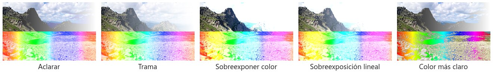

Son el espejo de los anteriores: ignoran el negro de la capa de fusión y solo pueden aclarar.

- **Aclarar**: se queda con el valor más alto de cada canal.
- **Trama** (en inglés *Screen*): el inverso de Multiplicar. Es como proyectar dos diapositivas sobre la misma pantalla: la luz se suma, nunca se resta. El negro desaparece y el blanco lo tapa todo. Es el modo de las **luces**: fuegos artificiales, destellos, humo, chispas, rayos, cualquier cosa fotografiada sobre fondo negro se integra sin recortar nada. También es la base de la doble exposición.
- **Sobreexponer color**: aclara aumentando el contraste. Las luces se queman enseguida y los colores se saturan. Para brillos muy intensos: neón, reflejos metálicos, bordes iluminados.
- **Sobreexposición lineal (Añadir)**: suma directamente los dos colores. Aclara más que ningún otro y es el que más quema. Es el modo de las luces "físicas": si sumas dos focos, se suman.
- **Color más claro**: como Aclarar pero con el color entero.

## Grupo Contraste

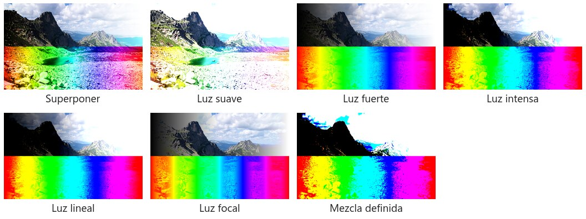

Combinan los dos grupos anteriores: oscurecen donde la capa de fusión es más oscura que el gris medio y aclaran donde es más clara. El gris 50 % desaparece. Por eso sirven para las **texturas** (una textura de piedra o papel es, en el fondo, un gris con manchas más claras y más oscuras) y para el **dodge and burn**, que consiste en pintar luces y sombras sobre una capa gris.

- **Superponer**: Multiplicar en las sombras y Trama en las luces, pero decidiendo según el color de la **base**. Respeta los negros y los blancos de la foto y aumenta el contraste y la saturación. Es el más usado para texturas y para dar fuerza a una imagen apagada (duplica la capa y ponla en Superponer).
- **Luz suave**: lo mismo pero mucho más suave, como una luz difusa. No quema ni los blancos ni los negros. Es el modo más seguro para texturas discretas y para el dodge and burn.
- **Luz fuerte**: como Superponer pero decidiendo según la capa de **fusión**. Mucho más agresivo: la textura se ve con todos sus colores.
- **Luz intensa**: Subexponer color en las zonas oscuras de la capa de fusión y Sobreexponer color en las claras. Contraste extremo, colores saturadísimos. Con Relleno bajo sirve para efectos de color intensos.
- **Luz lineal**: Subexposición y Sobreexposición lineal según la capa de fusión. Igual de fuerte que Luz intensa pero sin saturar tanto. Se usa en la técnica de separación de frecuencias para retoque de piel.
- **Luz focal**: sustituye colores según la capa de fusión: donde es oscura, se queda con el más oscuro; donde es clara, con el más claro. Resultados raros; para efectos especiales.
- **Mezcla definida**: lleva cada canal a 0 o a 255, así que el resultado tiene como mucho ocho colores. Con el Relleno al 10 o 20 % da un contraste fuerte y limpio.

## Grupo Inversión

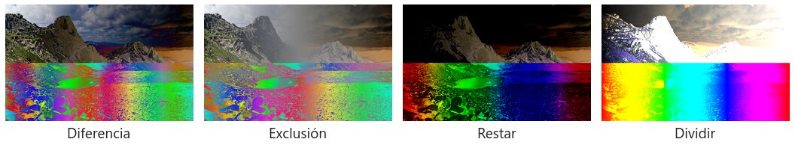

Comparan las dos capas. Son los que menos se usan en fotomontaje, pero tienen un par de trucos muy útiles.

- **Diferencia**: resta el color más oscuro al más claro. Si las dos capas son iguales el resultado es **negro**; blanco en la capa de fusión invierte la base. Truco: para **alinear** dos fotos casi iguales, pon la de arriba en Diferencia y muévela hasta que todo quede negro.
- **Exclusión**: como Diferencia pero más suave, con grises en los medios tonos.
- **Restar**: resta la capa de fusión a la base. Oscurece de forma distinta a Multiplicar.
- **Dividir**: divide la base entre la capa de fusión. Truco: duplica una foto o un documento escaneado, desenfoca mucho la copia (50 píxeles o más) y ponla en Dividir: se elimina la iluminación irregular y el fondo queda uniforme.

## Grupo Componentes

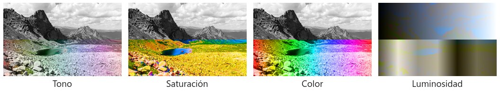

En lugar de operar con los números del color, cogen de la capa de fusión una sola propiedad del modelo HSL (tono, saturación o luminosidad) y lo demás lo toman de la base. Son los mismos tres ejes de la capa de ajuste Tono/saturación de la práctica de ajustes.

- **Tono**: tono de la capa de fusión con la saturación y la luminosidad de la base. Fíjate en el degradado gris: como un gris no tiene tono, al aplicarlo la base se **desatura**. Sirve para cambiar el color de un objeto manteniendo su sombreado y su intensidad.
- **Saturación**: saturación de la capa de fusión con el tono y la luminosidad de la base. Una capa gris en este modo deja la foto en blanco y negro; una capa muy saturada la enciende. Para el efecto de "solo un objeto en color".
- **Color**: tono y saturación de la capa de fusión con la luminosidad de la base. Es el modo para **colorear fotos en blanco y negro**, para virados y para cambiar el color de la ropa, el pelo o un coche: el color cambia, las luces y las sombras se quedan.
- **Luminosidad**: luminosidad de la capa de fusión con el color de la base. Casi nunca se usa con una capa de píxeles, pero sí con **capas de ajuste**: una capa de Curvas o Niveles en modo Luminosidad cambia el contraste sin alterar los colores ni la saturación. Lo mismo con un filtro de enfoque aplicado a una copia en Luminosidad: enfoca sin crear halos de color.

## Las matemáticas, por si tienes curiosidad

Photoshop trabaja con cada canal (rojo, verde y azul) por separado, con valores de 0 (negro) a 1 (blanco). Si llamas **A** al color de la base y **B** al de la capa de fusión:

| Modo | Fórmula | De dónde sale el color neutro |
|---|---|---|
| Multiplicar | A × B | Cualquier cosa por 1 (blanco) queda igual |
| Trama | 1 − (1 − A) × (1 − B) | Si B = 0 (negro), queda A |
| Superponer | Si A < 0,5: 2 × A × B. Si no: 1 − 2 × (1 − A) × (1 − B) | Con B = 0,5 (gris) las dos ramas devuelven A |
| Luz fuerte | Igual que Superponer, pero la condición mira B | Gris 50 % |
| Subexponer color | 1 − (1 − A) / B | Blanco |
| Sobreexponer color | A / (1 − B) | Negro |
| Subexposición lineal | A + B − 1 | Blanco |
| Sobreexposición lineal | A + B | Negro |
| Diferencia | \|A − B\| | Negro |
| Exclusión | A + B − 2 × A × B | Negro |
| Restar | A − B | Negro |
| Dividir | A / B | Blanco |

Lo que se sale del rango 0 a 1 se recorta: por eso Sobreexposición lineal "quema" y Subexposición lineal "empasta".

## Chuleta

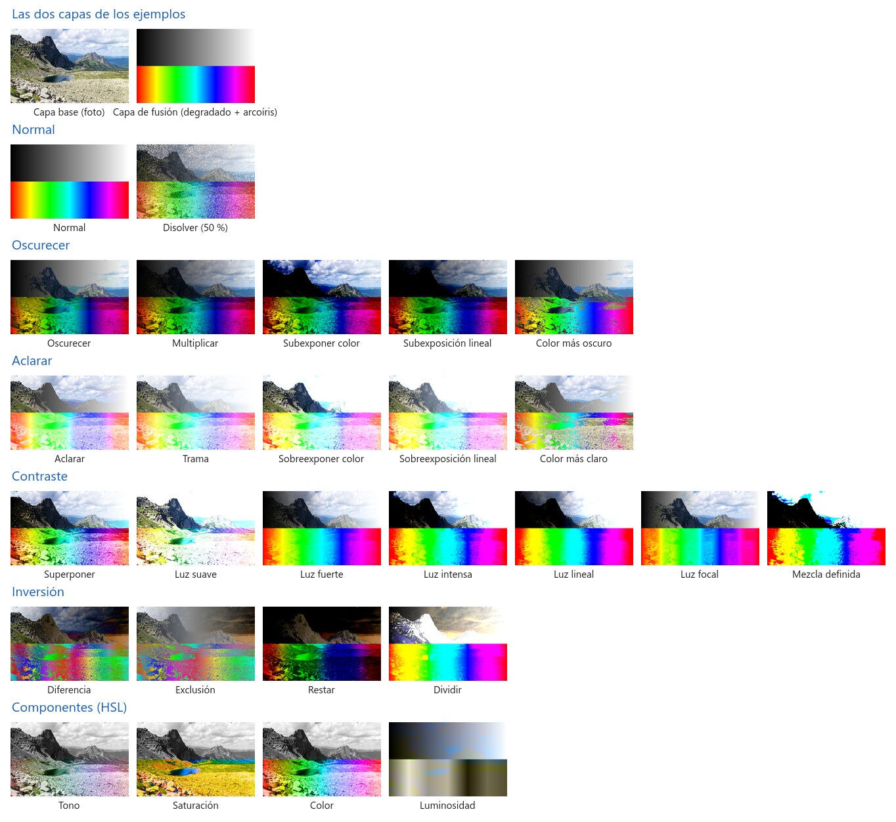

*Los 27 modos con la misma pareja de capas. Guárdala y compara cuando dudes.*

## Ejercicios

Trabaja cada ejercicio en un `.psd` propio. Antes de dar por bueno un modo, recorre los demás con `Shift` + `+` para ver que no hay otro que funcione mejor.

### 1. Tinta sobre papel (Multiplicar)

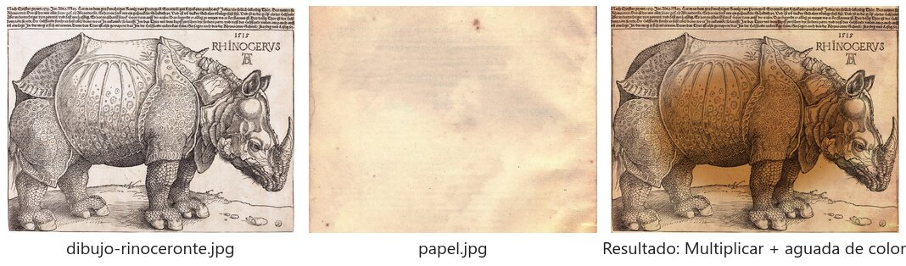

Material en `ejercicios/01-tinta-sobre-papel/`: `dibujo-rinoceronte.jpg` (el grabado del rinoceronte de Durero, de 1515, sobre fondo blanco) y `papel.jpg`.

Consigue que el grabado parezca impreso en el papel viejo y colorea el rinoceronte como si fuera una aguada de acuarela, **sin seleccionar ni borrar el fondo blanco** del dibujo.

1. Abre `papel.jpg` y coloca encima el dibujo (`Archivo > Colocar incrustado`). Ajusta el tamaño.
2. Pon la capa del dibujo en **Multiplicar**. El blanco desaparece y la tinta se queda. Compara con Normal y con Oscurecer.
3. Si el fondo no desaparece del todo (porque no es blanco puro), añade una capa de ajuste de **Niveles** con máscara de recorte sobre el dibujo y arrastra el triángulo blanco hacia la izquierda hasta que se limpie.
4. Crea una capa vacía encima, en **Multiplicar**, y pinta con un pincel suave y colores claros (ocre, verde, azul grisáceo) sobre el cuerpo. El color tiñe sin tapar las líneas, y donde pases dos veces se oscurece, como un rotulador. Si quieres volumen, otra capa en **Luz suave** y pinta con blanco y negro.
5. Para que la tinta parezca absorbida por el papel, baja la opacidad de la capa del dibujo al 85 o 90 % y aplica un *Desenfoque gaussiano* de 0,3 píxeles.

### 2. Sombra (Multiplicar)

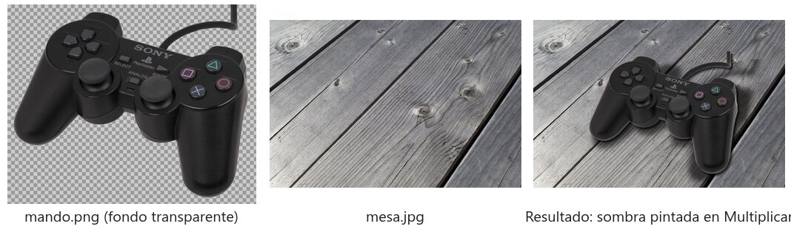

Material en `ejercicios/02-sombra/`: `mando.png` y `galletas.png` (objetos con fondo transparente) y `mesa.jpg`.

Coloca el mando (o las galletas) sobre la mesa y píntale las dos sombras que tiene cualquier objeto apoyado: la **sombra de contacto**, pequeña y oscura justo debajo, y la **sombra proyectada**, más larga, más suave y más clara.

1. Coloca `mando.png` sobre `mesa.jpg` y escálalo con `Ctrl+T`. Decide de dónde viene la luz: la sombra irá hacia el lado contrario.
2. **Sombra proyectada a partir de la silueta**: `Ctrl+clic` en la miniatura de la capa del mando para seleccionar su silueta. Crea una capa nueva debajo del mando y rellénala de negro (`Alt+Retroceso` con el negro como color frontal). Deselecciona. Con `Ctrl+T` y botón derecho, *Distorsionar* o *Sesgar* para tumbar la sombra hacia donde iría. `Filtro > Desenfocar > Desenfoque gaussiano` de 10 a 20 píxeles. Modo **Multiplicar**, opacidad entre 50 y 70 %.
3. **Sombra de contacto**: duplica esa capa de sombra antes de deformarla (o vuelve a seleccionar la silueta y rellena otra capa), desenfócala solo 3 o 5 píxeles, desplázala unos píxeles hacia la sombra y déjala al 70 u 80 %.
4. Las sombras reales no son negras: pinta las sombras con un color oscuro cogido de la propia mesa (un gris azulado o marrón) o aplícales *Tono/saturación* con *Colorear*. Multiplicar las integra mejor.
5. Alternativa a mano: capa vacía en Multiplicar y pincel suave negro con opacidad al 15 o 20 %, acumulando pasadas donde la sombra es más densa.
6. Comprueba la coherencia: cuanto más baja esté la luz, más larga la sombra proyectada; la sombra de contacto es siempre la más oscura.

### 3. Luces (Trama)

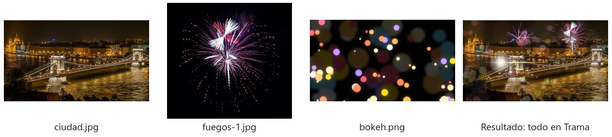

Material en `ejercicios/03-luces/`: `ciudad.jpg`, `fuegos-1.jpg`, `fuegos-2.jpg`, `bokeh.jpg` y `destello.jpg`. Todos los elementos de luz están sobre fondo negro.

Añade fuegos artificiales en el cielo, luces desenfocadas por delante y un destello sobre uno de los focos del puente. **Sin recortar nada**: todo con Trama, que hace desaparecer el negro.

1. Coloca `fuegos-1.jpg` sobre la ciudad y ponlo en **Trama**. Escálalo y muévelo al cielo. Si el fondo negro de los fuegos no es negro puro, se verá un rectángulo gris: arréglalo con una capa de ajuste de **Niveles** con máscara de recorte (arrastra el triángulo negro hacia la derecha) o con `Opciones de fusión > Fusionar si` (arrastra el regulador negro de *Esta capa* hacia la derecha).
2. Añade `fuegos-2.jpg` más pequeño y volteado en horizontal. Ponle una máscara y difumina la parte baja para que las chispas no se vean sobre los edificios.
3. `bokeh.jpg` en **Trama** al 40 o 60 % de opacidad, con un poco de desenfoque gaussiano para suavizarlo.
4. `destello.jpg` sobre una farola del puente: Trama, escálalo y gíralo con `Ctrl+T`. El centro del destello tiene que coincidir con la luz.
5. Compara Trama con Aclarar, Sobreexponer color y Sobreexposición lineal en los fuegos: Trama es el más natural; Sobreexposición lineal el más luminoso y el que más quema.
6. Extra: capa vacía en **Sobreexponer color** y pincel suave naranja a opacidad muy baja sobre las farolas: les sale un brillo intenso alrededor.

### 4. Textura (Superponer y Luz suave)

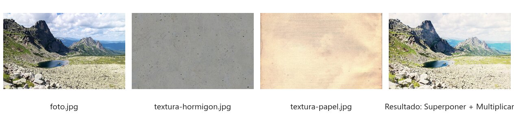

Material en `ejercicios/04-textura/`: `foto.jpg`, `textura-hormigon.jpg`, `textura-papel.jpg` y `textura-grunge.jpg`.

Convierte la foto en una impresión antigua con textura de papel y manchas.

1. Coloca `textura-hormigon.jpg` sobre la foto y ponla en **Superponer**. Los grises medios de la textura desaparecen; los puntos oscuros oscurecen y los claros aclaran. Compara con **Luz suave** (más discreto) y **Luz fuerte** (más agresivo).
2. Regula la opacidad entre el 40 y el 70 %.
3. Si solo quieres el relieve y no el color de la textura, desatúrala (`Ctrl+Shift+U`). Si la textura parece "al revés" (las grietas aclaran en vez de oscurecer), inviértela (`Ctrl+I`).
4. `textura-papel.jpg` en **Multiplicar** al 50 o 60 % tiñe y oscurece como un papel amarillento. En Luz suave solo deja las manchas.
5. `textura-grunge.jpg` en **Luz suave**. Si tapa demasiado el lago o el cielo, añade una máscara y pinta de negro esas zonas.
6. **Viñeta**: capa nueva con un degradado radial de transparente (centro) a negro (bordes), en **Multiplicar** al 30 o 40 %. Con blanco y en **Trama**, la viñeta es de luz.

### 5. Luces y sombras a mano (Luz suave con gris 50 %)

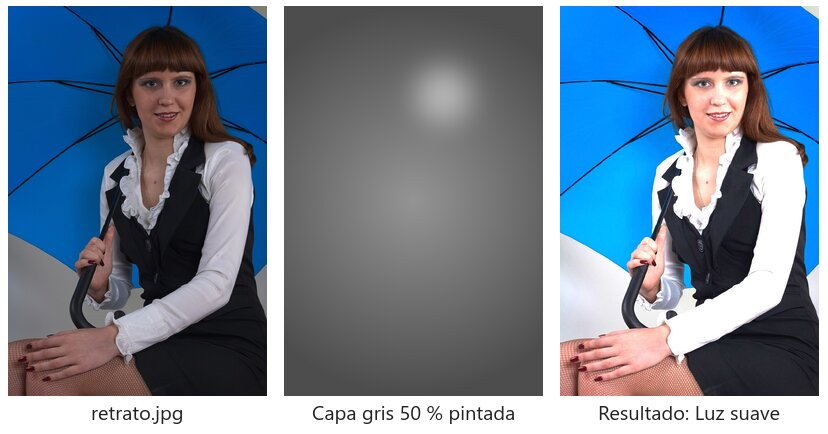

Material en `ejercicios/05-luces-y-sombras-a-mano/`: `retrato.jpg`. El archivo `ejemplo-capa-gris.jpg` muestra una capa gris ya pintada, por si quieres ver cómo queda.

Es la técnica clásica de *dodge and burn*: una capa gris en Luz suave sobre la que se pinta la luz con blanco y la sombra con negro. Como el gris 50 % es el color neutro de Luz suave, la capa no se ve hasta que pintas.

1. `Capa > Nueva > Capa` (`Ctrl+Shift+N`). En el cuadro de diálogo elige modo **Luz suave** y marca **Rellenar con color neutro para Luz suave (gris 50 %)**. La imagen no cambia.
2. Pincel redondo suave, opacidad entre 5 y 10 %, flujo bajo. Pinta con **blanco** donde da la luz: frente, pómulos, puente de la nariz, barbilla, brillos del pelo. Pinta con **negro** donde va la sombra: laterales de la nariz, bajo los pómulos, cuello, cuencas de los ojos y bordes de la imagen.
3. `Alt+clic` en el ojo de la capa gris para verla sola y comprobar lo que has pintado, como en la muestra. Si te pasas, pinta con gris 50 % para borrar.
4. Compara **Luz suave** con **Superponer**: el segundo da más contraste con las mismas pinceladas.
5. Aclara también el fondo detrás de la cabeza con un pincel grande para separarla, y oscurece las esquinas a modo de viñeta.
6. Extra: un degradado de blanco a transparente en una capa en Luz suave simula un foco; uno de negro a transparente, una sombra.

### 6. Color (Color, Tono y Luminosidad)

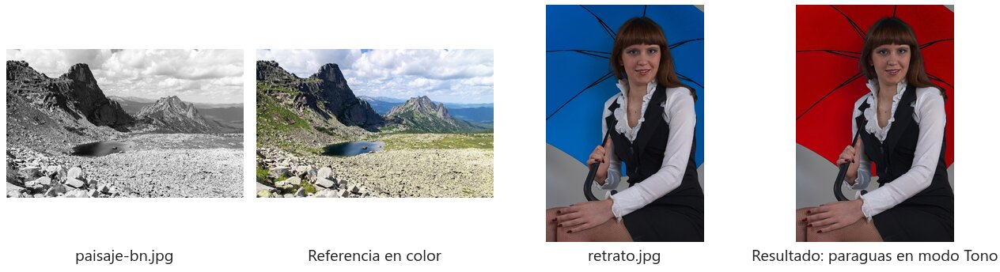

Material en `ejercicios/06-color/`: `paisaje-bn.jpg`, `paisaje-color-referencia.jpg` y `retrato.jpg`.

**A. Colorear.** Devuelve el color al paisaje en blanco y negro usando la referencia.

1. Una capa vacía en modo **Color** por cada elemento: cielo, rocas, hierba, lago. Coge los colores de la referencia con el cuentagotas y pinta con un pincel suave y grande. La luminosidad de la foto se mantiene; solo cambia el color.
2. Regula la opacidad de cada capa. Prueba a pintar lo mismo en **Tono**: no pasa nada, porque un gris no tiene saturación que conservar. En **Superponer** tiñe y además contrasta; en **Multiplicar** tiñe y oscurece.

**B. Cambiar el color de un objeto.** Pasa el paraguas azul del retrato a rojo (o al color que quieras).

1. Selecciona el paraguas (*Selección de objeto* o *Varita mágica*) para que la pintura no se salga.
2. Capa vacía en modo **Tono** y pinta de rojo sobre la selección. Se cambia el tono pero se conservan la saturación y las luces del paraguas. Compara con **Color** (cambia también la saturación) y con una capa de ajuste *Tono/saturación*, que aprendiste en la práctica de ajustes.

**C. Contraste sin cambiar el color.** Sobre la referencia en color, crea una capa de ajuste de **Curvas** con una S marcada y fíjate en cómo se saturan los colores. Cambia la capa de ajuste a modo **Luminosidad**: el contraste se queda, la saturación vuelve a su sitio.

### 7. Diferencia (alinear)

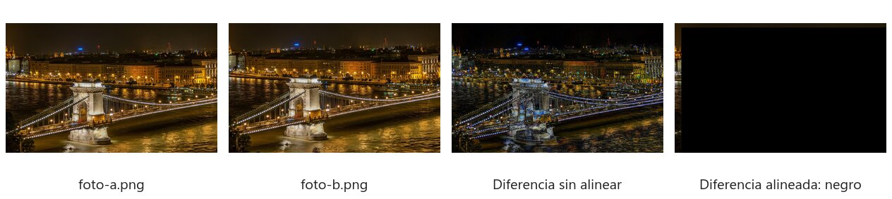

Material en `ejercicios/07-diferencia/`: `foto-a.png` y `foto-b.png`. Son la misma foto, pero `foto-b` está desplazada unos píxeles.

1. Abre `foto-a.png` y coloca `foto-b.png` encima. Ponla en **Diferencia**: donde las dos coinciden el resultado es negro; donde no, se ven bordes dobles.
2. Mueve la capa de arriba con las flechas del teclado (`Shift` + flecha mueve de 10 en 10 píxeles) hasta que la imagen se vuelva negra del todo, salvo una franja en dos bordes.
3. Vuelve a ponerla en Normal. Sirve para alinear escaneados, fotos para HDR o panorámicas, y para comparar dos versiones de un diseño y ver qué ha cambiado.
4. Extra: una capa de ajuste de **Niveles** encima, con el triángulo blanco muy a la izquierda, amplifica las diferencias pequeñas que no se ven a simple vista.

### 8. Proyecto: cartel

Haz un cartel (A4 a 150 ppp es suficiente) a partir de una foto tuya o de un banco libre, usando **al menos cuatro modos de fusión** distintos, por ejemplo:

- Una textura en Superponer o Luz suave.
- Luces (destellos, bokeh, humo, partículas) en Trama o Sobreexponer color.
- Sombras en Multiplicar.
- Un virado de color: una capa rellena de un color en modo Color o Luz suave a baja opacidad, o un Mapa de degradado en Luz suave.
- Dodge and burn con gris 50 %.
- Texto con una textura dentro (máscara de recorte) y un modo de fusión que lo integre con el fondo.

Las capas tienen que ir nombradas con su modo y agrupadas.

## Entrega

- Los `.psd` de los ejercicios 1 a 7 y del cartel, con las capas en su modo de fusión y nombradas (`fuegos-trama-80`, `sombra-multiplicar-60`).
- La exportación en `.jpg` o `.png` de cada resultado.

## Créditos de las imágenes

Todas las fotos vienen de [Wikimedia Commons](https://commons.wikimedia.org):

- Paisaje: Vyacheslav Argenberg, [*Ergaki, Mountain lake Skazka, Rock formations, Sayan Mountains, Russia*](https://commons.wikimedia.org/wiki/File:Ergaki,_Mountain_lake_Skazka,_Rock_formations,_Sayan_Mountains,_Russia.jpg), CC BY 4.0.
- Ciudad de noche: Wilfredor, [*Széchenyi Chain Bridge in Budapest at night*](https://commons.wikimedia.org/wiki/File:Sz%C3%A9chenyi_Chain_Bridge_in_Budapest_at_night.jpg), CC0.
- Fuegos artificiales: Matthew Bellemare, [*Several Fireworks*](https://commons.wikimedia.org/wiki/File:Several_Fireworks_%28163993629%29.jpeg) y [*Purple Fireworks*](https://commons.wikimedia.org/wiki/File:Purple_Fireworks_%28163993599%29.jpeg), CC BY-SA 3.0.
- Papel viejo: [*Old paper2*](https://commons.wikimedia.org/wiki/File:Old_paper2.jpg), dominio público.
- Hormigón: Sisters.seamless, [*Grey speckled moderately cracked grubby grungy seamless concrete building wall texture*](https://commons.wikimedia.org/wiki/File:Grey_speckled_moderately_cracked_grubby_grungy_seamless_concrete_building_wall_texture.jpg), CC0.
- Retrato: Dmitry Makeev, [*Russia, Moscow Oblast. Young woman with umbrella, studio portrait*](https://commons.wikimedia.org/wiki/File:Russia,_Moscow_Oblast._Young_woman_with_umbrella,_studio_portrait.jpg), CC BY-SA 4.0.
- Rinoceronte: Alberto Durero, [*The Rhinoceros*](https://commons.wikimedia.org/wiki/File:The_Rhinoceros_%28NGA_1964.8.697%29_enhanced.png), 1515, National Gallery of Art, dominio público.
- Mando: Evan-Amos, [*PlayStation2-DualShock2*](https://commons.wikimedia.org/wiki/File:PlayStation2-DualShock2.png), dominio público. Galletas: Bruce The Deus, [*Oreo biscuits (transparent background)*](https://commons.wikimedia.org/wiki/File:Oreo_biscuits_%28transparent_background%29.png), dominio público.
- Mesa: W.carter, [*Weatherworn top of wooden table*](https://commons.wikimedia.org/wiki/File:Weatherworn_top_of_wooden_table.jpg), CC0.

El bokeh, el destello, la textura grunge y todos los esquemas de los modos se han generado para esta práctica con ImageMagick y son de uso libre. Los resultados de muestra que incluyen fotos con licencia CC BY-SA (fuegos artificiales y retrato) se comparten con esa misma licencia.
