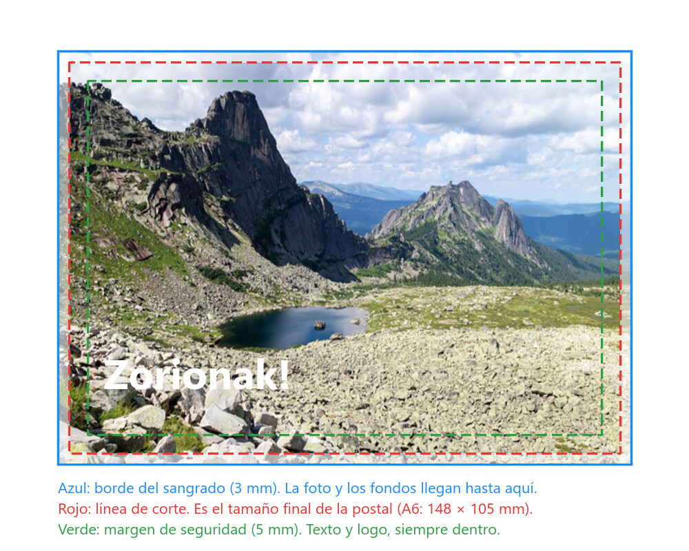

# Postal de Navidad

Diseña una **postal de Navidad** lista para imprimir. Puede ser para tu familia, para la clase, para una empresa inventada o para la marca que creaste en la práctica de branding. El estilo es libre (fotográfico, ilustrado, collage, minimalista, humorístico...), pero tiene que ser **tuyo**: no vale descargar una plantilla y cambiar el texto.

## Requisitos

### Formato

- Tamaño **A6 (148 × 105 mm)** o **10 × 15 cm**, horizontal o vertical.
- Resolución **300 ppp**.
- **3 mm de sangrado** por cada lado, y nada importante (texto, logo) a menos de 5 mm del borde.
- Trabaja en RGB y exporta una versión en CMYK para imprenta además de la versión para pantalla.

### Cómo preparar el documento

*Las tres líneas que tienes que tener en la cabeza. La imprenta imprime en una hoja más grande y luego corta por la línea roja. Como el corte nunca es exacto, el fondo tiene que seguir hasta la línea azul (el **sangrado**) para que no quede un filo blanco, y lo importante tiene que quedar dentro de la verde (el **margen de seguridad**) para que no lo corten.*

- **ppp** son píxeles por pulgada: cuántos píxeles se imprimen en cada 2,54 cm. A 300 ppp no se ven los píxeles a la distancia de lectura; a 72 ppp, la resolución de pantalla, la postal saldría pixelada. 300 ppp equivalen a 11,8 píxeles por milímetro.
- `Archivo > Nuevo`: anchura **154 mm** y altura **111 mm** (el A6 más 3 mm de sangrado por cada lado), **300 ppp**, color RGB de 8 bits. Photoshop lo convertirá en **1819 × 1311 píxeles**. Para la postal vertical, intercambia los valores.
- Pon las guías del corte y del margen con `Vista > Nueva guía`, escribiendo las posiciones en milímetros: verticales en 3, 8, 146 y 151 mm; horizontales en 3, 8, 103 y 108 mm. Las de 3 mm son la línea de corte; las de 8 mm, el margen de seguridad. También puedes usar `Vista > Nueva composición de guías` con márgenes de 3 mm y añadir las de 8 mm a mano.
- Las fotos que uses tienen que tener píxeles de sobra: una foto de 1200 píxeles de ancho solo cubre 10 cm a 300 ppp. Si la amplías, se emborrona.
- **RGB y CMYK**: la pantalla mezcla luz (rojo, verde y azul) y la imprenta mezcla tintas (cian, magenta, amarillo y negro), que no pueden reproducir los colores más luminosos y saturados del RGB. Trabaja en RGB y, antes de exportar, activa `Vista > Ajuste de prueba > CMYK de trabajo` (`Ctrl+Y`) para ver cómo se apagan los colores; si algo se pierde, corrígelo. Para la exportación de imprenta, acopla una copia y conviértela (`Imagen > Modo > Color CMYK`) o guarda como *Photoshop PDF* eligiendo la conversión a CMYK en las opciones de salida, con marcas de corte y sangrado.
- Para la versión de pantalla, `Archivo > Exportar > Exportar como` en `.png` o `.jpg`, recortando antes el sangrado si no quieres que se vea.

### Contenido

- **Cara delantera**: la imagen principal y una felicitación corta. En euskera, castellano, bilingüe o en el idioma que quieras.
- **Cara trasera** (opcional, pero suma): zona para escribir, un texto breve, tu nombre o logo, y algún elemento gráfico que repita la paleta de la cara delantera.

### Técnica

La postal tiene que demostrar lo trabajado en las prácticas anteriores. Como mínimo tienen que aparecer **tres** de estas técnicas, y debe notarse al abrir el `.psd`:

- Selecciones y máscaras de capa (recortar elementos de distintas fotos y combinarlos).
- Capas de ajuste (curvas, niveles, balance de color, tono/saturación) para igualar o cambiar colores.
- Transformar (escala, perspectiva, deformar) para colocar elementos con coherencia.
- Clonar o licuar.
- Modos de fusión, estilos de capa (sombra, resplandor) o filtros.
- Texto con una tipografía elegida con criterio y trabajada (no solo escrita).

## Proceso recomendado

1. **Idea y boceto**: qué quieres contar y para quién. Un boceto a lápiz, o con rectángulos en Photoshop, de dónde va la imagen y dónde el texto.
2. **Material**: fotos propias o de bancos libres (Pexels, Unsplash, Pixabay). Apunta las fuentes.
3. **Montaje**: fondo, elementos, ajustes, texto. Capas nombradas y en grupos.
4. **Revisión**: míralo al 25 % de zoom (como se verá impreso en la mano) y comprueba legibilidad, contraste y que nada importante toca el borde.
5. **Exportación** e impresión de prueba si es posible.

## Entrega

- El `.psd` con capas nombradas y agrupadas.
- Exportación para pantalla (`.png` o `.jpg`, RGB).
- Exportación para imprenta (`.pdf` o `.jpg`, CMYK, 300 ppp, con sangrado).
- Lista de fuentes de las imágenes utilizadas.

## Rúbrica de evaluación

| Criterio | Peso | Excelente (4) | Bien (3) | Suficiente (2) | Insuficiente (1) |
|---|---|---|---|---|---|
| **Composición y diseño** | 25 % | Hay una jerarquía clara (imagen, texto, detalles), el espacio está bien repartido y la mirada va donde debe. La postal funciona vista de lejos y de cerca. | Composición correcta y equilibrada, con algún elemento que compite o sobra. | Los elementos están colocados pero sin orden claro; hay zonas vacías o saturadas. | Elementos amontonados o descentrados sin intención; no se entiende qué es lo principal. |
| **Técnica de Photoshop** | 25 % | Usa tres o más técnicas de la lista con limpieza: recortes sin halos, máscaras en vez de borrador, capas de ajuste no destructivas, objetos inteligentes. | Usa tres técnicas; alguna con pequeños fallos (bordes duros, ajustes destructivos). | Usa dos técnicas, o las usa con fallos visibles. | Una técnica o ninguna; se nota un copia-pega sin integrar. |
| **Color e integración** | 15 % | Todos los elementos comparten luz, dominante y contraste; la paleta es coherente con la temática. | Integración buena, con algún elemento que desentona ligeramente. | Se nota que los elementos vienen de fotos distintas. | Colores sin relación entre sí; elementos "pegados". |
| **Tipografía y texto** | 15 % | Tipografía adecuada al tono de la postal, legible, bien colocada y trabajada (estilo, color, integración con la imagen). Sin faltas. | Tipografía correcta y legible, poco trabajada. | Legible, pero mal elegida o mal colocada (tapa cosas, demasiado pequeña). | Ilegible, con faltas o inexistente. |
| **Originalidad** | 10 % | Idea propia y reconocible; sorprende o emociona. | Idea propia, aunque poco arriesgada. | Idea muy vista, ejecutada con poco criterio propio. | Copia de una plantilla o de un ejemplo. |
| **Formato y entrega** | 10 % | Tamaño, resolución, sangrado y exportaciones correctos; PSD limpio con capas nombradas y agrupadas; fuentes citadas. | Un requisito de formato o de organización incumplido. | Dos o tres requisitos incumplidos; PSD desordenado. | Formato incorrecto o entrega incompleta. |

La nota final es la media ponderada de los seis criterios, pasada a escala de 0 a 10. Sin el `.psd` no se puede evaluar el criterio de técnica.

## Créditos de las imágenes

- Foto de paisaje de las figuras: Vyacheslav Argenberg, [*Ergaki, Mountain lake Skazka, Rock formations, Sayan Mountains, Russia*](https://commons.wikimedia.org/wiki/File:Ergaki,_Mountain_lake_Skazka,_Rock_formations,_Sayan_Mountains,_Russia.jpg), Wikimedia Commons, CC BY 4.0.
- Los esquemas se han generado para estas prácticas con ImageMagick y son de uso libre.
