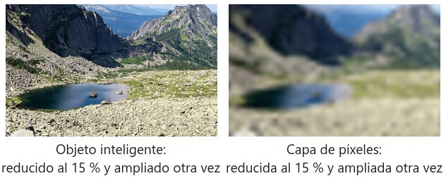
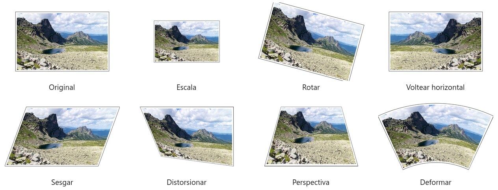
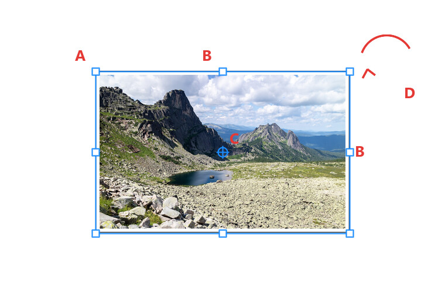
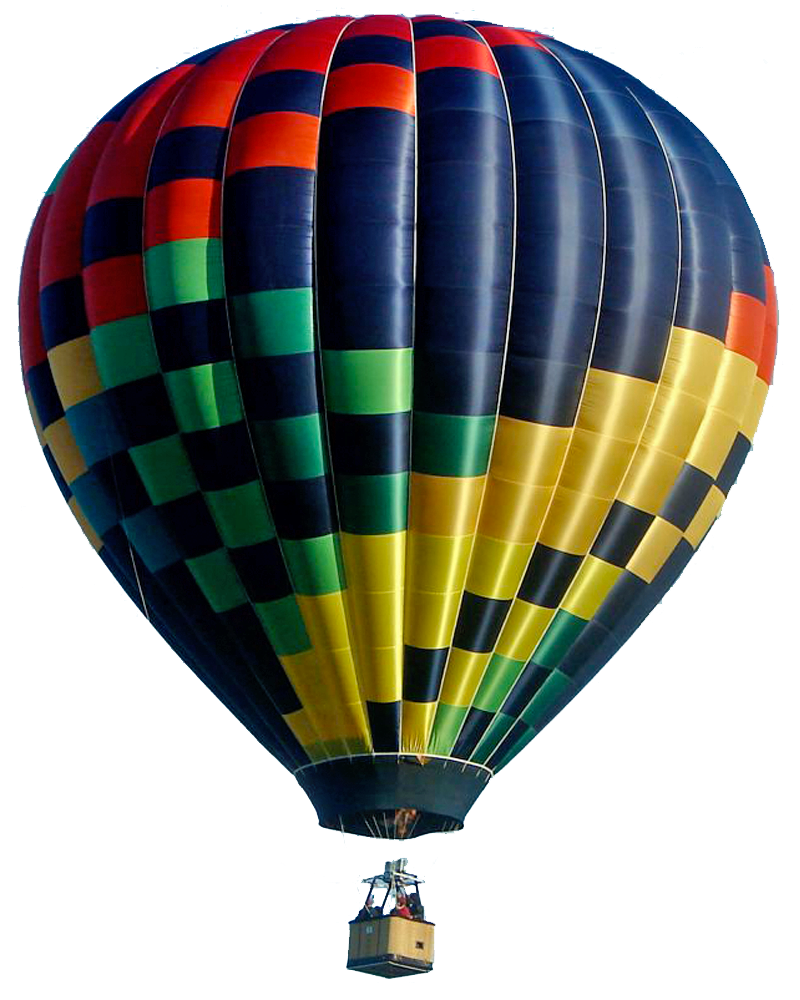
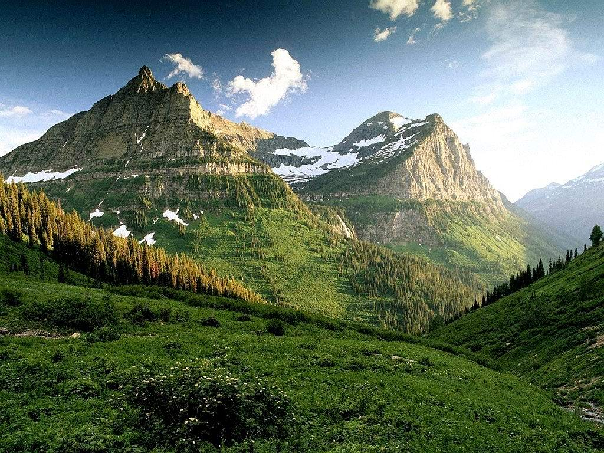
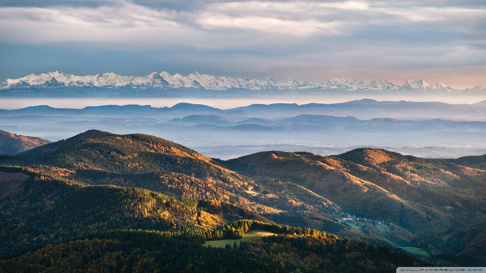
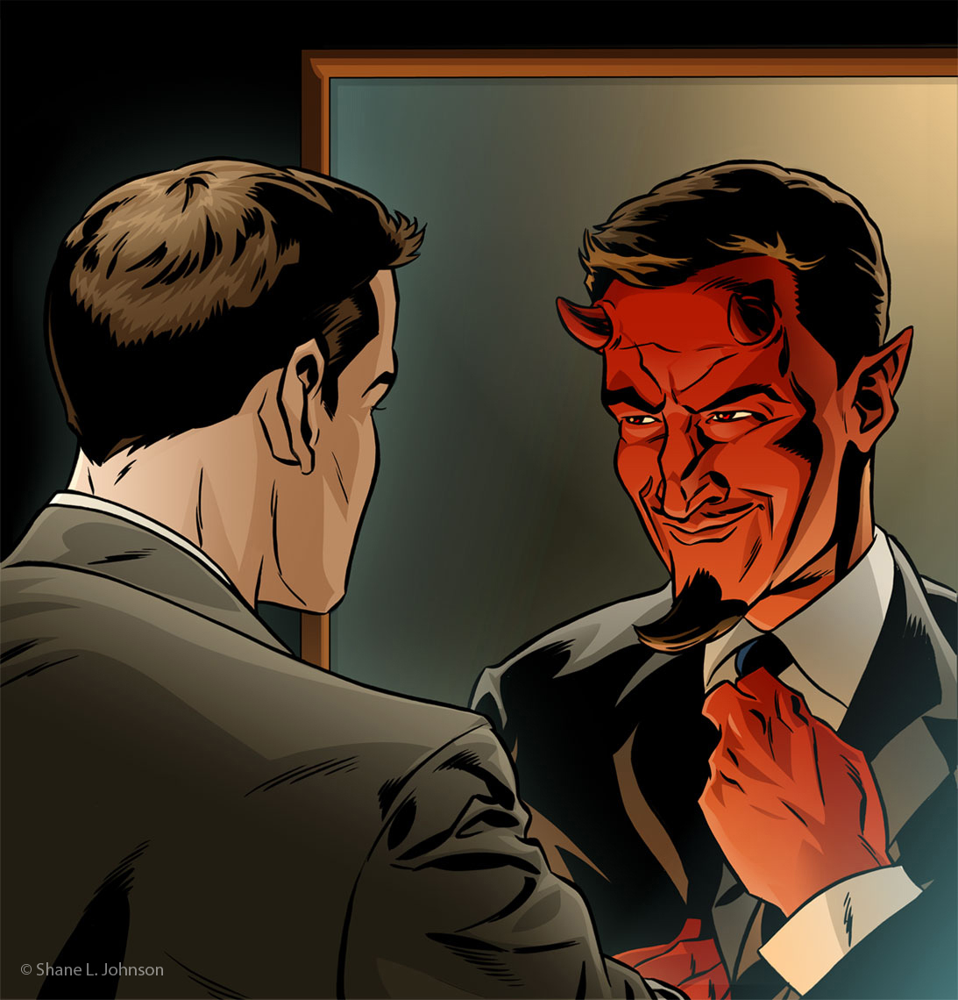
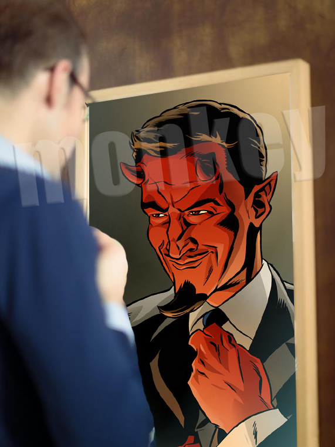
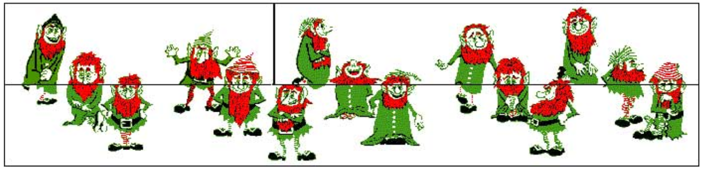

# Transformatu

Bi ariketa `Edición > Transformar` menua eta *Transformazio librea* (`Ctrl+T`) menderatzeko: eskalatu, biratu, irauli, okertu, distortsionatu, perspektiba eta deformatu.

## Hasi aurretik: objektu adimendunak

Geruza bat transformatu aurretik, bihurtu **objektu adimendun** (`Capa > Objetos inteligentes > Convertir en objeto inteligente`, edo eskuineko botoia geruzaren gainean). Objektu adimendun batek jatorrizko pixelak gordetzen ditu barruan: txikitu, handitu, deformatu eta ehun aldiz iritziz alda dezakezu, eta Photoshopek beti jatorrizkotik abiatuko da. Pixel-geruza arrunt batek, ordea, informazioa galtzen du txikitzen duzun bakoitzean.

*Argazki bera % 15era txikituta eta berriro bere tamainara handituta. Ezkerrean, objektu adimendun gisa: osorik. Eskuinean, pixel-geruza gisa: txikitzean bota ziren pixelak ez dira itzultzen.*

Irudi bat `Archivo > Colocar incrustado` bidez kokatzen duzunean, objektu adimendun gisa sartzen da zuzenean. Gainean margotu edo klonatu nahi baduzu, rasterizatu beharko duzu (`Capa > Rasterizar`) edo, hobeto, gaineko geruza batean margotu.

## Transformazio motak

Guztiak `Edición > Transformar` menuan daude, eta Transformazio librearen barruan eskuineko botoiaren menuan.

- **Eskalatu** (*Escala*): tamaina aldatzen du. Izkina bat arrastatuz bi ardatzetan eskalatzen da; alde bat arrastatuz, batean bakarrik.
- **Biratu** (*Rotar*): erreferentzia-puntuaren inguruan biratzen du. Aukeren barran angelu zehatza idatz dezakezu, eta menuan lasterbideak daude 180°-rako eta 90°-rako alde bakoitzera.
- **Irauli horizontalki / bertikalki** (*Voltear horizontal / vertical*): isla sortzen du. Erabilgarria kopia bat nabaritu ez dadin (globoak, sagarrak) eta uretako islak egiteko.
- **Okertu** (*Sesgar*): geruza makurtzen du alde bat desplazatuz eta kontrakoa finko utziz. Aldeak paralelo jarraitzen dute. Itzalak eta testuak etzateko.
- **Distortsionatu** (*Distorsionar*): izkina bakoitza bere aldetik mugitzen da, inolako mugarik gabe. Irudi bat angeluan dagoen plano batean sartzeko erabiltzen dena da (pantaila bat, koadro bat, ispilu bat).
- **Perspektiba** (*Perspectiva*): izkina bat mugitzean, alde bereko izkina ispiluan mugitzen da, eta alde hori estutu edo zabaldu egiten da. Objektua handik urruntzen dela simulatzen du. Planoa aurrez aurre badago bakarrik balio du; angeluan badago, erabili Distortsionatu.
- **Deformatu** (*Deformar*): 3 × 3ko sare bat agertzen da puntuekin eta kurba-heldulekuekin. Geruza gainazal baten gainean kurbatzeko balio du (katilu bat, botila bat, bandera bat) eta aurrez ezarritako deformazioak ditu (arkua, bandera, olatua, puztu...) aukeren barran.

## Transformazio librea (`Ctrl+T`)

Aurreko guztia menutik pasatu gabe egiteko modu azkarra da. `Ctrl+T` sakatzean, zortzi helduleku dituen kutxa bat agertzen da geruzaren inguruan.

*A. Izkinetako heldulekuak: bi ardatzetan eskalatzen dute. B. Alboetako heldulekuak: ardatz bakarrean eskalatzen dute. C. Erreferentzia-puntua: biraketaren eta eskalaren zentroa; beste leku batera arrasta dezakezu (ikusten ez baduzu, aktibatu aukeren barran). D. Kurtsorea kutxatik kanpo dagoela gezi kurbatu bat agertzen da: arrastatu biratzeko.*

- **Proportzioa**: Photoshopen bertsio berrietan (2019tik aurrera) eskala proportzionala da lehenespenez eta `Shift` teklak apurtzen du; zaharretan alderantziz da. Begiratu aukeren barrako katearen ikonoari.
- `Alt` arrastatzen duzun bitartean: zentrotik eskalatzen du.
- `Ctrl` + izkina bat arrastatu = **Distortsionatu**. `Ctrl+Shift` + alde bat arrastatu = **Okertu**. `Ctrl+Alt+Shift` + izkina bat arrastatu = **Perspektiba**. Eskuineko botoiak menua irekitzen du guztiekin.
- `Shift` biratzen duzun bitartean: biraketa 15°-ko jauzietara mugatzen du.
- **Aukeren barran** balio zehatzak idatz ditzakezu: posizioa (X, Y), zabalera eta altuera ehunekotan, angelua, eta Deformatu modura pasatzeko botoia.
- `Intro` teklak berresten du eta `Esc` teklak bertan behera uzten du. `Ctrl+Shift+T` teklak azken transformazioa errepikatzen du, eta `Ctrl+Alt+Shift+T` teklak kopia berri baten gainean errepikatzen du (ezin hobea gero eta globo txikiagoen serieak egiteko).

## Kapadozia

| `baloon.png` | `landscape1.png` | `landscape2.png` |
|---|---|---|
|  |  |  |

Kokatu globoa hainbat tamainatan zeruan hegan, **gutxienez 8 edo 9 globo**. Erabili kolore-balantzea guztiak berdin-berdinak izan ez daitezen.

Aukeratu bi paisaietako bat (edo egin biak) eta bihurtu zerua Kapadoziako globo-jaialdi bat.

### Urratsak

1. Ireki paisaia eta kokatu `baloon.png` barruan objektu adimendun gisa (`Archivo > Colocar incrustado`). Globoak gardentasunaren ordez atzeko planoa badakar, moztu *Makila magikoa* (*Varita mágica*) edo *Objektu-hautapena* (*Selección de objeto*) erabiliz eta aplikatu maskara bat.
2. Bikoiztu globoaren geruza (`Ctrl+J`) nahi adina globo lortu arte eta kokatu `Ctrl+T` bidez:
   - **Eskalatu** izkina bat arrastatuz. Begiratu aukeren barrako katearen ikonoari proportzioa mantentzeko (Photoshopen bertsioaren arabera, `Shift` teklak mantendu edo apurtu egiten du).
   - **Urruneko** globoak: txikiagoak, horizontetik hurbilago eta multzokatuta. **Hurbilekoak**: handiak, gorago edo ertzak moztuta ere.
   - **Biratu** pixka bat batzuk (2-5°) eta **irauli horizontalki** beste batzuk (`Edición > Transformar > Voltear horizontal`) kopia nabarmenak izan ez daitezen.
3. Berdinak izan ez daitezen, globo bakoitzari (edo globo-multzoei) gehitu doikuntza-geruza bat **mozketa-maskararekin** (*máscara de recorte*; `Alt+klik` doikuntza-geruzaren eta globoaren geruzaren artean):
   - **Kolore-balantzea** (*Balance de color*) nagusitasuna aldatzeko (batzuk beroagoak, beste batzuk hotzagoak).
   - **Tonua/saturazioa** (*Tono/saturación*) *Tonua* mugituz zerrenden koloreak aldatzeko.
4. Integratu atmosferarekin: urruneko globoek kontraste gutxiago, saturazio gutxiago dute eta zeruaren kolorera jotzen dute (*Kurbak* kontrastea jaitsiz gehi *Argazki-iragazki* (*Filtro de fotografía*) urdinxka bat, edo zeruaren koloreko geruza bat opakutasun baxuan mozketa-maskararekin). *Gauss-en lausotze* arin batek (*Desenfoque gaussiano*) laguntzen du urrunenetan.
5. Antolatu geruzak taldetan (*urrun*, *erdi*, *hurbil*) eta jarri izenak.

## The devil in disguise

| `devil/image1.png` | `devil/image.png` | `devil/finaldevil.png` |
|---|---|---|
|  |  |  |

Erabili transformatu eta aldatu perspektiba.

Argazkiko gizona ispiluan begiratzen ari da eta ikusten duena deabruaren ilustrazioa da. Komikiaren isla argazkiko ispiluaren barruan sartu behar duzu, perspektiba zuzenarekin, adibideko emaitzan bezala.

### Urratsak

1. Ireki argazkia (`image1.png`) oinarrizko dokumentu gisa.
2. Komikitik (`image.png`) hautatu deabrua duen ispiluaren eremua (markoarekin edo barrualdea bakarrik). Erabili *Marko angeluzuzena* (*Marco rectangular*), edo *Luma* (*Pluma*) zehaztasuna nahi baduzu. Kopiatu eta itsatsi argazkian geruza berri gisa, eta bihurtu objektu adimendun.
3. Sartu ilustrazioa ispiluan `Ctrl+T` eta eskuineko botoiarekin:
   - **Eskalatu** lehenengo gutxi gorabeherako tamaina batera.
   - **Perspektiba**: izkina bat arrastatzean, kontrakoa ispiluan mugitzen da. Ispilua aurrez aurre baina makurtuta ikusten denean balio du.
   - **Distortsionatu**: izkina bakoitza bere aldetik mugitzen du. Gehien erabiliko duzuna da: eraman ilustrazioaren izkina bakoitza ispiluaren barrualdeko izkina bakoitzera. `Ctrl` sakatuta eduki dezakezu ere Transformazio librean izkina bat arrastatzen duzun bitartean.
   - **Deformatu**: doikuntza txikietarako, markoa guztiz zuzena ez bada.
4. Gehitu **geruza-maskara** bat (*máscara de capa*) eta ezkutatu ispiluaren markotik kanpo geratzen den guztia. Argazkiko gizona ispiluaren aurrean dago: bere burua eta sorbalda islaren gainetik geratu behar dira, beraz margotu horiek ere maskaran (edo bikoiztu argazkiaren geruza, moztu gizona eta kokatu gainean).
5. Berdindu ilustrazioa argazkiarekin: *Kurbak* (*Curvas*) edo *Mailak* (*Niveles*) mozketa-maskararekin kontrasterako, *Kolore-balantzea* edo *Argazki-iragazkia* gelako argi beroa har dezan, eta argazkia pixka bat lausotuta badago, aplikatu *Gauss-en lausotze* leun bat komikiari. Zuritik gardenera doan degradatu bat *Argi leuna* (*Luz suave*) moduan opakutasun baxuan, kristalaren isla simulatzen du.
6. Aukerakoa: *Barruko itzal* (*Sombra interior*) pixka bat ispiluaren ertzean, kristalari sakontasuna emateko.

## Iratxoak

Moztu irudiaren goiko bi laukiak eta aldatu tokiz modu honetan.

Zer gertatu da falta den iratxoarekin?

## Entrega

- Bi ariketen `.psd` fitxategiak, geruzak izendatuta eta objektu adimendunak mantenduta.
- Azken irudiak `.jpg` edo `.png` formatuan esportatuta.

## Irudien kredituak

- Irudietako paisaiaren argazkia: Vyacheslav Argenberg, [*Ergaki, Mountain lake Skazka, Rock formations, Sayan Mountains, Russia*](https://commons.wikimedia.org/wiki/File:Ergaki,_Mountain_lake_Skazka,_Rock_formations,_Sayan_Mountains,_Russia.jpg), Wikimedia Commons, CC BY 4.0.
- Eskemak praktika hauetarako sortu dira ImageMagick-ekin eta erabilera librekoak dira.
