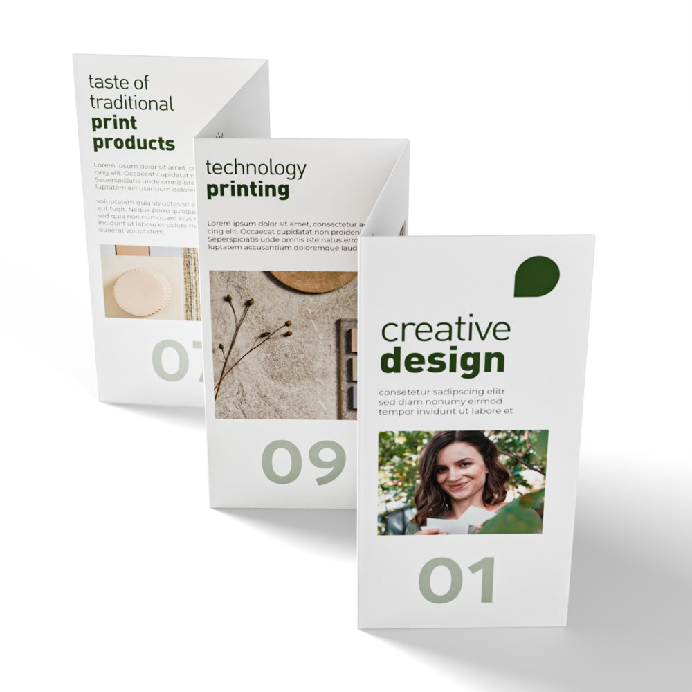
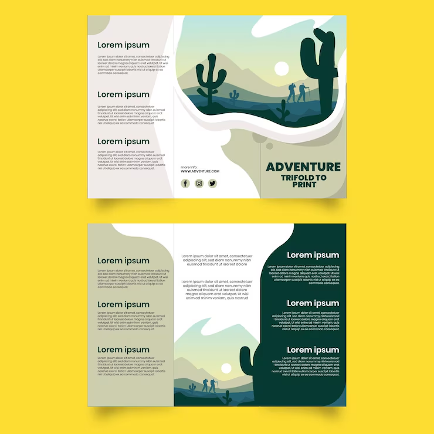
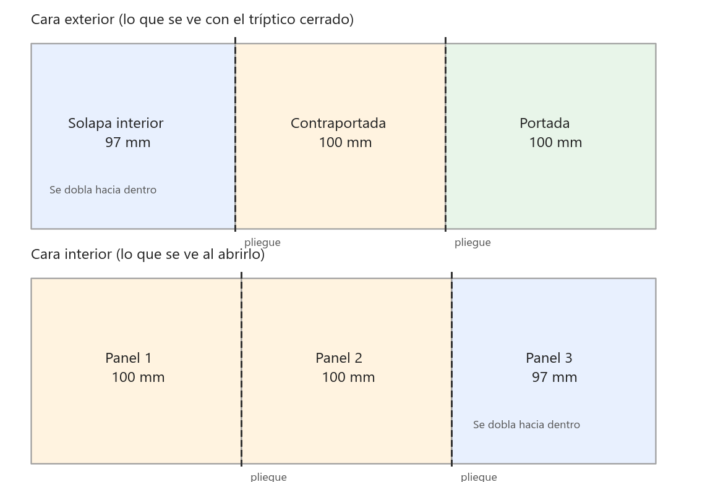

# Tríptico

| | |
|---|---|
|  |  |

Un tríptico es una hoja (normalmente un A4 apaisado) doblada en tres partes, lo que da seis caras: tres por fuera y tres por dentro. Es el folleto típico de un museo, un evento, un restaurante o una empresa. En esta tarea tienes que diseñar uno, maquetarlo correctamente para imprenta e **imprimirlo y doblarlo**.

> **Esta tarea se pedirá en el reto.** Trabaja con el tema y la marca del reto para que el tríptico sea una entrega real y no un ejercicio suelto.

## Qué hay que hacer

Diseña un tríptico sobre **el tema del reto** (o, si aún no está definido, sobre un tema que elijas y que luego puedas adaptar) y entrégalo impreso y plegado.

### Estructura de las seis caras

Imagina la hoja desplegada. La cara **exterior** (la que se ve con el folleto cerrado) tiene, de izquierda a derecha:

| Solapa interior | Contraportada | Portada |
|---|---|---|
| Texto de cierre, un mapa, un formulario, testimonios... | Datos de contacto, dirección, redes, logo, horario, código QR. | Título, imagen principal, logo. Tiene que llamar la atención por sí sola. |

La cara **interior** (la que se ve al abrirlo) tiene tres paneles seguidos con el contenido principal: qué es, qué ofrece, por qué, cómo participar... Puedes tratarlos como tres columnas independientes o como una sola imagen continua que cruce los pliegues, como en el ejemplo del desierto.

### Medidas

- Hoja **A4 apaisada: 297 × 210 mm**, con **3 mm de sangrado** por cada lado (documento de 303 × 216 mm).
- **Tres paneles**, pero no iguales: el que se dobla hacia dentro tiene que ser unos 2 o 3 mm más estrecho para que cierre bien. Por ejemplo **97 + 100 + 100 mm**, siendo el panel de 97 el que queda dentro.
- Dibuja **guías** en los pliegues (`Vista > Nueva guía`) y respeta un **margen de seguridad de 5 mm** a cada lado de cada pliegue y del borde: ningún texto ni logo debe quedar sobre el doblez.
- **300 ppp** desde el principio. No escales fotos pequeñas hacia arriba.
- Modo **CMYK** para la exportación final (puedes trabajar en RGB y convertir al final, pero comprueba los colores).

### Cómo preparar el documento

*La hoja desplegada por las dos caras. Al darle la vuelta, el orden de los paneles se invierte: el panel estrecho (97 mm) queda a la izquierda en el exterior y a la derecha en el interior, y es siempre el que se dobla hacia dentro.*

- `Archivo > Nuevo`: anchura **303 mm** y altura **216 mm** (el A4 apaisado más 3 mm de sangrado por cada lado), **300 ppp**, RGB de 8 bits. Son **3579 × 2551 píxeles**. Hazlo dos veces: `exterior.psd` e `interior.psd`.
- Guías verticales con `Vista > Nueva guía`, en milímetros desde el borde izquierdo del documento:
  - Corte: 3 y 300 mm. Margen de seguridad: 8 y 295 mm.
  - Pliegues del exterior: **100 y 200 mm** (3 de sangrado más 97, y 100 más). Pliegues del interior: **103 y 203 mm** (3 más 100, y 100 más).
  - Margen de seguridad a cada lado de cada pliegue, 5 mm antes y después: 95, 105, 195 y 205 en el exterior; 98, 108, 198 y 208 en el interior.
- Guías horizontales: 3 y 213 mm (corte) y 8 y 208 mm (seguridad).

*Lo mismo que en la postal: el fondo llega hasta el sangrado (azul), la imprenta corta por la línea roja y nada importante pasa de la verde. En el tríptico, además, nada importante pasa de las guías de seguridad de los pliegues.*

- **ppp**: 300 píxeles por pulgada son 11,8 píxeles por milímetro. Una foto de 1500 píxeles de ancho cubre justo un panel de 100 mm; si es más pequeña, saldrá borrosa.
- **CMYK**: trabaja en RGB, activa `Vista > Ajuste de prueba > CMYK de trabajo` (`Ctrl+Y`) para ver cómo cambian los colores en imprenta, y exporta con `Archivo > Guardar como > Photoshop PDF` convirtiendo a CMYK en las opciones de salida, con marcas de corte y sangrado. Para juntar el exterior y el interior en un PDF de dos páginas usa `Archivo > Automatizar > Presentación en PDF`.

### Contenido y diseño

- **Identidad coherente**: logo, paleta de 3 a 5 colores y una o dos tipografías (una para títulos, otra para texto) que se repitan en las seis caras. Si tienes la marca de la práctica de branding, úsala.
- **Jerarquía**: títulos, subtítulos y texto claramente diferenciados. Texto de párrafo entre 9 y 11 pt; nada por debajo de 8 pt.
- **Imágenes** propias o de bancos libres, a 300 ppp y tratadas en Photoshop (ajustes, recortes, máscaras, integración con el fondo o con formas gráficas).
- **Texto real**, no *lorem ipsum*: redacta el contenido aunque sea breve.
- Elementos gráficos (formas, iconos, un patrón) que ayuden a unir las caras y a guiar la lectura.

## Proceso recomendado

1. Haz un **boceto en papel**: dobla un A4 en tres y escribe en cada cara qué va a ir. Es la única manera de no confundir el orden de los paneles.
2. Crea dos documentos en Photoshop (`exterior.psd` e `interior.psd`) con las medidas, el sangrado y las guías.
3. Maqueta primero los bloques de texto y las imágenes como rectángulos grises, y cuando el reparto funcione empieza a diseñar.
4. Exporta un PDF, **imprímelo en borrador**, dóblalo y revisa: orden de las caras, márgenes, legibilidad, colores. Corrige y vuelve a imprimir.
5. Impresión final, preferiblemente a doble cara y en papel de 120 g o más.

## Entrega

- Los `.psd` del exterior y del interior, con capas nombradas y agrupadas.
- Un `.pdf` de dos páginas (exterior e interior) a 300 ppp, en CMYK, con sangrado y marcas de corte si tu versión lo permite.
- El **tríptico impreso y doblado**.
- Lista de fuentes de las imágenes y tipografías usadas.

## Créditos de las imágenes

- Foto de paisaje de las figuras: Vyacheslav Argenberg, [*Ergaki, Mountain lake Skazka, Rock formations, Sayan Mountains, Russia*](https://commons.wikimedia.org/wiki/File:Ergaki,_Mountain_lake_Skazka,_Rock_formations,_Sayan_Mountains,_Russia.jpg), Wikimedia Commons, CC BY 4.0.
- Los esquemas se han generado para estas prácticas con ImageMagick y son de uso libre.
