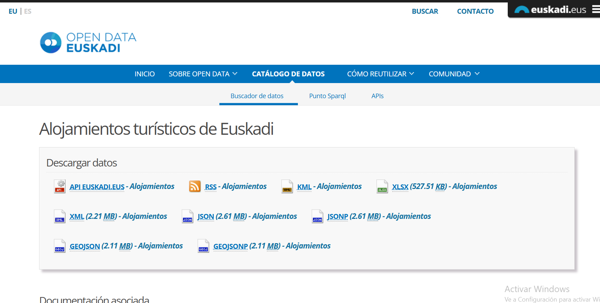

# Informe Alojamientos Turísticos Euskadi

---
- [Informe Alojamientos Turísticos Euskadi](#informe-alojamientos-turísticos-euskadi)
  - [0 - Fuente de los datos 🫗](#0---fuente-de-los-datos-)
  - [1 - Descarga y limpia los datos 🧹](#1---descarga-y-limpia-los-datos-)
  - [2 - Ordena, filtra y busca 🔎](#2---ordena-filtra-y-busca-)

---

## 0 - Fuente de los datos 🫗

- **Fuente de los datos:** [Open data Euskadi](https://opendata.euskadi.eus/catalogo/-/alojamientos/)

- **Datos original 30/09/2026:** [Fichero XLSX](alojamientos%20turisticos.xlsx)

## 1 - Descarga y limpia los datos 🧹

1. ¿Cuántas filas de datos y cuántas columnas tiene el archivo? ¿Qué día y a qué hora lo descargasteis?
   
- 1500 filas de datos
- 

2. ¿Qué columnas están completamente vacías? Listádlas y decid cuántas son.
3. . ¿Qué nombres de columna aparecen dos veces? ¿Por qué es un problema y cómo lo habéis resuelto?
4. ¿Cuántos alojamientos no tienen teléfono? ¿Y sin correo? ¿Y sin web? Dad el número y el porcentaje.
5. Mirad la columna Categoría: ¿qué valores distintos toma? ¿Se puede calcular su media? Justificad la respuesta.
6. ¿Hay nombres repetidos? ¿Y signaturas repetidas? ¿Qué habéis decidido hacer con ellos y por qué?
7. ¿Hay alojamientos con capacidad 0? ¿Qué puede significar y qué hacéis con ellos?
8. De vuestro encargo: ¿cuántos registros tiene vuestro segmento? ¿Le falta algún dato importante?

---

## 2 - Ordena, filtra y busca 🔎

